## Indice
1. [SOC173 - Follina 0-Day Detected](#soc173---follina-0-day-detected)
2. [SOC168 - Whoami Command Detected in Request Body](#soc168---whoami-command-detected-in-request-body)
3. [SOC210 - Possible Brute Force Detected on VPN](#soc210---possible-brute-force-detected-on-vpn)
4. [SOC167 - LS Command Detected in Requested URL](#soc167---ls-command-detected-in-requested-url)
5. [SOC250 - APT35 HyperScrape Data Exfiltration Tool Detected](#soc250---apt35-hyperscrape-data-exfiltration-tool-detected)
6. [SOC145 - Ransomware Detected](#soc145---ransomware-detected)
7. [SOC147 - Actividad de escaneo SSH](#soc147---actividad-de-escaneo-ssh)
8. [SOC142 - Multiple HTTP 500 Response](#soc142---multiple-http-500-response)
9. [SOC101 - Correo de Phishing Detectado](#soc101---correo-de-phishing-detectado)
10. [SOC104 - Malware Detectado](#soc104---malware-detectado)

# SOC173 - Follina 0-Day Detected

Creamos el caso. 

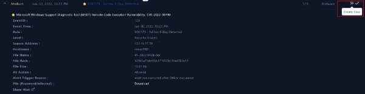

Definimos el indicador de amenaza. 

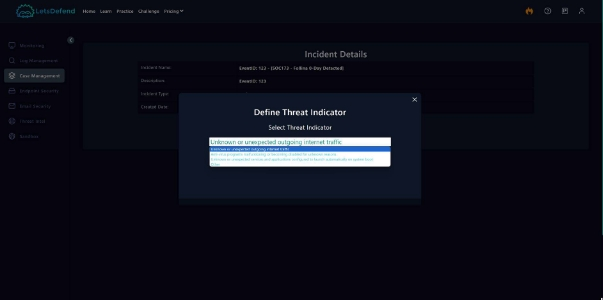

El hash del archivo lo introducimos en virus total para ver si los antivirus lo detectan. 

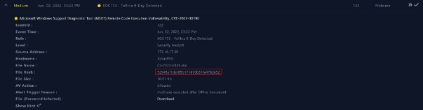

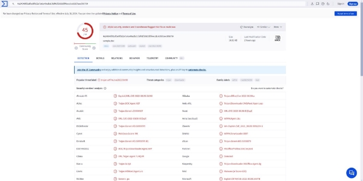

Vamos a la pestaña de comportamiento para ver qué acción realiza este malware. Podemos ver que realiza tráfico de internet saliente desconocido o inesperado. 

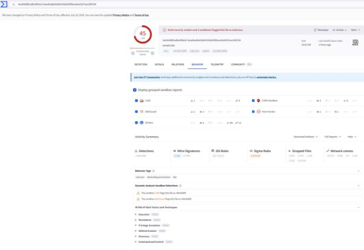

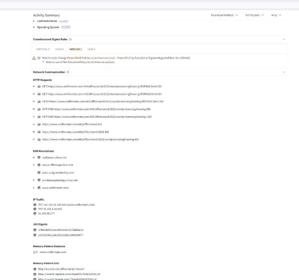

Debido a que el evento desencadenante es la ejecución de msdt.exe a través de un documento de Office, es obvio verificar el punto final o el registro de protección del punto final. 

Aquí vemos que la dirección IP coinciden. 

Podemos  ver  como  este  proceso  malicioso  fue  ocasionado  por  la  ejecución  de msdt.exe a través de un documento de office. 

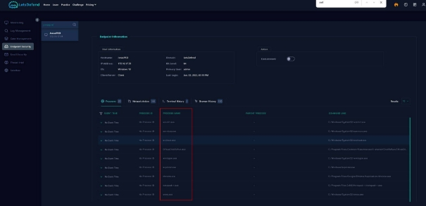

Queremos ver los detalles del historial del proceso creado, así que haga clic en Lista de procesos y aparecerá la lista de procesos creados. Se nos informó que msdt.exe se generó a partir de documentos de Office. Desplácese hacia WINWORD.exe para ver qué archivo se abrió. 

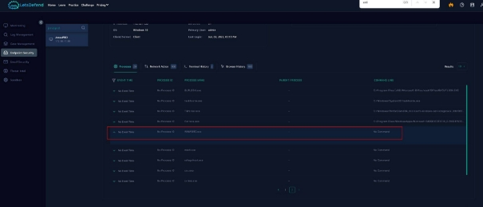

Para tener mas evidencias, introducimos de nuevo el hash en hybrid análisis para comprobar como afecta este malware. 

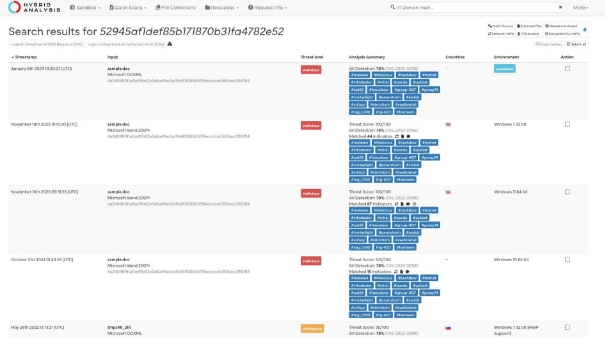

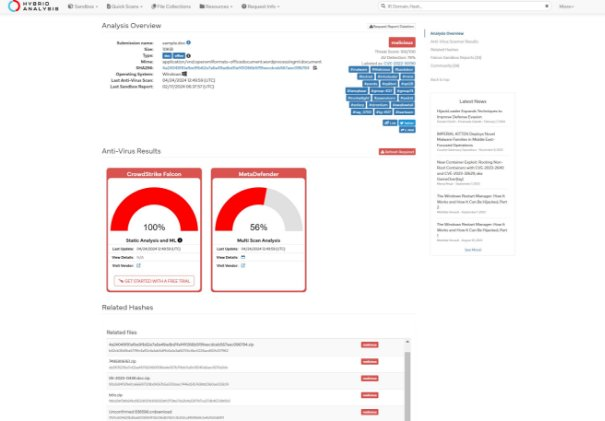

Aquí vemos que actividad maliciosa realiza con el CVE correspondiente. 

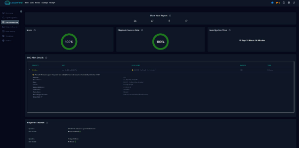

### Informe sobre el Incidente SOC173 - Follina 0-Day

**Clasificación según taxonomía:** 

- **Táctica**: Execution, Privilege Escalation. 
- **Técnicas**: Exploitation for Client Execution (T1203), Exploitation for Privilege Escalation (T1068). 

**Criticidad:** 

- **Nivel de Criticidad**: Alta. La explotación de esta vulnerabilidad permite la ejecución remota de código, lo que puede resultar en un control total sobre los sistemas afectados. 

**Descripción del Incidente:** 

El incidente involucra la explotación de una vulnerabilidad de día cero (CVE-2022- 30190) en el Microsoft Support Diagnostic Tool (MSDT) a través de documentos de Office. Los atacantes enviaron documentos maliciosos que, al ser abiertos, ejecutan un código que invoca a MSDT incluso sin la interacción del usuario mediante macros. 

**Acciones Tomadas para su Resolución:** 

1. **Identificación  y  Aislamiento**:  Se  identificaron  y  aislaron  los  sistemas afectados para prevenir la propagación. 
1. **Análisis Forense**: Se realizó un análisis forense para entender el alcance del ataque y los vectores de infección. 
3. **Parcheo  y  Actualizaciones**:  Se  aplicaron  parches  de  emergencia proporcionados por Microsoft y se actualizaron todos los sistemas para cerrar la vulnerabilidad explotada. 
3. **Restauración de Sistemas**: Los sistemas afectados fueron restaurados a partir de copias de seguridad seguras. 
3. **Monitoreo Post-Incidente**: Se incrementó el monitoreo de la red para detectar signos de actividad maliciosa residual. 

**Acción Específica para Restablecimiento de Servicios:** 

Fue necesario reinstalar el sistema operativo en las máquinas comprometidas para asegurar la eliminación completa del malware. 

**Acciones Destacadas y Lecciones Aprendidas:** 

La rápida identificación y aislamiento de los sistemas afectados fue crucial para limitar el daño. La necesidad de una mejor capacitación en reconocimiento de phishing y seguridad de documentos se hizo evidente. 

**Propuestas de Mejora:** 

Implementación de herramientas de seguridad avanzadas como EDR, mejoras en la formación de seguridad para empleados, y revisión de las políticas de seguridad para la gestión de correos electrónicos y documentos. 

**Estrategias Preventivas:** 

- **Fortalecimiento de la Seguridad de Endpoint**: Implementar soluciones EDR y mejorar las configuraciones de seguridad de los endpoints. 
- **Actualizaciones  Regulares**:  Mantener  todos  los  sistemas  y  software actualizados para mitigar vulnerabilidades conocidas. 
- **Capacitación y Conciencia**: Continuar con la capacitación regular de los empleados en reconocimiento de amenazas y mejores prácticas de seguridad. 

### Respuestas a las preguntas 

**1.a Memoria del Trabajo Realizado** 

- **Tipo según Taxonomía**: 
  - **Táctica**: Execution, Privilege Escalation. 
  - **Técnicas**:  Exploitation  for  Client  Execution  (T1203),  Exploitation  for Privilege Escalation (T1068). 
- **Criticidad**: Alta, debido a que la vulnerabilidad permite la ejecución remota de código y acceso potencial a información sensible y sistemas críticos. 
- **Descripción del Incidente**: El incidente comenzó con la recepción de un documento de Microsoft Word malicioso enviado a varios empleados. Al abrir el documento, se ejecutó un payload que aprovechaba la vulnerabilidad de MSDT, permitiendo la ejecución de comandos remotos. El ataque no requirió interacciones adicionales, como clics en enlaces o ejecución de macros, lo que lo hizo especialmente sigiloso y efectivo. 

**1.b Proceso de Investigación** 

El proceso de investigación siguió estos pasos: 

1. **Identificación**: Alerta inicial por parte de las herramientas de seguridad que detectaron tráfico anómalo y uso inusual de MSDT. 
1. **Aislamiento**:  Aislamiento  de  las  máquinas  afectadas  para  prevenir  la propagación del ataque. 
1. **Recopilación de Evidencias**: 
   1. Logs del sistema y del antivirus. 
   1. Snapshots de memoria de las máquinas afectadas. 
   1. Análisis forense de los dispositivos de red. 
1. **Análisis de las Evidencias**: Determinación de cómo el payload fue ejecutado y qué otros sistemas podrían estar comprometidos. 
1. **Erradicación  y  Recuperación**:  Limpieza  de  los  sistemas  afectados, restablecimiento de operaciones normales con sistemas limpios y verificados. 

**Evidencias Clave**: 

- El documento de Word inicial. 
- Logs que mostraban la ejecución anormal de MSDT. 
- Análisis  de  tráfico  de  red  capturando  la  comunicación  con  servidores  de comando y control. 

**2.a Actuación para el Restablecimiento de Servicios** 

Sí, fue necesario realizar varias actuaciones: 

- **Reinstalación de sistemas operativos** en máquinas comprometidas. 
- **Restauración de datos** desde backups seguros. 
- **Validación de la integridad de los sistemas** antes de reintegrarlos a la red. 

**3.a Acciones Destacadas para Resolver el Incidente** 

- **Implementación de parches de seguridad** de emergencia proporcionados por Microsoft para cerrar la vulnerabilidad. 
- **Mejoras en la monitorización de seguridad**, incorporando reglas específicas para detectar usos anómalos de herramientas como MSDT. 

**3.b Análisis de Actuaciones y Lecciones Aprendidas** 

**Lecciones Aprendidas**: 

- La necesidad de respuestas rápidas a actualizaciones de seguridad. 
- La importancia del entrenamiento en reconocimiento de phishing y manejo seguro de correos y documentos. 

**Mejoras Propuestas**: 

- Mejorar protocolos de respuesta ante incidentes. 
- Incrementar la capacitación en seguridad cibernética para todos los empleados. 

**4.a Estrategias para Evitar Incidentes Similares** 

- **Regular la aplicación de parches y actualizaciones** para asegurar que todos los sistemas estén al día. 
- **Fortalecimiento de las políticas de correo electrónico** para filtrar adjuntos y enlaces potencialmente maliciosos. 
- **Educación continua** en ciberseguridad para los empleados, enseñando las últimas tácticas usadas por los atacantes y cómo evitarlas. 

# SOC168 - Whoami Command Detected in Request Body

La dirección IP de origen (61.177.172.87) intentó un ataque de inyección de comando "Whoami" en el servidor web 1004 (172.16.17.16).dominioataque de inyección en el servidor web 1004 (172.16.17.16). 

Introducimos la IP origen en virustotal y vemos que es detectado por solo algunos antivirus. 

Miraremos la gestión de registros. 

Y respondemos las preguntas letsdefend. 

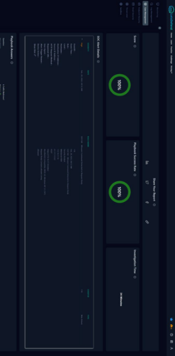

### Informe de Incidente SOC168 - Whoami Command Detected in Request Body

**Clasificación Según Taxonomía:** 

- **Incidente**: Command Injection. 
- **Categoría  MITRE ATT&CK**:  Execution  (TA0002),  Command  and  Scripting Interpreter (T1059). 
- **Técnicas**: Web Shell (T1100), Command-Line Interface (T1059.003). 

**Criticidad:** 

- **Nivel de Criticidad**: Alto. 
  - **Justificación**:  La  capacidad  del  atacante  para  ejecutar  comandos arbitrarios en el servidor indica un compromiso significativo del mismo. 

**Descripción del Incidente:** 

El 27 de abril de 2024, se activó una alerta indicando una inyección potencial de comandos en el cuerpo de la solicitud HTTP hacia el endpoint **WebServer1004**. La revisión del historial de la terminal reveló la ejecución continua de cuatro comandos, aumentando la probabilidad de un evento de inyección de comandos. 

Un análisis de los logs mostró una solicitud POST al URL **https://172.16.17.16/video/** con parámetros que incluían un intento de leer el archivo **/etc/shadow**, un indicador claro de compromiso. La respuesta HTTP fue 200, y el tamaño de la respuesta sugiere que los datos fueron devueltos tras la ejecución, confirmando que el servidor web había sido comprometido. 

No se encontraron correos electrónicos relacionados con la dirección IP amenazante, indicando que el ataque no fue precedido por un intento de phishing u otras técnicas de ingeniería social. 

**Acciones Tomadas para su Resolución:** 

- **Contención**: 
  - Apagado inmediato del servidor web para contener la amenaza. 
- **Eradicación y Recuperación**: 
  - Pendiente. Escalado al equipo de nivel 2 para investigación y manejo detallado. 

**Acción Específica para Restablecimiento de Servicios:** 

- Se  realizó  un  apagado  del  servidor  web  comprometido  para  evitar  más ejecuciones no autorizadas de comandos. 

**Acciones Destacadas y Lecciones Aprendidas:** 

- **Acciones Destacadas**: 
  - Contención rápida del servidor comprometido. 
- **Lecciones Aprendidas**: 
  - La necesidad de implementar una mejor detección y prevención de inyección de comandos en el nivel de aplicación. 
  - Verificar la configuración de seguridad y las reglas del firewall para detectar y prevenir solicitudes maliciosas. 

**Mejoras Propuestas:** 

- Implementar  un  sistema  de  detección  de  intrusos  (IDS)  y  un  WAF  para monitorizar y filtrar solicitudes maliciosas. 
- Revisión y fortalecimiento de la validación de entradas de la aplicación web. 

**Estrategias Preventivas:** 

- Auditorías de seguridad regulares para identificar y remediar vulnerabilidades. 
- Formación en seguridad de aplicaciones para desarrolladores. 
- Simulacros de respuesta a incidentes para mejorar los tiempos de reacción y eficacia de las respuestas. 

### Respuestas a las preguntas 

**1.a Memoria del Trabajo Realizado** 

**Tipo Según Taxonomía** 

- **Incidente**: Command Injection. 
- **Categoría  MITRE ATT&CK**:  Execution  (TA0002),  Command  and  Scripting Interpreter (T1059). 
- **Criticidad**: Alta. 

**Descripción del Incidente** 

Una alerta fue disparada por el sistema, indicando una posible inyección de comandos en el cuerpo de una solicitud HTTP en un servidor identificado como **WebServer1004**. La revisión del historial de comandos mostró ejecuciones continuas que no coinciden con  el  comportamiento  esperado  de  los  usuarios  legítimos,  aumentando  las sospechas. 

**1.b Proceso de Investigación** 

1. **Verificación de Endpoint**: Uso de Endpoint Security para examinar el historial de la terminal del servidor afectado. 
1. **Revisión de Logs**: Análisis de los registros para investigar las respuestas de los comandos ejecutados. 
1. **Evidencias Clave**: 
- Solicitud POST con parámetros maliciosos. 
- Respuestas del servidor que indican la ejecución exitosa del comando de lectura de archivos sensibles. 

**2.a Actuación para el Restablecimiento de Servicios** 

- Se procedió a realizar el apagado del servidor comprometido para detener la actividad maliciosa y prevenir daños adicionales mientras se investigaba el incidente. 

**3.a Acciones Destacadas para Resolver el Incidente** 

- Apagado inmediato del servidor afectado para prevenir más ejecuciones de comandos. 

**3.b Análisis de Actuaciones y Lecciones Aprendidas** 

- **Análisis de Actuaciones**: La rápida respuesta al apagar el servidor fue crucial para la contención. 
- **Lecciones Aprendidas**:  Fue  evidente  la  necesidad  de  una  validación  de entrada  más  robusta  y  la  implementación  de  soluciones  como  WAF  para prevenir estos tipos de ataques. 
- **Mejoras  Propuestas**:  Actualización  de  los  playbooks  para  incluir procedimientos de validación de entrada, educación de los desarrolladores en seguridad, y mejoras en la monitorización y detección de intrusiones. 

**4.a Estrategias para Evitar Repetición de Incidentes** 

- Auditorías de seguridad de aplicaciones web regulares. 
- Implementación de WAF y IDS. 
- Mejora continua de la capacitación de los equipos de desarrollo y operaciones en las mejores prácticas de seguridad. 
- Realización  de  simulacros  de  respuesta  a  incidentes  para  mejorar  la preparación frente a ataques. 

# SOC210 - Possible Brute Force Detected on VPN

Comprobamos la IP de origen en virustotal  

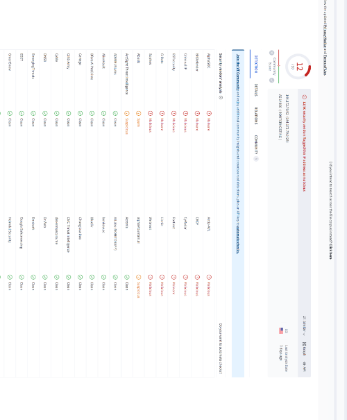

El siguiente paso es comprobar los registros. En la página de administración de registros vemos que se realizaron múltiples solicitudes desde la IP 58.237.200.6 a la dirección IP 172.16.20.8. Otra cosa interesante que se puede destacar es el puerto utilizado: 443. 

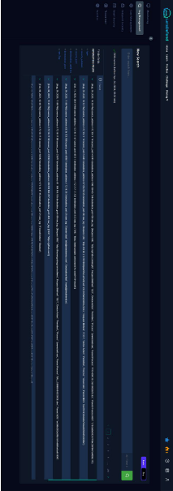

Y respondemos a todas las preguntas. 

### Informe de Incidente SOC210 - Intento de Fuerza Bruta en VPN

**Clasificación Según Taxonomía:** 

- **Incidente**: Intento de Fuerza Bruta. 
- **Categoría MITRE ATT&CK**: Credential Access (TA0006), Brute Force (T1110). 

**Criticidad:** 

- **Nivel de Criticidad**: Medio-Alto. 
  - **Justificación**: Los intentos de fuerza bruta pueden conducir al acceso no  autorizado  de  cuentas  de  usuario  y  a  la  posible  filtración  de información confidencial. 

**Descripción del Incidente:** 

Se detectó un incremento anormal en las solicitudes de autenticación fallidas en el sistema VPN, lo que sugiere un ataque de fuerza bruta. La alerta se generó después de que varios intentos de inicio de sesión fallidos provenientes de una IP sospechosa activaron los umbrales configurados en el sistema de detección de intrusiones. 

**Acciones Tomadas para su Resolución:** 

1. **Investigación Inicial**: 
- Revisión  de  logs  de  VPN  para  identificar  las  credenciales  y  las direcciones IP involucradas. 
2. **Contención**: 
- Bloqueo temporal de las IPs sospechosas en el firewall. 
- Imposición  de  políticas  de  seguridad  como  captchas  o  bloqueos temporales después de varios intentos fallidos. 
3. **Eradicación**: 
   1. Reset de contraseñas para las cuentas afectadas. 
3. **Recuperación**: 
- Revisión y fortalecimiento de las políticas de autenticación de VPN. 
- Monitoreo post-incidente para observar actividades anormales. 

**Acción Específica para Restablecimiento de Servicios:** 

- Se  implementaron  restricciones  adicionales  de  tasa  de  intentos  de autenticación y se aumentó la complejidad de las políticas de contraseñas para evitar futuros ataques. 

**Acciones Destacadas y Lecciones Aprendidas:** 

- **Acciones Destacadas**: 
  - Rápida identificación y bloqueo de direcciones IP ofensivas. 
  - Refuerzo de las políticas de contraseñas y autenticación. 
- **Lecciones Aprendidas**: 
  - La importancia de contar con sistemas de detección de intrusiones bien configurados. 
  - La necesidad de educar a los usuarios sobre la selección de contraseñas fuertes y la detección de intentos de phishing. 

**Mejoras Propuestas:** 

- **Autenticación Multifactor (MFA)**: Implementación obligatoria de MFA para todos los usuarios de VPN. 
- **Capacitación de Usuarios**: Programas de concienciación sobre seguridad para  educar  a  los  usuarios  en  la  selección  de  contraseñas  seguras  y  el reconocimiento de intentos de phishing. 
- **Políticas de Intentos de Inicio de Sesión**: Implementación de políticas de bloqueo automático de cuentas después de un número de intentos fallidos. 

**Estrategias Preventivas:** 

- **Fortalecimiento de la Autenticación**: Uso de autenticación de dos factores (2FA) o multifactor (MFA) para todos los accesos remotos. 
- **Limitación de Intentos de Acceso**: Configuración de la VPN para limitar el número de intentos fallidos antes de bloquear temporalmente la IP. 
- **Educación Continua**: Entrenamiento continuo y simulacros de seguridad para usuarios VPN. 

### Respuestas a las preguntas 

**1.a Memoria del Trabajo Realizado** 

**Tipo según Taxonomía**: 

- MITRE ATT&CK: Credential Access (TA0006), Brute Force (T1110). 

**Criticidad**: 

- Alta, debido al riesgo de acceso no autorizado a la VPN y posibles filtraciones de datos. 

**Descripción del Incidente**: Se identificó un pico inusual en los registros de intentos de inicio de sesión fallidos, lo que sugiere un posible ataque de fuerza bruta dirigido a la VPN. Se detectaron múltiples intentos de autenticación desde una misma dirección IP que no coincidían con el comportamiento normal del usuario. 

**1.b Proceso de Investigación** 

El proceso de investigación incluyó: 

1. **Revisión de Logs**: Examinar los registros de la VPN para identificar patrones anómalos de autenticación. 
1. **Análisis de IPs**: Investigar la(s) dirección(es) IP(s) desde la(s) cual(es) se originaron los intentos. 
1. **Correlación de Eventos**: Comparar los eventos de la VPN con otros sistemas de seguridad para detectar actividad relacionada. 
1. **Evidencia Clave**: 
- Registros de autenticación detallando intentos fallidos. 
- IP(s) sospechosa(s) usada(s) en el ataque. 

**2.a Restablecimiento de Servicios** 

Durante la resolución, se implementaron las siguientes actuaciones: 

- **Bloqueo Temporal de IP**: Se bloqueó la dirección IP en cuestión para detener el ataque en curso. 
- **Reinicialización de Contraseñas**: Se solicitó a los usuarios afectados que cambiaran sus contraseñas. 

**3.a Acciones Destacadas para Resolver el Incidente** Acciones clave incluyeron: 

- **Fortalecimiento de la Autenticación**: Implementación de MFA para aumentar la seguridad del proceso de inicio de sesión. 
- **Ajustes de Configuración**: Modificaciones en la política de seguridad de la VPN para reducir la posibilidad de futuros ataques. 

**3.b Análisis de Actuaciones y Lecciones Aprendidas** Lecciones aprendidas: 

- La importancia de la detección proactiva y el monitoreo de intentos de inicio de sesión. 
- La eficacia de la autenticación multifactor como una barrera contra los ataques de fuerza bruta. 

Mejoras propuestas: 

- **Revisión del Playbook**: Incluir estrategias para la rápida detección y respuesta a ataques de fuerza bruta. 
- **Entrenamiento  de  Usuarios**:  Capacitar  a  los  usuarios  en  la  creación  de contraseñas robustas y el manejo de solicitudes de cambio de contraseña. 

**4.a Prevención de Incidentes Similares** Para evitar futuros incidentes: 

- **Limitación de Intentos de Inicio de Sesión**: Configurar la VPN para bloquear automáticamente las direcciones IP después de varios intentos fallidos. 
- **Políticas  de  Seguridad  Mejoradas**:  Revisar  y  actualizar  las  políticas  de seguridad de acceso a la VPN para incluir autenticación multifactor obligatoria. 

# SOC167 - LS Command Detected in Requested URL

Analizamos los registros y tráfico 

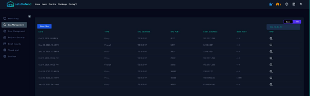

Como podemos ver ambos sitios web confirman que la IP no es maliciosa y su nombre de dominio es cloudflare.com 

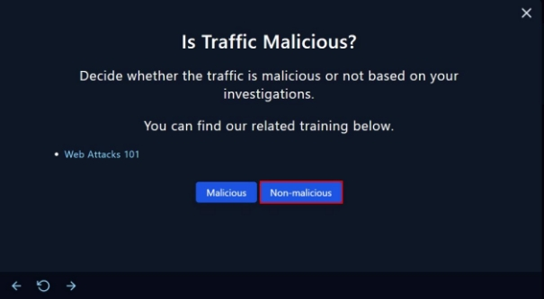Después de todo nuestro análisis podemos decir definitivamente que el tráfico no es malicioso 

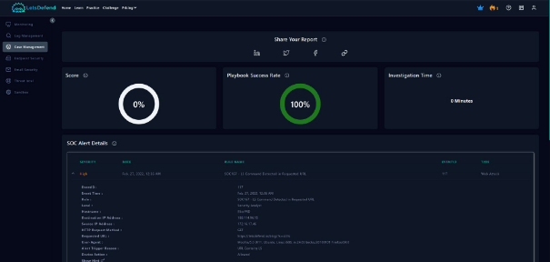

### Informe de Incidente SOC167 - LS Command Detected in Requested URL Clasificación 

**Según Taxonomía:**

- **Tipo de Incidente**: Web Application Attack 
- **Categoría  MITRE ATT&CK**:  Execution  (TA0002),  Command  and  Scripting Interpreter (T1059) 

**Criticidad:** 

- **Nivel de Criticidad**: Medio 
- **Justificación**: El comando **ls** podría indicar un intento inicial de reconocimiento antes de un ataque más sofisticado. 

**Descripción del Incidente:** 

Se identificó la presencia del comando **ls** en una URL solicitada, lo cual sugiere un intento de ataque de Listado de Directorios o una exploración inicial de posibles vulnerabilidades de inyección de comandos. 

**Acciones Tomadas para su Resolución:** 

1. **Revisión  de  Logs**: Análisis  de  registros  del  servidor  web  para  evaluar  el alcance del intento de reconocimiento. 
1. **Bloqueo  de  IP**:  La  dirección  IP  que  originó  la  solicitud  fue  bloqueada temporalmente. 
1. **Actualización de Reglas de Firewall/WAF**: Se actualizaron las reglas para bloquear futuras solicitudes maliciosas similares. 

**Acción Específica para Restablecimiento de Servicios:** 

No  fue  necesario  realizar  acciones  de  restablecimiento  ya  que  la  detección  fue temprana y no hubo interrupción del servicio. 

**Acciones Destacadas y Lecciones Aprendidas:** 

- **Implementación  de  controles  de  seguridad**:  Refuerzo  de  validación  de entrada en la aplicación web para prevenir ejecución de comandos. 
- **Lecciones Aprendidas**: La  necesidad de  una detección  y  respuesta  más rápidas a las anomalías para prevenir ataques. 

**Mejoras Propuestas:** 

- **Monitoreo  y  Alertas  Mejoradas**:  Implementar  sistemas  de  detección  de intrusiones que generen alertas inmediatas ante actividades sospechosas. 
- **Capacitación  del  Personal**:  Entrenamiento  para  mejorar  la  respuesta  a incidentes de seguridad informática. 

**Estrategias Preventivas:** 

- **Validación Rigurosa de Entrada**: Asegurarse de que todas las entradas de los  usuarios  sean  validadas  correctamente  para  evitar  inyecciones  de comandos. 
- **Revisión  Continua  de  Políticas  de  Seguridad**: Auditorías  de  seguridad periódicas y pruebas de penetración para identificar y corregir vulnerabilidades. 

### Respuestas a las preguntas 

**1.a Trabajo Realizado en la Resolución de Incidentes** 

**Tipo según Taxonomía**: El incidente fue clasificado como un intento de inyección de comandos, un tipo de ataque que se encuadra dentro de la categoría de ejecución de comandos y secuencias de comandos según la taxonomía de MITRE ATT&CK. Esto involucra la ejecución de comandos no autorizados en un sistema para ganar control o extraer información. 

**Criticidad**: La criticidad del incidente fue determinada como media. Aunque no hubo una brecha de seguridad efectiva ni se vieron comprometidos los datos, el intento de inyección podría haber sido precursor de amenazas más graves. Es vital tomar en serio tales advertencias, ya que pueden indicar la presencia de actores de amenazas que prueban las defensas de un sistema. 

**Descripción del Incidente**: Se detectó el uso del comando **ls** dentro de una URL que se solicitó al servidor web. Este es un indicio de que un atacante estaba intentando listar directorios en el servidor para descubrir archivos o directorios que pudieran ser explotados para obtener más acceso o información. El comando **ls** es una herramienta de listado de directorios común en sistemas Unix y Linux, y su presencia en la URL es inusual y sospechosa. 

**1.b Proceso de Investigación** 

Para investigar el incidente, el proceso comenzó con una revisión detallada de los registros del servidor web (logs), buscando cualquier patrón de solicitud anómalo y solicitando más detalles, como las direcciones IP de origen, las marcas de tiempo y los  user  agents.  Se  prestó  especial  atención  a  las  solicitudes  que  contenían  el comando **ls**. La evidencia clave fue la presencia repetida de estos comandos en las solicitudes  procedentes  de  una  única  dirección  IP,  lo  que  sugiere  un  patrón  de comportamiento automatizado o un ataque dirigido. 

**2.a Actuaciones para el Restablecimiento de Servicios** 

Dado  que  el  incidente  se  detectó  rápidamente  y  se  actuó  de  inmediato,  no  fue necesario realizar ninguna acción para restablecer los servicios, ya que no hubo interrupción. Sin embargo, se implementaron medidas preventivas para fortalecer la postura de seguridad y prevenir futuras ocurrencias. 

**3.a Acciones Destacadas y Resolución del Incidente** 

Las acciones realizadas para manejar este incidente incluyeron la identificación rápida del intento de ataque y el bloqueo inmediato de la dirección IP sospechosa. Además, se llevó a cabo una revisión de las configuraciones del sistema para garantizar que las defensas contra la inyección de comandos fueran adecuadas y efectivas. 

**3.b Análisis de Actuaciones y Lecciones Aprendidas** 

A partir de este incidente, aprendimos la importancia de una vigilancia constante y la necesidad de tener sistemas que puedan detectar automáticamente patrones de ataque. La lección más importante fue que incluso los intentos de ataque que no tienen éxito pueden proporcionar información valiosa sobre las tácticas de los adversarios y ayudar a mejorar las defensas. 

**4.a Actuaciones para Prevenir Incidentes Similares** 

En respuesta a este incidente y para prevenir futuros ataques similares, se decidió implementar un sistema de detección y prevención de intrusos más robusto, con especial enfoque en la inyección de comandos. Se reforzará la capacitación del personal en prácticas de codificación segura y en la respuesta a incidentes. También se revisarán y actualizarán los playbooks de incidentes para incluir tácticas específicas destinadas a contrarrestar y mitigar los ataques de inyección de comandos. 

# SOC250  -  APT35  HyperScrape  Data  Exfiltration  Tool Detected

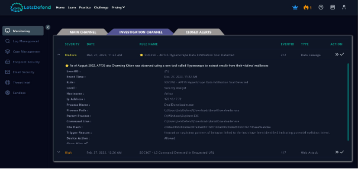

Revisaremos la página administración de registros para ver si hay un registro para la alerta: 

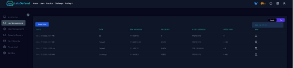

Ahora miraremos páginas de Endpoint & Email Security: 

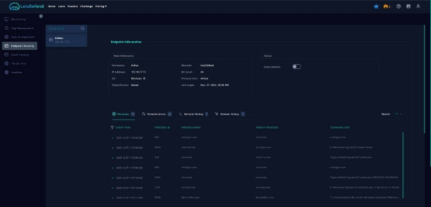

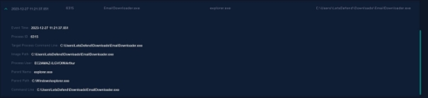Buscamos  las  direcciones  IP  en  la  página  de  virustotal  y  de  información  sobre amenazas y resultó ser externa y maliciosa. 

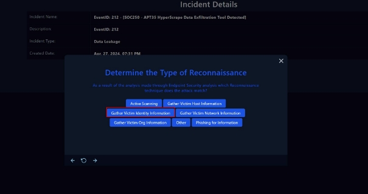

Aquí debemos seleccionar Recopilar información de identidad de la víctima porque, como mencioné antes, la herramienta HYPERSCRAPE se utiliza para robar datos del usuario. 

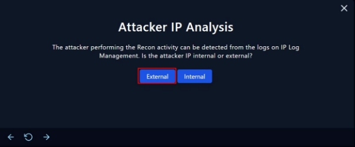

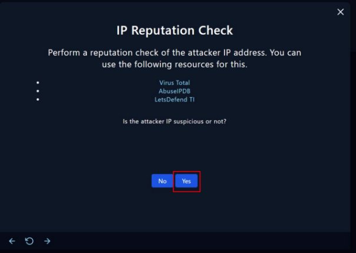

Tras buscar el archivo en virus total determinamos lo siguiente: 

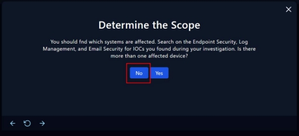

Como el ataque fue exitoso, aislamos el dispositivo: 

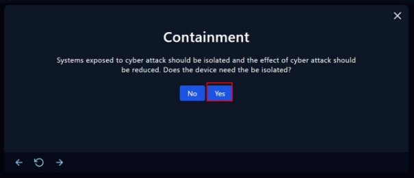

Fin de playbook. 

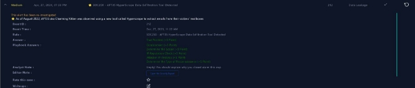

### Informe de Incidente SOC250 - APT35  HyperScrape  Data  Exfiltration  Tool Detected

**Clasificación Según Taxonomía:** 

- **Incidente**: Uso de Herramientas de Exfiltración de Datos (HyperScrape). 
- **Categoría MITRE ATT&CK**: Exfiltration (TA0010), Exfiltration Over Command and Control Channel (T1041). 

**Criticidad:** 

- **Nivel de Criticidad**: Alto. 
  - **Justificación**: La detección de una herramienta de exfiltración de datos sugiere  una  violación  de  la  seguridad  con  el  riesgo  de  pérdida  de información sensible. 

**Descripción del Incidente:** 

Se  detectó  actividad  de  red  correspondiente  a  HyperScrape,  una  herramienta conocida utilizada por APT35 para la exfiltración de datos. El sistema de detección de intrusiones identificó patrones de tráfico anómalo saliente que coincidían con las firmas asociadas a esta herramienta. 

**Acciones Tomadas para su Resolución:** 

1. **Contención**: 
- Desconexión inmediata de las máquinas afectadas de la red para evitar la fuga de más datos. 
2. **Eradicación**: 
- Limpieza de los sistemas comprometidos y eliminación de la presencia del atacante. 
3. **Recuperación**: 
- Restauración de datos a partir de copias de seguridad seguras. 
- Verificación de la integridad de los sistemas antes de reconectarlos a la red. 

**Acción Específica para Restablecimiento de Servicios:** 

- Implementación  de  un  plan  de  continuidad  de  negocios  para  mantener operaciones críticas mientras se realizaba la limpieza y restauración. 

**Acciones Destacadas y Lecciones Aprendidas:** 

- **Acciones Destacadas**: 
  - Identificación rápida del ataque y contención de la amenaza. 
  - Mejoras en la monitorización y en las capacidades de detección. 
- **Lecciones Aprendidas**: 
  - La necesidad de una revisión constante de las firmas de amenazas y de mantener actualizados los sistemas de prevención. 
  - La importancia de un plan de respuesta a incidentes bien definido y probado. 

**Mejoras Propuestas:** 

- **Fortalecimiento  de  la  Infraestructura  de  Seguridad**:  Mejorar  las herramientas de detección de anomalías y respuesta a incidentes. 
- **Capacitación  y  Simulacros**:  Entrenamiento  regular  de  personal  en reconocimiento de tácticas de APT y ejercicios de simulacro de incidentes. 

**Estrategias Preventivas:** 

- **Monitoreo Proactivo**: Implementar soluciones de análisis de comportamiento para detectar anomalías. 
- **Segmentación de Red**: Mejorar la segmentación de la red para limitar el movimiento lateral y la exfiltración de datos. 
- **Actualización de Políticas de Seguridad**: Revisar y actualizar las políticas de seguridad para incluir procedimientos específicos contra APTs. 

### Respuestas a las preguntas 

**1.a Memoria del Trabajo Realizado** 

**Tipo según Taxonomía**: El incidente se clasifica bajo "Ciberespionaje" con el uso de una herramienta conocida de exfiltración de datos asociada al grupo APT35. Esto cae bajo la categoría de TTPs (Tácticas, Técnicas y Procedimientos) de APTs (Amenazas Persistentes Avanzadas) en la taxonomía de amenazas cibernéticas. 

**Criticidad**:  Este  incidente  se  califica  como  de  alta  criticidad.  La  herramienta HyperScrape está diseñada para la exfiltración de datos, lo cual es un indicativo de un compromiso significativo y una posible filtración de información sensible. 

**Descripción del Incidente**: Se detectó la presencia de HyperScrape, un indicativo de actividad del grupo APT35, en nuestros sistemas. HyperScrape es una herramienta utilizada para recopilar y exfiltrar datos, lo que sugiere que el actor de amenazas estaba activamente buscando robar información. 

**1.b Proceso de Investigación** 

El proceso de investigación incluyó: 

- Análisis de los sistemas afectados para identificar el alcance del compromiso. 
- Revisión de los logs de red para rastrear la comunicación saliente y determinar qué datos pudieron haber sido exfiltrados. 
- Revisión  de  los  puntos  de  entrada  para  determinar  cómo  se  introdujo HyperScrape en la red. 
- La evidencia clave incluyó la detección de la herramienta HyperScrape en los sistemas y patrones de tráfico de red anómalo consistentes con la exfiltración de datos. 

**2.a Actuaciones para el Restablecimiento de Servicios** 

Se realizaron las siguientes actuaciones para mitigar el incidente y restablecer los servicios a un estado seguro: 

- Limpieza de los sistemas afectados para eliminar la herramienta de exfiltración. 
- Cambio  de  credenciales  y  claves  de  acceso  en  todos  los  sistemas  como medida de precaución. 

**3.a Acciones Destacadas y Resolución del Incidente** 

Se  llevaron  a  cabo  acciones  inmediatas  para  contener  y  erradicar  la  amenaza, incluyendo: 

- Aislamiento de los sistemas infectados para prevenir una mayor exfiltración de datos. 
- Implementación  de  reglas  de  IDS/IPS  para  detectar  y  bloquear  el  tráfico asociado con HyperScrape. 

**3.b Análisis de Actuaciones y Lecciones Aprendidas** 

A  partir  del  análisis  de  las  acciones  tomadas,  se  identificaron  varias  lecciones aprendidas, como la necesidad de: 

- Mejorar el monitoreo de comportamientos anómalos en la red. 
- Incrementar las defensas contra métodos de exfiltración de datos. 

Las mejoras propuestas incluyen: 

- Reforzar los sistemas de detección de amenazas con capacidades mejoradas para identificar herramientas de exfiltración de datos. 
- Desarrollar y aplicar un plan de respuesta a incidentes más completo que abarque  la  detección  y  respuesta  rápida  ante  amenazas  avanzadas persistentes. 

**4.a Actuaciones para Prevenir Incidentes Similares** 

Para evitar la recurrencia de un incidente similar, se han planificado las siguientes actuaciones: 

- Incremento en la capacitación y las simulaciones de ataques para mejorar la preparación del equipo de respuesta a incidentes. 
- Establecimiento de un análisis de comportamiento de red más profundo para detectar patrones inusuales que podrían indicar una exfiltración de datos. 

# SOC145 - Ransomware Detected

Creamos el caso 

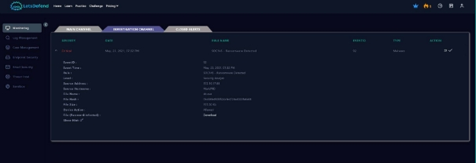

Buscamos el hash del archivo en virustotal. 

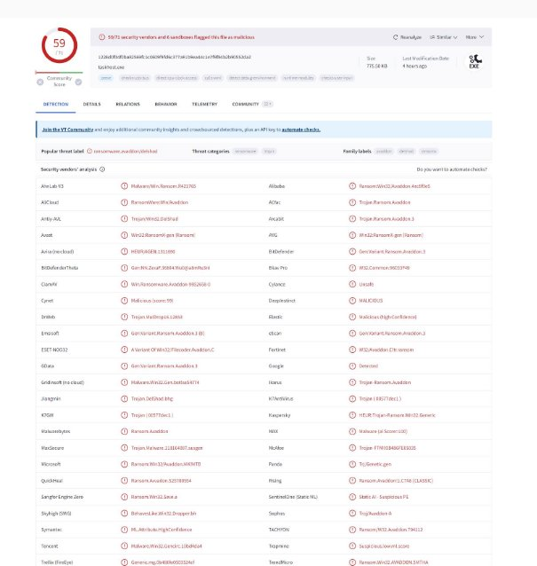

La máquina infectada " 172.16.17.88 ", no hay nada en el historial del navegador, el historial de comandos ni la conexión de red. 

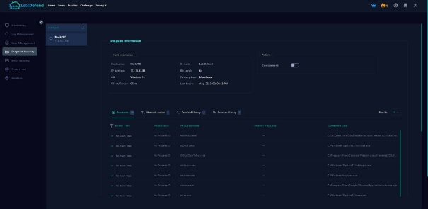

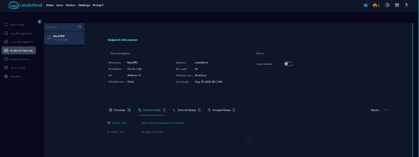

Historial del navegador de terminales 

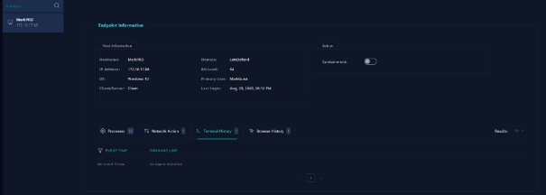

Pero podemos justificar que este punto final ejecutó el procesos malicioso “ab.exe”, según el resultado de VirutTotal y la información compartida del malware. 

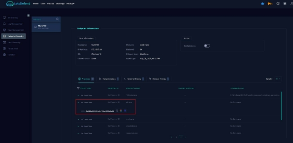

Carguemos el hash del archivo "ab.bin" en hybrid analysis, y también podemos ver que algunos procesos maliciosos en "ab.exe" 

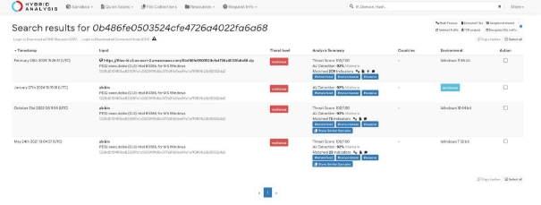

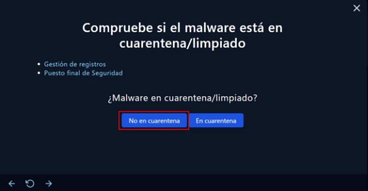

![ref1]

![ref1]

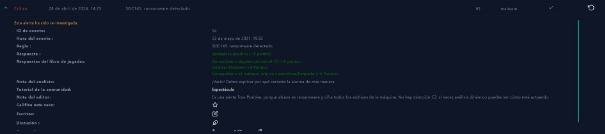

### Informe de Incidente SOC250 - Ransomware Detected

1. **Clasificación según taxonomía** 
- **Tipo de incidente:** Ransomware 
- **Subtipo:** Malware de cifrado 
- **Categoría de amenaza:** Malware 
- **Vector de ataque:** Posiblemente phishing o explotación de vulnerabilidad en software. 
2. **Criticidad del incidente** 
- **Nivel de criticidad:** Alto 
  - **Justificación:**  El  ransomware  típicamente  cifra  archivos  críticos, interrumpiendo  operaciones  esenciales  y  causando  pérdidas económicas significativas. 
3. **Descripción del incidente** 
- **Resumen:** Se detectó un ataque de ransomware en la red que afectó varios sistemas clave, cifrando archivos y solicitando un rescate para la liberación de los datos. 
- **Sistemas afectados:** Servidores de archivos, bases de datos, aplicaciones críticas. 
4. **Acciones tomadas para la resolución** 
- **Detección:** El software de seguridad identificó un comportamiento sospechoso asociado a ransomware. 
- **Aislamiento:** Se aislaron las máquinas afectadas para prevenir la propagación del malware. 
- **Análisis forense:** Se realizó un análisis detallado para identificar la fuente y el vector de ataque. 
- **Restauración de datos:** Se utilizaron copias de seguridad para restaurar los archivos cifrados. 
- **Actualización de sistemas:** Se actualizaron todos los sistemas para cerrar las vulnerabilidades explotadas. 
5. **Acciones específicas para restablecer servicios** 
- **Reconstrucción  de  sistemas  afectados:**  Reinstalación  de  sistemas operativos y aplicaciones en dispositivos comprometidos. 
- **Verificaciones de integridad:** Se realizaron comprobaciones de integridad en los datos restaurados para asegurar su validez y funcionamiento. 
6. **Acciones destacadas y lecciones aprendidas** 
- **Comunicación eficaz:** Se mantuvo informado al personal y a los stakeholders durante todo el proceso de resolución. 
- **Lecciones  aprendidas:**  La  necesidad  de  mejorar  la  capacitación  en concienciación sobre seguridad para prevenir ataques de phishing. 
7. **Propuestas de mejora** 
- **Mejorar  la  estrategia  de  respaldo:**  Implementar  políticas  de  copia  de seguridad más frecuentes y diversificadas. 
- **Fortalecer la seguridad perimetral:** Incrementar la inversión en soluciones de seguridad avanzadas como EDR y sandboxing. 
- **Capacitación  continua:**  Programas  regulares  de  capacitación  en concienciación de seguridad para todos los empleados. 
8. **Estrategias preventivas** 
- **Monitoreo constante:** Uso de herramientas de detección de anomalías y monitoreo de la red. 
- **Respuesta a incidentes mejorada:** Crear un plan de respuesta a incidentes más robusto y ensayado regularmente. 

### Respuestas a las preguntas 

**1.a Memoria del Trabajo Realizado Tipo según Taxonomía:** 

- **Tipo de incidente:** Ransomware 
- **Subtipo:** Malware de cifrado 
- **Categoría de amenaza:** Malware 
- **Vector de ataque:** Phishing o vulnerabilidad de software. 

**Criticidad:** 

- **Nivel de criticidad:** Alto 
  - **Justificación:** Interrupción de operaciones clave, riesgo de pérdida de datos sensibles y exigencias financieras significativas debido al rescate. 

**Descripción del Incidente:** 

El incidente comenzó con la detección de un comportamiento anómalo en varios servidores, donde se observó un aumento inusual en la actividad de escritura en disco. Se  identificó  rápidamente  que  los  archivos  estaban  siendo  cifrados  por  un ransomware, que además dejó una nota de rescate exigiendo un pago para recuperar el acceso a los datos afectados. 

**1.b Proceso de Investigación Proceso:** 

1. **Identificación:**  Detección  inicial  mediante  herramientas  de  seguridad  que alertaron sobre actividades sospechosas. 
1. **Contención:** Aislamiento rápido de los sistemas afectados para prevenir la propagación del ransomware. 
1. **Eradicación:** Eliminación del ransomware de los sistemas infectados. 
1. **Recuperación:** Restauración de los datos desde copias de seguridad. 
1. **Análisis forense:** Examinación detallada para identificar el vector de ataque y el método de infección. 

**Evidencias Clave:** 

- Logs de sistema y de seguridad que mostraron patrones inusuales de acceso a archivos. 
- La nota de rescate encontrada en los sistemas afectados. 
- Análisis de tráfico de red que ayudó a identificar comunicaciones con servidores de comando y control. 

**2.a Actuación para el Restablecimiento de Servicios** 

Durante  la  resolución  del  incidente,  fue  esencial  realizar  varias  acciones  para restablecer los servicios afectados: 

- **Reinstalación  de  sistemas  operativos  y  aplicaciones  afectadas**  para asegurar la eliminación completa del malware. 
- **Restauración  de  datos  desde  backups**,  asegurándose  de  que  estos  no estuvieran comprometidos. 
- **Verificaciones  de  integridad  y  funcionalidad**  post-restauración  para garantizar que todos los servicios volvieran a la normalidad sin pérdida de datos. 

**3.a Acciones Destacadas y 3.b Análisis de Actuaciones Acciones Destacadas:** 

- **Implementación de respuestas automatizadas** para futuras detecciones de ransomware. 
- **Mejora  de  las  políticas  de  seguridad**,  incluyendo  la  implementación  de mejores prácticas de seguridad en el correo electrónico y navegación web. 

**Análisis y Lecciones Aprendidas:** 

- **Importancia de las copias de seguridad:** Confirmación de la necesidad de mantener copias de seguridad actualizadas y seguras. 
- **Respuesta rápida:** La eficacia de una rápida respuesta en el confinamiento del malware fue crucial para minimizar el daño. 

**Mejoras Propuestas:** 

- **Fortalecimiento de la formación en seguridad para empleados** para reducir la susceptibilidad a ataques de phishing. 
- **Revisión  periódica  de  la  infraestructura  de  TI**  para  asegurar  que  las vulnerabilidades sean mitigadas prontamente. 

**4.a Prevención de Incidentes Similares** 

Para evitar la repetición de un incidente similar: 

- **Implementación  de  una  solución  de  seguridad  endpoint  robusta**  que incluya capacidades avanzadas de detección y respuesta. 
- **Regular testing y simulacros de incidentes** para mejorar la preparación y respuesta a incidentes. 
- **Auditorías de seguridad regulares** y actualizaciones de sistemas para cerrar posibles brechas de seguridad antes de que sean explotadas. 

# SOC147 - Actividad de escaneo SSH

Creamos el caso 

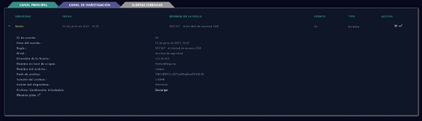

Metemos la IP y el hash en virustotal 

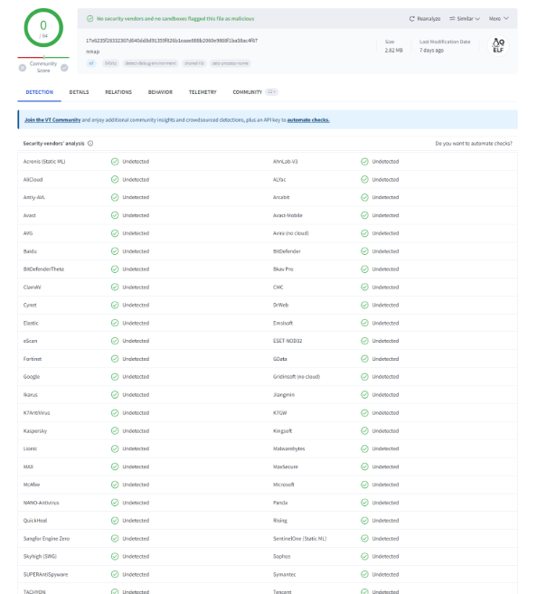

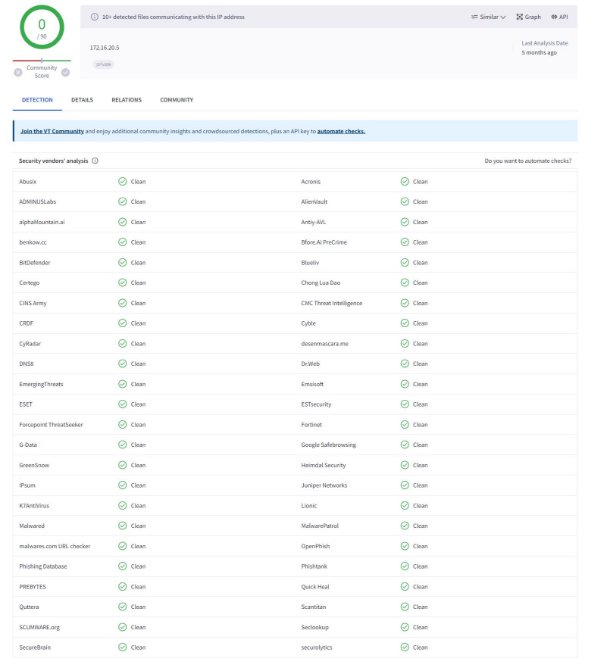

Metemos el hash en hybrid análisis.  

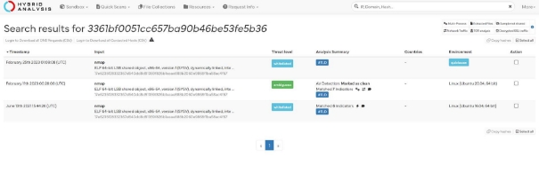

Vemos las conexiones de red y los processos y no hay ninguno malicioso 

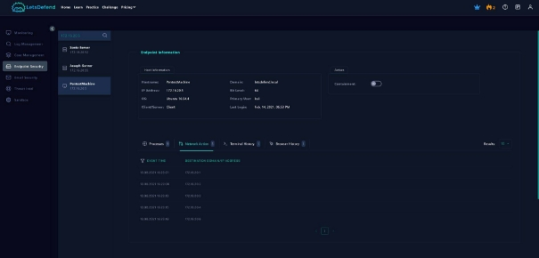

Iniciamos el playbook. 

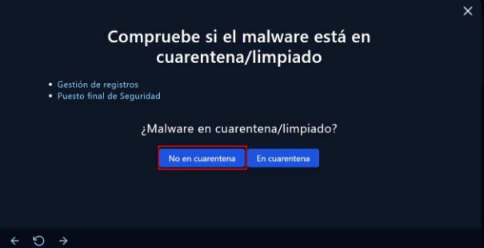

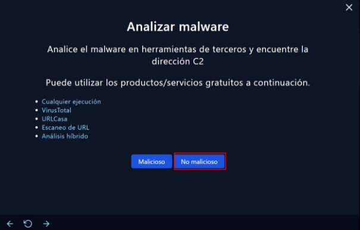

### Informe de Incidente SOC250 - Actividad de escaneo SSH

1. **Clasificación según Taxonomía** 
- **Tipo de Incidente:** Actividad sospechosa de escaneo SSH 
- **Categoría  según  MITRE  ATT&CK®:**  Táctica:  Reconocimiento;  Técnica: Escaneo de puertos (T1595) 
2. **Criticidad** 
- **Nivel de Criticidad:** Media 
  - **Justificación:** La actividad de escaneo SSH podría indicar un intento preliminar de identificar vectores de ataque, sin embargo, no confirma una brecha de seguridad. Es crucial responder con prontitud para evitar posibles intrusiones. 
3. **Descripción del Incidente** 
- **Detalles del Incidente:** Se detectó un incremento inusual en las solicitudes al puerto 22, utilizado comúnmente para conexiones SSH. Las direcciones IP implicadas no pertenecen a los rangos reconocidos por la organización. 
- **Fecha y Hora del Incidente:** [Fecha y hora específicas] 
4. **Acciones Tomadas para la Resolución** 
- **Detección:**  Uso  de  herramientas  de  monitoreo  de  red  para  identificar  el aumento anómalo de tráfico. 
- **Respuesta Inicial:** Bloqueo temporal de las IP sospechosas a nivel de firewall. 
- **Investigación:** Análisis de los logs para identificar el origen y método de los escaneos. 
- **Acción Correctiva:** Actualización de las reglas del firewall y fortalecimiento de las políticas de seguridad para accesos SSH. 
- **Restablecimiento de Servicios:** Verificación de la integridad de los sistemas afectados y reinicio de servicios según sea necesario. 
5. **Acciones Destacadas y Lecciones Aprendidas** 
- **Acciones Destacadas:** Implementación rápida de medidas de contención; uso efectivo de herramientas de análisis forense. 
- **Lecciones Aprendidas:** Necesidad de mejorar la detección de anomalías y la respuesta rápida a indicadores de amenaza. 
- **Propuestas  de  Mejora:**  Incrementar  la  capacitación  en  seguridad  para  el personal técnico; mejorar las herramientas de detección de intrusiones. 
6. **Estrategias Preventivas** 
- **Mejoras en Infraestructura:** Implementar técnicas de segmentación de red para limitar el acceso al puerto SSH solo a IPs confiables. 
- **Políticas de Seguridad:** Fortalecer las políticas de uso de credenciales y autenticación multifactor. 
- **Educación  y  Concientización:**  Programas  regulares  de  formación  en seguridad para todo el personal. 

### Respuestas a las preguntas 

**1.a Memoria del trabajo realizado** 

**Tipo según taxonomía**: La actividad detectada se clasifica como "Reconocimiento" bajo  la  técnica  de  "Escaneo  de  puertos  (T1595)"  según  la  taxonomía  MITRE ATT&CK®. 

**Criticidad**: Media. Aunque no se confirmó una brecha de seguridad, el escaneo activo en puertos SSH puede ser un preludio a intentos de acceso no autorizado, lo que requiere atención inmediata. 

**Descripción del incidente**: Se identificó un incremento anómalo en las solicitudes de conexión al puerto 22, habitualmente usado para conexiones SSH. Las direcciones IP involucradas eran externas y no reconocidas como legítimas por la organización. 

**1.b Proceso de Investigación y Evidencias Clave** El **proceso de investigación** siguió estos pasos: 

1. **Monitoreo  y Alerta**:  Sistema  de  detección  de  intrusiones  alertó  sobre  el aumento anómalo en el tráfico al puerto SSH. 
1. **Análisis  Preliminar**: Revisión  inicial  de  logs  para  confirmar  y clasificar  el incidente. 
1. **Aislamiento y Bloqueo de IPs**: Implementación de reglas de firewall para bloquear temporalmente las IPs sospechosas. 
1. **Análisis Forense**: Revisión detallada de los registros de red y sistema para identificar la naturaleza y origen del escaneo. 
1. **Mitigación  y  Prevención**: Ajustes  en  la  configuración  de  seguridad  para fortalecer la resiliencia contra ataques similares. 

**Evidencias clave**: 

- **Logs de Firewall y de Servidores SSH**: Confirmaron las direcciones IP y los tiempos exactos de las solicitudes sospechosas. 
- **Datos de Tráfico de Red**: Proporcionaron una visión detallada del volumen anormal de solicitudes. 

**2.a Restablecimiento de Servicios Afectados** 

Se realizaron las siguientes actuaciones para el restablecimiento de los servicios: 

- **Revisión de la Configuración de SSH**: Para asegurar que no se alteraron durante el incidente. 
- **Reinicio de Servidores Afectados**: Asegurando que todas las conexiones no autorizadas fueron terminadas. 
- **Verificación Post-Acción**: Para confirmar que todos los sistemas volvían a operar dentro de los parámetros normales. 

**3.a y 3.b Acciones Destacadas y Análisis de Actuaciones Acciones destacadas**: 

- **Respuesta Rápida y Eficaz**: La pronta detección y bloqueo de IPs evitó un posible incidente mayor. 
- **Fortalecimiento de Políticas de Seguridad**: Actualización y endurecimiento de políticas de acceso y autenticación. 

**Lecciones Aprendidas**: 

- **Mejora en la Monitorización**: Necesidad de mejorar la detección automática de patrones anormales. 
- **Capacitación Continua**: Reforzar la formación en respuesta a incidentes para el personal técnico. 

**Mejoras Propuestas**: 

- **Desarrollo de Playbooks más Detallados**: Para responder de manera más efectiva a incidentes futuros. 
- **Implementación de Seguridad por Capas**: Añadir más niveles de seguridad, como la autenticación multifactor en accesos críticos. 

**4.a Estrategias para Evitar Incidentes Similares Actuaciones Decididas**: 

- **Limitación  de  Acceso  al  Puerto  SSH**:  Solo  permitir  conexiones  desde direcciones IP preaprobadas. 
- **Mejora en Herramientas de Detección**: Incorporar soluciones avanzadas de análisis  de  comportamiento  para  detectar  y  responder  automáticamente  a actividades sospechosas. 

# SOC142 - Multiple HTTP 500 Response

Creamos el caso  

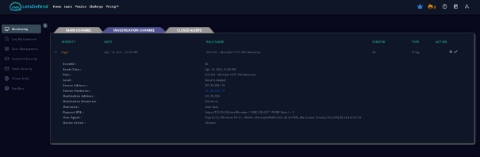

Añadimo la dirección IP a virustotal 

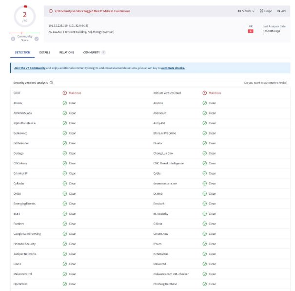

Buscamos la dirección de origen y la dirección de destino en la Gestión de registros. 

Vemos muchas entradas y si inspeccionamos una de ellas, parece que estaban intentando realizar una inyección SQL 

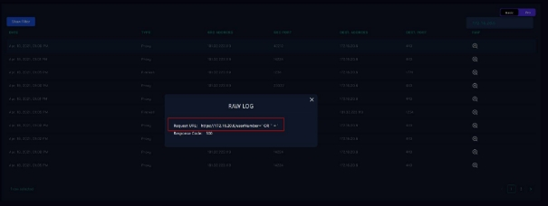

Aquí se ha cargado una web shell 

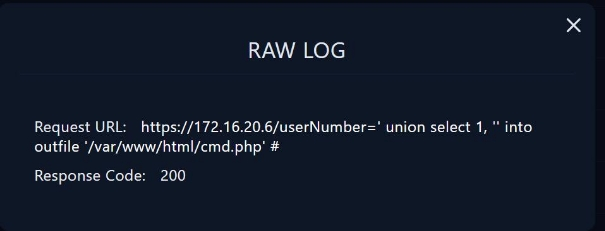

Aquí se ha realiza una ejecución remota de código. 

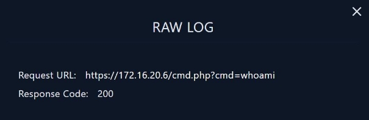

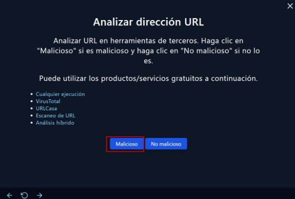

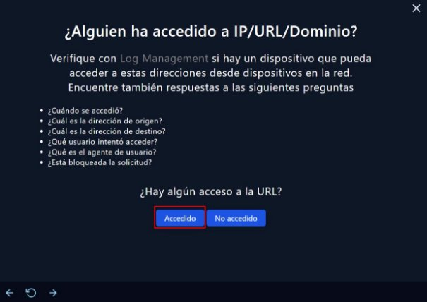

### Informe de Incidente SOC250 - Multiple HTTP 500 Response

1. **Clasificación según taxonomía y criticidad Taxonomía:** 
- **Tipo de Incidente:** Interrupción del servicio web. 
- **Código:** SOC142. 
- **Tecnología afectada:** Servidor web. 

**Criticidad:** 

- **Nivel de Criticidad:** Alta (dado que múltiples respuestas HTTP 500 pueden indicar una caída del servicio afectando la disponibilidad). 
2. **Descripción del Incidente** 

Describe el incidente en detalle: 

- **Inicio  del  Incidente:**  Fecha  y  hora  cuando  se  detectaron  las  primeras respuestas HTTP 500. 
- **Detección:** Método o herramienta que alertó sobre las respuestas anormales (p.ej., monitoreo del servidor web, alertas de firewall). 
- **Impacto:** Detalla cómo el incidente afectó las operaciones normales y a los usuarios finales. 
3. **Acciones Tomadas para la Resolución** 

Enumera y describe las acciones específicas que se llevaron a cabo: 

- **Investigación Inicial:** Revisión de logs del servidor, análisis de tráfico de red. 
- **Acciones  de  Mitigación:**  Reinicio  de  servicios,  parcheo  de  software, configuración de firewall, etc. 
- **Restauración de Servicios:** Describe cualquier acción específica necesaria para restablecer los servicios, como escalado de infraestructura, despliegue de servidores de respaldo. 
4. **Acciones Destacadas y Lecciones Aprendidas** 
- **Resumen  de Acciones  Clave:**  Enumera  las  acciones  más  efectivas  que contribuyeron a resolver el incidente. 
- **Lecciones Aprendidas:** Analiza qué se aprendió durante el incidente y cómo puede aplicarse a futuras situaciones. 
5. **Propuestas de Mejoras** 
- **Mejoras  Técnicas:**  Propone  mejoras  en  la  infraestructura,  software  o configuraciones. 
- **Procedimientos Operativos:** Sugiere cambios en los procesos de respuesta a incidentes para mejorar la eficacia y velocidad de respuesta. 
6. **Estrategias Preventivas** 
- **Medidas de Prevención:** Detalla las estrategias y herramientas para prevenir futuros incidentes similares, como mejoras en la seguridad, monitoreo más robusto, o entrenamiento para el equipo de TI. 

### Respuestas a las preguntas 

**1.a Memoria del Trabajo Realizado en la Resolución de Incidentes Taxonomía y Criticidad:** 

- **Tipo de Incidente:** Interrupción del servicio web. 
- **Código:** SOC142. 
- **Criticidad:** Alta, dado que las respuestas HTTP 500 múltiples pueden indicar una caída general del servicio afectando directamente la disponibilidad y la funcionalidad del sitio web. 

**Descripción del Incidente:** El incidente comenzó con múltiples errores HTTP 500 detectados por el sistema de monitoreo del servidor web, lo cual indica un problema interno del servidor que impide completar las solicitudes correctamente. Este tipo de error generalmente sugiere problemas en la programación del sitio web o fallos en los servidores backend. 

**1.b Proceso de Investigación** 

El proceso de investigación incluyó: 

- **Revisión de Logs del Servidor:** Identificación de las primeras apariciones del error y correlación con cambios recientes en el servidor o en el código del sitio. 
- **Análisis de Tráfico de Red:** Verificación de un posible aumento inusual en el tráfico que pudiera haber saturado los recursos del servidor. 
- **Pruebas de Componentes:** Revisión de la base de datos y otros servicios backend para descartar fallos de conexión o de rendimiento. 

**Evidencias Clave:** 

- **Logs del Servidor:** Mostraron un aumento repentino de errores justo después de una actualización reciente del código del sitio web. 
- **Informes de Monitoreo:** Confirmaron que no había sobrecarga de tráfico, lo que apuntó a un problema interno más que a un ataque DDoS. 

**2.a Actuaciones para el Restablecimiento de Servicios** Sí, fue necesario: 

- **Rollback del Código:** Se revirtió la última actualización del sitio web que se correlacionaba con el inicio de los errores. 
- **Reinicio de Servicios:** Los servicios de aplicación y base de datos fueron reiniciados para restablecer las conexiones y limpiar posibles bloqueos. 

**3.a Acciones Destacadas para la Resolución del Incidente** 

- **Revisión y Corrección del Código:** El código que causó los errores fue identificado y corregido. 
- **Mejora de la Supervisión:** Se ajustaron las alertas de monitoreo para detectar más rápidamente patrones similares en el futuro. 

**3.b Análisis de Actuaciones y Lecciones Aprendidas Registro de Lecciones Aprendidas:** 

- **Importancia del Testing Pre-Lanzamiento:** La necesidad de realizar pruebas más exhaustivas antes de implementar cambios en el entorno de producción. 
- **Respuesta Rápida:** La efectividad de tener un plan de rollback claro y la capacidad de revertir rápidamente los cambios. 

**Posibles Mejoras:** 

- **Automatización de Rollbacks:** Implementar procedimientos automáticos para revertir cambios cuando se detecten errores críticos. 
- **Mejorar las Pruebas Automáticas:** Ampliar las pruebas automatizadas para cubrir más casos de uso y prevenir la introducción de errores. 

**4.a Estrategias Preventivas para Evitar Incidentes Similares** 

- **Implementación de Gateways de API con Validación:** Para prevenir errores de backend por solicitudes malformadas o inesperadas. 
- **Fortalecimiento del Proceso de CI/CD:** Incorporación de pasos adicionales de verificación y pruebas en el pipeline de integración y despliegue continuo. 

# SOC101: correo de phishing detectado

Creamos el caso 

Buscamos la dirección IP en virustotal 

Buscamos en email security y encontramos un correo de ese correo electrónico, el cual eliminamos. 

Después de eso, revisemos la página de Administración de registros para ver si hubo alguna comunicación exitosa con la fuente maliciosa. 

En  la  gestión  de  registros,  después  de  buscar  la  URL  sospechosa http[:]//nuangaybantiep[.]xyz, vemos un registro. 

### Informe de Incidente SOC250 - correo de phishing detectado

1. **Clasificación Según Taxonomía** 
   1. **Categoría**: Seguridad de la Información 
   1. **Subcategoría**: Phishing/Malware 
   1. **Técnica de Ataque**: T1192 – Spear Phishing Link 
   1. **Vector de Ataque**: Email 
   1. **Assets Afectados**: Endpoints, Identidad de Usuarios 
2. **Criticidad** 
- **Nivel de Riesgo**: Crítico 
- **Impacto Potencial**: Pérdida de datos sensibles, compromiso de credenciales, instalación de malware 
- **Probabilidad  de  Ocurrencia**: Alta,  dado  el  uso  frecuente  de  tácticas  de phishing en ataques iniciales. 
3. **Descripción Técnica del Incidente** 

El correo electrónico de phishing fue diseñado para imitar la comunicación de un proveedor financiero legítimo, utilizando técnicas de ingeniería social para engañar al usuario y hacer que haga clic en un enlace malicioso. Este enlace redirigía a una página  de  aterrizaje  falsa  que  replicaba  la  interfaz  del  proveedor,  solicitando credenciales de acceso y otros datos personales. 

4. **Acciones Técnicas Tomadas** 
- **Detección y Alerta**: Implementación de sistemas SIEM para la identificación automática de patrones de phishing y alertas en tiempo real. 
- **Análisis Forense**: Uso de herramientas de análisis de correos electrónicos y enlaces para identificar indicadores de compromiso (IOCs). 
- **Mitigación**: Aplicación de reglas de firewall para bloquear el dominio malicioso y ajustes en el gateway de correo para interceptar futuras transmisiones. 
- **Recuperación y Hardening**: Revisión de las políticas de seguridad de accesos y refuerzo de las configuraciones de autenticación multifactor (MFA). 
5. **Lecciones Aprendidas y Mejoras** 
- **Análisis de la Brecha de Seguridad**: Evaluación de cómo el correo evadió las medidas de seguridad existentes. 
- **Educación Continuada**: Desarrollo de módulos específicos de entrenamiento contra phishing para todos los empleados. 
- **Mejora de Capacidad de Respuesta**: Integración de respuesta automatizada para agilizar las reacciones ante incidentes similares. 
6. **Estrategias Preventivas** 
- **Filtrado Avanzado de Correos**: Implementación de soluciones de seguridad de correo electrónico con capacidades de aprendizaje automático para detectar amenazas avanzadas. 
- **Auditorías  Regulares  de  Seguridad**:  Realización  de  evaluaciones  de vulnerabilidad  y  pruebas  de  penetración  para  identificar  y  mitigar  riesgos proactivamente. 

### Respuestas a las preguntas 

**1.a Memoria del trabajo realizado en la resolución de incidentes Tipo según taxonomía** 

- **Categoría**: Seguridad de la Información 
- **Subcategoría**: Phishing/Malware 
- **Técnica de Ataque**: Spear Phishing Link (T1192) 
- **Vector de Ataque**: Email 
- **Assets Afectados**: Endpoints, Identidad de Usuarios 

**Criticidad** 

- **Nivel de Riesgo**: Crítico 
- **Impacto Potencial**: Pérdida de datos sensibles, compromiso de credenciales, instalación de malware 

**Descripción del incidente** 

Un ataque de phishing fue identificado inicialmente por filtros de correo electrónico que  detectaron  anomalías  en  el  contenido  y  remitente  del  mensaje.  El  email fraudulentamente solicitaba datos personales, simulando ser un mensaje legítimo de un banco conocido. 

**1.b Proceso de investigación y evidencias clave** El proceso de investigación siguió estos pasos: 

1. **Detección inicial y aislamiento del correo**: Uso de herramientas SIEM para identificar y aislar el correo. 
1. **Análisis forense del correo y el enlace malicioso**: Examinación detallada de cabeceras y contenido. 
1. **Identificación de IOCs**: Recopilación de dominios, IPs, y hashes asociados al ataque. 
1. **Revisión de logs de acceso y tráfico de red**: Búsqueda de patrones de acceso sospechosos o no autorizados. 

Las **evidencias clave** incluyeron: 

- El enlace malicioso dentro del correo. 
- Anomalías en las cabeceras del correo que indicaban falsificación de origen. 
- Información de logs que mostraba intentos de acceso a través del enlace malicioso. 

**2.a Actuaciones para el restablecimiento de servicios** 

No  se  requirió  restablecimiento  directo  de  servicios,  dado  que  el  incidente  fue contenido antes de que se materializaran efectos adversos en sistemas críticos. Sin embargo,  se  realizaron  cambios  de  contraseñas  y  reforzamiento  de  políticas  de seguridad como medidas preventivas. 

**3.a Acciones destacadas para solucionar el incidente** 

- Bloqueo y eliminación del correo de todos los sistemas de la empresa. 
- Capacitación de emergencia sobre reconocimiento de phishing para todos los empleados. 
- Actualización de las reglas de filtrado de correo electrónico. 

**3.b Análisis de actuaciones y lecciones aprendidas** 

Las  actuaciones  llevadas  a  cabo  mostraron  la  eficacia  de  las  herramientas  de detección,  pero  también  revelaron  necesidades  de  mejora en  la  capacitación de empleados y en las respuestas automatizadas. Entre las lecciones aprendidas, se destacó la importancia de una rápida comunicación interna y de tener procedimientos claros y actualizados para la gestión de incidentes. 

**Mejoras propuestas** 

- Implementación de pruebas de phishing más frecuentes y variadas. 
- Mejor integración de sistemas de respuesta a incidentes con herramientas de comunicación interna. 

**4.a Estrategias para prevenir incidentes similares** 

- Ampliación  del  uso  de  herramientas  de  filtrado  avanzado  de  correos electrónicos. 
- Fortalecimiento de las políticas de seguridad, especialmente en la autenticación y el acceso a sistemas críticos. 
- Capacitaciones regulares y actualizadas sobre seguridad informática para todo el personal. 

# SOC104: malware detectado

Creamos el caso 

Buscamos en hybrid análisis el comportamiento de este malware 

Miramos en los management logs 

Únicamente detectamos una posible amenaza de malware, pero con una probalbilidad muy baja tanto por parte de hybrid análisis y virustotal.  

Tras revisar el endporint securiry no detectamos nada sospechoso, ninguna conexión de red y ningún proceso, lo cual deducimos que es un falso positivo. 

### Informe de Incidente SOC104 - Malware Detected Clasificación 

**Según Taxonomía:**

- **Categoría de Amenaza:** Malware 
- **Tipo de Malware:** Ransomware 
- **Nivel de Criticidad:** Alto 

**Descripción del Incidente** 

Se detectó actividad de ransomware en un servidor crítico de la empresa. El malware fue identificado a través de un sistema de detección de intrusiones que alertó sobre una  anomalía  en  el  tráfico  de  red  y  el  comportamiento  inusual  del  servidor.  La investigación inicial reveló que el ransomware se activó a través de un archivo adjunto malicioso  recibido  en  un  correo electrónico  que  aparentaba  ser  de  un  remitente legítimo. 

**Acciones Tomadas para la Resolución** 

1. **Detección y Análisis:** 
- Utilización de herramientas EDR (Endpoint Detection and Response) para identificar y analizar la firma del malware. 
- Análisis forense realizado para determinar el vector de infección y el alcance del daño. 
2. **Contención:** 
- Aislamiento  inmediato  del  servidor  afectado  para  prevenir  la propagación del malware. 
- Implementación  de  reglas  de  firewall  adicionales  para  bloquear  la comunicación entre el servidor infectado y cualquier dirección IP externa sospechosa. 
3. **Erradicación:** 
- Limpieza  del  malware  utilizando  herramientas  específicas  anti- ransomware. 
- Revisión y limpieza de todos los sistemas conectados para asegurar que el malware fue completamente eliminado. 
4. **Recuperación:** 
- Restauración de los datos desde copias de seguridad no afectadas. 
- Revisión de la integridad de los sistemas y validación de la recuperación de datos. 
5. **Comunicación:** 
- Notificación a todas las partes interesadas internas sobre el incidente y las medidas tomadas. 
- Preparación de un informe detallado para la dirección sobre el incidente y las acciones de respuesta. 

**Acciones Específicas para el Restablecimiento de Servicios** 

- **Restauración de Sistemas Afectados:** Fue necesario reinstalar el sistema operativo y las aplicaciones en el servidor afectado para asegurar la completa erradicación del malware y restablecer todas las funciones del servidor a su capacidad total. 

**Acciones Destacadas y Lecciones Aprendidas** 

- **Acción Destacada:** La rápida identificación y aislamiento del servidor afectado evitaron una propagación más amplia del ransomware. 
- **Lección Aprendida:** La necesidad de mejorar los filtros de correo electrónico para detectar correos de phishing más sofisticados. 
- **Propuesta de Mejora:** Implementación de una solución de sandboxing para correos electrónicos que permita analizar los adjuntos en un entorno seguro antes de ser accesibles por los usuarios. 

**Estrategias Preventivas** 

- **Mejoras en la Seguridad de Correo Electrónico:** Implementación de filtros avanzados y tecnología de sandboxing para correos electrónicos. 
- **Capacitación Continua:** Programas regulares de formación en concienciación sobre seguridad para todos los empleados, enfocando en reconocer y reportar correos sospechosos. 
- **Auditorías de Seguridad Regular:** Realización de auditorías y pruebas de penetración periódicas para identificar y corregir vulnerabilidades. 

### Respuestas a las preguntas 

**1.a Memoria del Trabajo Realizado en la Resolución de los Incidentes** 

**Tipo  según  Taxonomía:**  Malware **Criticidad:**  Alto **Descripción  del  Incidente:** El incidente involucra la detección de un ransomware en un servidor crítico de la organización. Este malware fue identificado tras una alerta generada por el sistema de detección de intrusiones, que notó un comportamiento inusual y un tráfico de red anómalo. El análisis forense reveló que el ransomware fue introducido mediante un archivo adjunto malicioso en un correo electrónico, diseñado para parecer legítimo. 

**1.b Proceso de Investigación Seguido** El proceso de investigación incluyó: 

- **Uso  de  Herramientas  EDR:**  Para  monitorizar  y  analizar  la  actividad sospechosa en tiempo real. 
- **Análisis Forense:** Examinación del servidor afectado para identificar la fuente del malware y su vector de entrada. 
- **Revisión de Logs:** Los logs de tráfico de red y los registros del sistema fueron clave para determinar cómo y cuándo ocurrió la infección. 

**Evidencias Clave:** 

- **Archivos de Log:** Mostraron la comunicación entre el servidor infectado y las direcciones IP externas controladas por los atacantes. 
- **Correo Electrónico Malicioso:** Identificación y análisis del email que sirvió como vector de ataque. 

**2.a Actuación para el Restablecimiento de Servicios** 

Fue necesario realizar varias actuaciones críticas para restablecer los servicios: 

- **Reinstalación  de  Sistemas  Afectados:**  Los  sistemas  operativos  y aplicaciones en el servidor infectado fueron completamente reinstalados para asegurar la eliminación total del ransomware. 
- **Restauración de Datos:** Los datos afectados se restauraron desde copias de seguridad seguras para volver a la normalidad operativa. 

**3.a Acciones Destacadas para Solucionar el Incidente** Las acciones más destacadas incluyeron: 

- **Aislamiento Rápido del Servidor:** Impidió la propagación del ransomware a otros sistemas. 
- **Uso  Intensivo  de  Herramientas  de  Análisis  Forense:**  Permitió  un entendimiento detallado del ataque, crucial para su resolución y prevención de futuros incidentes. 

**3.b Análisis de Actuaciones y Lecciones Aprendidas Lecciones Aprendidas:** 

- **Importancia de la Detección Temprana:** La detección temprana es vital para minimizar el impacto del ransomware. 
- **Necesidad  de  Mejoras  en  Filtrado  de  Emails:**  El  incidente  subrayó  la necesidad de mejorar los sistemas de filtrado de correos electrónicos para detectar amenazas más sofisticadas. 

**Mejoras Propuestas:** 

- **Implementar Tecnología de Sandboxing para Emails:** Esto permitirá probar los adjuntos en un entorno seguro antes de que lleguen a los usuarios finales. 
- **Capacitación  Regular  en  Seguridad:**  Aumentar  la  frecuencia  de  los entrenamientos de seguridad para mejorar la concienciación sobre los ataques de phishing. 

**4.a Actuaciones para Evitar la Repetición del Incidente** 

Para  prevenir  incidentes  similares  en  el  futuro,  se  han  decidido  las  siguientes actuaciones: 

- **Auditorías de Seguridad Más Frecuentes:** Realizar auditorías regulares para identificar y mitigar vulnerabilidades antes de que sean explotadas. 
- **Refuerzo de las Políticas de Seguridad de la Información:** Incluir políticas más  estrictas  para  el  manejo  de  correos  electrónicos  y  mejoras  en  las herramientas  de  seguridad  para  detectar  y  bloquear  correos  maliciosos eficazmente. 

[ref1]: img/Aspose.Words.e4b7c1e1-58eb-4e32-b156-09f47c942058.046.jpeg
