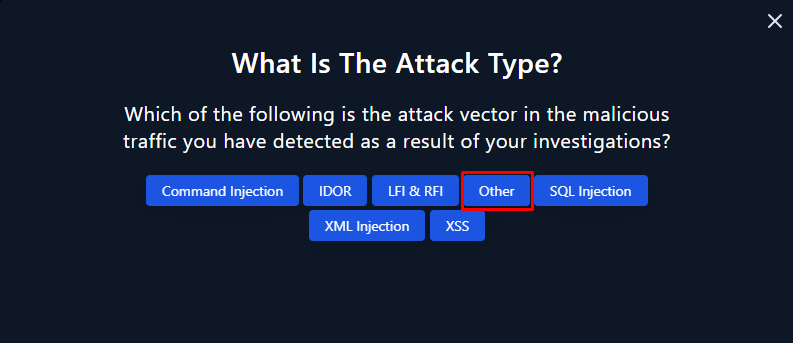
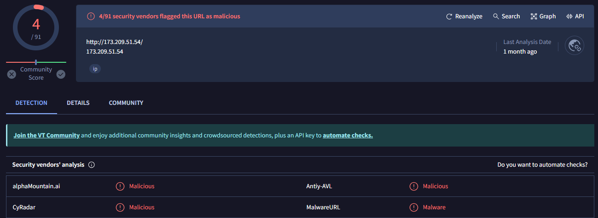
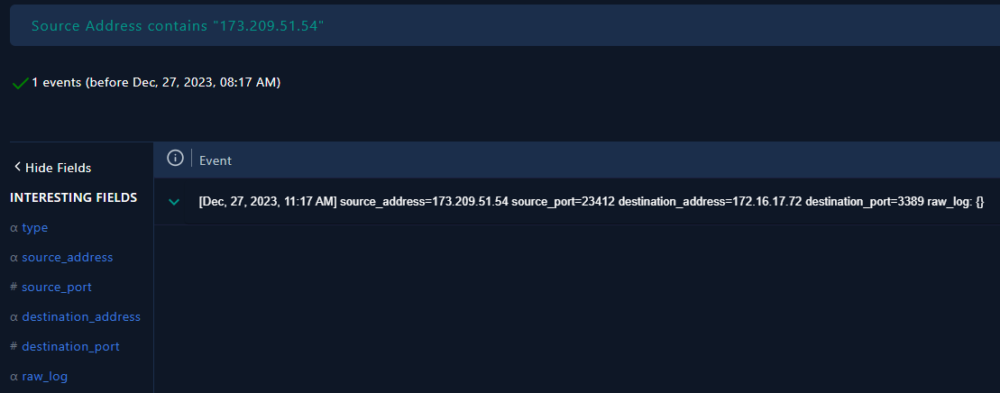
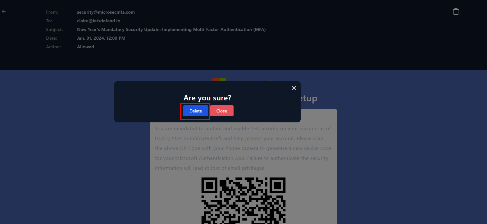
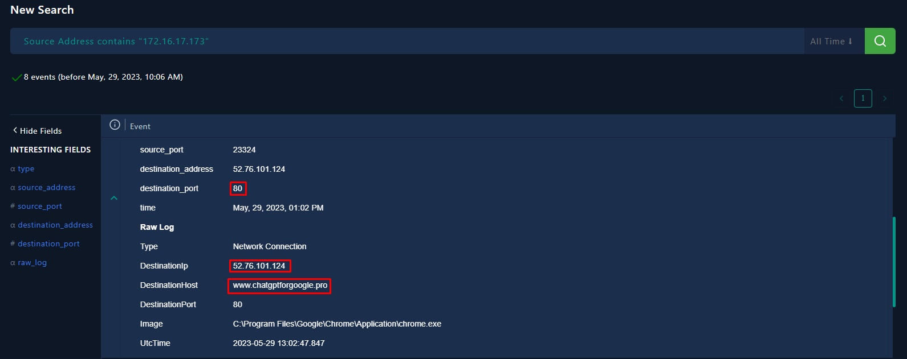
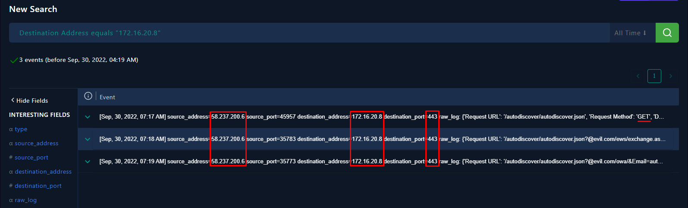

# Respuesta y seguimiento de incidentes

**Alumno:** Juan Manuel Cumbrera López  
**Curso:** CIBER  

## Índice

- [SOC176 - RDP Brute Force Detected](#soc176---rdp-brute-force-detected)
- [SOC168 - Whoami Command Detected in Request Body](#soc168---whoami-command-detected-in-request-body)
- [SOC227 - Microsoft SharePoint Server Elevation of Privilege](#soc227---microsoft-sharepoint-server-elevation-of-privilege---possible-cve-2023-29357-exploitation)
- [SOC250 - APT35 HyperScrape Data Exfiltration Tool Detected](#soc250---apt35-hyperscrape-data-exfiltration-tool-detected)
- [SOC251 - Quishing Detected](#soc251---quishing-detected-qr-code-phishing)
- [SOC239 - Remote Code Execution Detected in Splunk Enterprise](#soc239---remote-code-execution-detected-in-splunk-enterprise)
- [SOC274 - Palo Alto Networks PAN-OS Command Injection Vulnerability Exploitation](#soc274---palo-alto-networks-pan-os-command-injection-vulnerability-exploitation-cve-2024-3400)
- [SOC173 - Follina 0-Day Detected](#soc173---follina-0-day-detected)
- [SOC202 - FakeGPT Malicious Chrome Extension](#soc202---fakegpt-malicious-chrome-extension)
- [SOC175 - PowerShell Found in Requested URL](#soc175---powershell-found-in-requested-url---possible-cve-2022-41082-exploitation)

## Incidentes

### SOC176 - RDP Brute Force Detected

**1.a** Trabaja una memoria del trabajo realizado en la resolución de los incidentes. Tipo según taxonomía, Criticidad, Descripción del incidente para entender que ha sucedido. Utiliza imágenes y cualquier tipo de explicación y diagrama que permita aclarar tu trabajo. 

El informe de alerta destacó la detección de ataque web sospechoso dirigido contra el host "Matthew", con la IP 172.16.17.148. Los intentos de inicio de sesión registrados apuntan al puerto 3389, que corresponde al servicio RDP (Remote Desktop Protocol). El Indicador de Compromiso (IOC) sólo es detectado en las actividades de red del host antes mencionado.

El incidente fue desencadenado por la regla SOC176 para Detección de fuerza bruta RDP, que resalta errores repetidos de inicio de sesión desde la IP externa 218.92.0.56. Tras investigar la IP sospechosa, se descubrió que tenía un origen malicioso según múltiples plataformas. Además, 15 registros del firewall registraron intentos de conectarse al host "Matthew" sobre el servicio RDP, lo que sugiere un esfuerzo concertado para obtener acceso no autorizado.

Según la taxonomía de incidentes, este puede ser clasificado como un intento de intrusión, más concretamente como un intento de acceso con vulneración de credenciales, categoría en la que caen los ataques de fuerza bruta. Además, según el sistema, la severidad del incidente es de nivel medio.

**1.b** ¿Cuál es el proceso de investigación seguido para investigar el incidente y que evidencias han sido clave para la resolución del incidente? 

Tras observar 15 logs del firewall que muestran la dirección externa 218.92.0.56 tratando de conectarse a la máquina del host "Matthew". Razonamos que con toda seguridad, nos hallábamos ante un ataque de fuerza bruta con la intención de acceder ilegítimamente al host ya mencionado a través del puerto 3389 (RDP). Esta información la filtramos 

Después vemos que el ataque es dirigido contra sólo un host, que como ya ha sido mencionado, era la IP 172.16.17.148, que corresponde al usuario "Matthew".

Si buscamos la IP del host "Matthew" en la sección de seguridad de puntos finales (*Endpoints*), veremos que el 7 de marzo a las 11:44AM se observaron numerosos eventos de logon fallidos. En estos intentos se usaron los nombres de usuario "sysadmin", "admin" o "guest".

Finalmente, después de múltiples intentos fallidos de inicio de sesión, el atacante logra acceder exitosamente al host usando el nombre de usuario "Matthew". Esto lo averiguamos a través de la sección de seguridad de puntos finales, donde notamos que el 7 de marzo de 2024 a las 11:44:57 se ejecutó el proceso Winlogon.exe, que corresponde al evento 4624 de inicio de sesión exitoso. 

Tras acceder al sistema, el atacante ejecutó los siguientes comandos:

- "C:\Windows\system32\cmd.exe"
- whoami
- net user letsdefend
- net localgroup administrators
- netstat -ano

La ejecución de estos comandos indica que el atacante trató de obtener información sobre el sistema, los usuarios y las conexiones de red.

**2.a** Durante la resolución del incidente ¿has tenido que realizar algún tipo de actuación para el restableciciomiento de servicios afectados por el incidente, con el objetivo de volver a la normalidad?

A fin de frenar la obtención de información del host y del sistema por parte del atacante, se aisló al host a través de la sección de seguridad de endpoints.

Esto nos permite restablecer la contraseña del host y devolver la normalidad a su máquina, al mismo tiempo que nos cercioramos que el atacante pierda el acceso a la misma.

**3.a** Tras trabajar en la resolución del incidente ¿Que acciones/actuaciones destacadas se han realizado para solucionar el incidente? 

Hemos considerado una plétora de acciones de remediación, que persiguen el fin de maximizar la seguridad a futuro frente a otro posible ataque de esta naturaleza:

- Aplicar políticas de contraseñas seguras, incluido el uso de contraseñas complejas y cambios regulares de contraseña, para mitigar el riesgo de ataques de fuerza bruta.
- Implementar autentificación multifactor (MFA) para una capa adicional de seguridad.
- Restringir el acceso desde la red externa a las instancias de los servidores y de la máquina de Matthew, accesibles a través de Internet pública, hasta que se puedan realizar las actualizaciones necesarias.
- Configurar una VPN para proporcionar acceso remoto seguro a la red. Una VPN cifraría los datos transmitidos entre dispositivos remotos y la red, reduciendo el riesgo de interceptación o acceso no autorizado.
- Aislar la máquina comprometida de la red para evitar que el atacante acceder a otros recursos y sistemas dentro de la organización.

**3.b** Realizar un proceso de análisis de las actuaciones llevadas a cabo y obtener un registro de lecciones aprendidas, para finalmente concluir en las posibles mejoras que podrías plantear para tu plan/playbooks desarrollado en la práctica anterior.

Siguiendo la cronología de los eventos acaecidos a lo largo del transcurso del incidente, observamos una actuación práctica y directa, que busca pistas que puedan arrojar algo de luz sobre la naturaleza, la autoría y el objetivo del ataque. 

Para analizar, investigar y dar solución al incidente en proceso, hemos rastreado la IP sospechosa así como su objetivo, que resultó ser el host "Matthew". Revisando los logs, notamos numerosos intentos fallidos de inicio de sesión, seguidos de un logon exitoso, tras el cual el atacante procede a recopilar información del sistema a través de una serie de comandos. Para remediar esto, aislamos de forma efectiva e inmediata la máquina del usuario "Matthew".

Habiendo encontrado el origen del incidente y su objetivo, hemos podido aprender una serie de lecciones:

- Disponer de sistemas de monitorización y alerta es esencial para detectar y responder rápidamente a actividades sospechosas.
- El seguimiento de indicadores específicos de compromiso (IOC) ayuda a detectar posibles amenazas a la seguridad, pero deberían complementarse con un análisis en profundidad. 
- La respuesta rápida a los incidentes de seguridad es fundamental para minimizar el impacto del incidente.
- Educar a los usuarios y administradores sobre los vectores de ataque comunes, como los ataques de fuerza bruta, ayuda a mitigar los riesgos asociados con los intentos de acceso no autorizados.
- Habilitar y recopilar registros de los sistemas operativos puede mejorar significativamente la visibilidad de la situación de seguridad de su red.

**4.a** Seguro que en el proceso de análisis para obtener un registro de lecciones aprendidas anterior, has pensado como evitar que una situación similar se vuelva a repetir. ¿Que actuaciones has decidido para evitar que se pueda dar una situación similar?

Después de interiorizar lo aprendido en el transcurso del incidente, se han establecido una serie de acciones de remediación, que buscan evitar que un incidente de esta naturaleza se repita. Entre esas acciones encontramos el uso de contraseñas seguras, cambio regular de contraseñas, uso de aplicaciones de autentificación multifactor, restringir el acceso desde la red externa o implementar una VPN para poder acceder de forma segura a la red.

 

### SOC168 - Whoami Command Detected in Request Body

**1.a** Trabaja una memoria del trabajo realizado en la resolución de los incidentes. Tipo según taxonomía, Criticidad, Descripción del incidente para entender que ha sucedido. Utiliza imágenes y cualquier tipo de explicación y diagrama que permita aclarar tu trabajo. 

El informe de alerta destacó la presencia del comando "whoami" en el cuerpo de las solicitudes, de modo que determinamos si se activó correctamente. Accedemos a la página de gestión de logs, donde filtramos por la IP de destino y por la palabra "whoami" en la sección "raw log", y encontramos que el atacante envió el comando whoami desde la IP externa 61.177.172.87.

Si buscamos la IP de origen en la página [VirusTotal](https://www.virustotal.com/), veremos que la cataloga como maliciosa.

Además, sabemos que no nos hallamos ante un falso positivo, dado que si accedemos a la sección Email Security, y filtramos por la IP del servidor web (172.16.17.16), no veremos ningún correo avisando de una hipotética prueba de pentesting.

Sabiendo esto, revisamos el historial de comandos del servidor WebServer1004, en la sección Endpoint Security, donde confirmamos que el ataque tuvo éxito. Esto se demuestra debido a los comandos ejecutados por el atacante en el susodicho servidor.

Según la taxonomía de incidentes, este incidente puede ser clasificado como un intento de intrusión, y esto es debido a que si bien la obtención de información podría ser un subproducto de un intento de intrusión, en este caso, la acción principal parece estar dirigida hacia la ejecución de comandos en el sistema objetivo. Además, según el sistema, la severidad del incidente es de nivel alto.

**1.b** ¿Cuál es el proceso de investigación seguido para investigar el incidente y que evidencias han sido clave para la resolución del incidente? 

Comenzamos analizando los logs, donde vemos que el servidor web con la IP 172.16.17.16 ha recibido varias peticiones POST desde la IP externa maliciosa 61.177.172.87. Estas peticiones contienen comandos del sistema operativo. Entonces, hemos analizado la bandeja de correo electrónico del servidor, que está vacía, por lo cual podemos descartar una simulación de ataque o pentesting. Luego, si accedemos al apartado Endpoint Security y clicamos sobre el servidor WebServer1004, en las secciones Processes y Terminal History, vemos los comandos ejecutados en la máquina. Para finalizar el caso, aislamos el servidor hasta poder revertir el acceso malicioso al mismo.

**2.a** Durante la resolución del incidente ¿has tenido que realizar algún tipo de actuación para el restableciciomiento de servicios afectados por el incidente, con el objetivo de volver a la normalidad?

Para lograr frenar la obtención de información del host y del sistema por parte del atacante, además de la ejecución remota de comandos, se aisló al servidor a través de la sección Endpoint Security.

**3.a** Tras trabajar en la resolución del incidente ¿Que acciones/actuaciones destacadas se han realizado para solucionar el incidente? 

- Búsqueda del comando whoami en la máquina objetivo, que resultó ser el servidor web WebServer1004
- Análisis de la IP maliciosa 61.177.172.87, que fue catalogada como tal por la página VirusTotal
- Revisión de los procesos en ejecución y los comandos ejecutados en el servidor web WebServer1004
- Aislamiento del servidor, a fin de prevenir más ataques de la misma naturaleza

**3.b** Realizar un proceso de análisis de las actuaciones llevadas a cabo y obtener un registro de lecciones aprendidas, para finalmente concluir en las posibles mejoras que podrías plantear para tu plan/playbooks desarrollado en la práctica anterior.

- Se ha destacado la importancia de tener un sistema de detección y respuesta a incidentes bien establecido para identificar y responder rápidamente a amenazas.
- La colaboración entre diferentes equipos, incluidos el equipo de seguridad de la información, el equipo de operaciones de red y el equipo de sistemas, fue crucial para una resolución efectiva del incidente.
- Se ha resaltado la necesidad de realizar un seguimiento y análisis exhaustivo de los registros de actividad para comprender completamente la naturaleza del incidente y tomar medidas adecuadas.
- Se ha identificado la importancia de mantener actualizados los sistemas y aplicar parches de seguridad de manera regular para mitigar riesgos de seguridad conocidos.

**4.a** Seguro que en el proceso de análisis para obtener un registro de lecciones aprendidas anterior, has pensado como evitar que una situación similar se vuelva a repetir. ¿Que actuaciones has decidido para evitar que se pueda dar una situación similar?

- Restringir el uso de comandos del sistema operativo en peticiones POST, lo que cortaría el vector de ataque principal de este incidente.
- Configurar una VPN para proporcionar acceso remoto seguro a la red. Una VPN cifraría los datos transmitidos entre dispositivos remotos y la red, reduciendo el riesgo de interceptación o acceso no autorizado.
- Restringir el acceso desde una red externa a la corporativa, lo que redundaría en beneficio de la seguridad de la empresa y sus sistemas, debido a la barrera que supondría respecto al vector de ataque empleado en el incidente.

 

### SOC227 - Microsoft SharePoint Server Elevation of Privilege - Possible CVE-2023-29357 Exploitation

**1.a** Trabaja una memoria del trabajo realizado en la resolución de los incidentes. Tipo según taxonomía, Criticidad, Descripción del incidente para entender que ha sucedido. Utiliza imágenes y cualquier tipo de explicación y diagrama que permita aclarar tu trabajo. 

Se han destacado tres peticiciones GET sospechosas dirigidas contra el servidor MS-SharePointServer con IP 172.16.17.233 y contra el puerto 443. De las tres peticiones recibidas por el servidor, se han observado dos respuestas 404 y una 200, que corresponde con una respuesta afirmativa u OK.

Si analizamos en VirusTotal la IP de origen (39.91.166.222), nos indicará que es maliciosa.

Debido a esto, determinamos que el tráfico es malicioso. Además, el tipo de ataque sufrido no puede ser catalogado como Command Injection, IDOR, LFI & RFI, SQL Injection, XML Injection o XSS. 

Al buscar la IP 172.16.17.233 en la pestaña *Email Security*, vemos que está vacía, de lo que podemos deducir que no se ha llevado a cabo ningún simulacro de ataque o ninguna prueba de Pentesting.

Según el tipo de IP de origen, inferimos que el ataque proviene de Internet, procediendo del exterior, y marcando como objetivo el servidor MS-SharePointServer. Como se mencionó anteriormente, el hecho de haber registrado una respuesta HTTP afirmativa o HTTP 200, nos lleva a pensar que el ataque tuvo éxito. Esta conclusión nos mueve a aislar el servidor hasta que el problema haya sido resuelto.

Como punto final del playbook, consideramos necesaria una escalada de Tier 2 (Tier 2 Escalation), debido al éxito del ataque y el compromiso del servidor interno MS-SharePointServer.

**1.b** ¿Cuál es el proceso de investigación seguido para investigar el incidente y que evidencias han sido clave para la resolución del incidente? 

El punto de partida de la investigación comienza con la alerta de peticiones de dudosa procedencia hacia la IP interna 172.16.17.233, lo cual investigamos. Vemos que existen tres peticiones GET al puerto 443 desde la IP externa 39.91.166.222, obteniendo un HTTP 200 al tercer intento. Esto nos lleva a aislar el servidor MS-SharePointServer (172.16.17.233) y a proceder con una escalada de Tier 2.

**2.a** Durante la resolución del incidente ¿has tenido que realizar algún tipo de actuación para el restableciciomiento de servicios afectados por el incidente, con el objetivo de volver a la normalidad?

Además de tener que aislar y contener (a través de la sección Endpoint Security) el servidor MS-SharePointServer, hemos tenido que llevar a cabo una escalada de Tier 2. 

Debemnos mencionar que un SOC (Centro de Operaciones de Seguridad), suele estar estructurado en diferentes niveles o "tiers" para manejar incidentes de seguridad de manera efectiva. La escalada de Tier 2 se refiere a un proceso en el que un incidente de seguridad es transferido de un nivel inicial de análisis y respuesta a un nivel más avanzado o especializado.

**3.a** Tras trabajar en la resolución del incidente ¿Que acciones/actuaciones destacadas se han realizado para solucionar el incidente? 

Tras trabajar en la resolución del incidente, algunas actuaciones destacadas que se han realizado para solucionar el incidente incluyen:

- Aislamiento y contención del servidor MS-SharePointServer para evitar la propagación del ataque y proteger otros sistemas en la red.
- Escalada de Tier 2 para involucrar a analistas con habilidades especializadas en ciberseguridad y manejo de incidentes más complejos.
- Revisión exhaustiva de los registros de tráfico de red y de las alertas de seguridad para identificar el alcance del ataque y cualquier otra actividad maliciosa.
- Análisis forense del servidor afectado.
- Implementación de medidas correctivas para cerrar las vulnerabilidades explotadas.

**3.b** Realizar un proceso de análisis de las actuaciones llevadas a cabo y obtener un registro de lecciones aprendidas, para finalmente concluir en las posibles mejoras que podrías plantear para tu plan/playbooks desarrollado en la práctica anterior.

Como puntos de mejora a los playbook desarrollados en la práctica anterior se ha propuesto:

- Medidas más prácticas e instrucciones más precisas, a fin de ahorrar tiempo y proponer una solución más directa al problema.
- Análisis de los logs, con el objetivo de encontrar la IP de origen del incidente, como también de la IP de destino.
- Revisión de los procesos en curso, de las conexiones, del historial del terminal y del navegador de la máquina comprometida o bajo ataque.

**4.a** Seguro que en el proceso de análisis para obtener un registro de lecciones aprendidas anterior, has pensado como evitar que una situación similar se vuelva a repetir. ¿Que actuaciones has decidido para evitar que se pueda dar una situación similar?

- Implementación de controles de acceso más estrictos.
- Actualización regular de software y parches de seguridad para cerrar vulnerabilidades conocidas y reducir la superficie de ataque.
- Reforzamiento de la formación y concienciación en ciberseguridad para el personal, incluyendo la identificación de señales de ataques y la respuesta adecuada ante incidentes.
- Revisión y actualización periódica de los procedimientos de respuesta a incidentes para garantizar su eficacia y adaptación a las nuevas amenazas y vulnerabilidades.

 

### SOC250 - APT35 HyperScrape Data Exfiltration Tool Detected

**1.a** Trabaja una memoria del trabajo realizado en la resolución de los incidentes. Tipo según taxonomía, Criticidad, Descripción del incidente para entender que ha sucedido. Utiliza imágenes y cualquier tipo de explicación y diagrama que permita aclarar tu trabajo. 

Se ha detectado actividad sospechosa relacionada con el proceso "EmailDownloader.exe" en el host del usuario Arthur con la IP 172.16.17.72. Tras analizar en VirusTotal el hash del ejecutable, se descubierto el carácter malicioso del programa, por lo que se ha iniciado una investigación.

Revisamos los logs en busca de la IP de la máquina de Arthur, donde se muestran tres eventos. En el primero vemos que Arthur inicia sesión en su máquina a las 11:17AM, el 27 de diciembre de 2023. Luego, en el tercer log desde la IP 172.16.20.3, que pertenece al servidor de intercambio (Exchange Server), se realiza una petición de descarga de correos electrónicos desde su bandeja de entrada a través de Outlook Web App (*OWA*) utilizando el ordenador corporativo, y la operación fue exitosa. La operación se realiza a través del puerto 5985, que está asociado al servicio de Windows Remote Management (*WinRM*). 

Sin embargo la segunda conexión se realiza contra el puerto 3389 (Servicio *RDP*) desde la IP de origen 173.209.51.54, que proviene del exterior de la companía. Además, se ha de remarcar que esta dirección IP es catalogada por VirusTotal como maliciosa. 

Si analizamos esa misma IP a través de la sección *Threat Intel*, nos indica que está marcada con la etiqueta APT35, también conocida como Charming Kitten, es el nombre de un grupo de ciberatacantes asociado con actividades de ciberespionaje. APT es la abreviatura de "Advanced Persistent Threat" (Amenaza Persistente Avanzada).

Si filtramos en la sección *Log Management* por IP de origen, y buscamos la IP maliciosa 173.209.51.54, veremos que sólo existe un log, en el que se realiza la segunda conexión a la máquina de Arthur, por lo que podemos inferir que por este método, no se infectaron más ordenadores.

De la misma forma, la IP de destino, correspondiente al host vulnerado (172.16.17.72), realiza dos conexiones, una que corresponde al inicio de sesión de Arthur en su propia máquina, y la segunda, que indica que el programa EmailDownloader.exe en el equipo 172.16.17.72 ha accedido exitosamente a un servidor web remoto en la dirección IP 136.243.108.14 a través del puerto 80. Esta última IP también es calificada como maliciosa por VirusTotal.

Finalmente, podemos concluir que no ha habido más hosts infectados aparte de la máquina de Arthur, por lo que se procede a su contención y aislamiento.

**1.b** ¿Cuál es el proceso de investigación seguido para investigar el incidente y que evidencias han sido clave para la resolución del incidente? 

Se comienza investigando las conexiones realizadas contra la máquina del usuario Arthur, donde se descubre que este inicia sesión en su máquina, una IP externa maliciosa realiza una conexión contra el puerto 3389 (*RDP*) y desde el servidor de intercambio, se realiza una petición de descarga de correos electrónicos desde su bandeja de entrada a través de OWA utilizando el ordenador corporativo.

Al notar que la IP externa es de carácter malicioso, al igual que el programa descargado "EmailDownloader.exe". Entonces vemos que este ha sido ejecutado, en la máquina de Arthur, para luego realizarse una conexión desde este host a la IP externa maliciosa perteneciente a un servidor web remoto a través del puerto 80. 

Después de comprombar las conexiones salientes desde el host de Arthur, vemos que no ha realizado ninguna contra ningún dispositivo de la empresa, por lo que inferimos que no han sido infectados más equipos. De este modo, procedemos a aislar su equipo, para prevenir más infecciones.

**2.a** Durante la resolución del incidente ¿has tenido que realizar algún tipo de actuación para el restableciciomiento de servicios afectados por el incidente, con el objetivo de volver a la normalidad?

Dado el hecho de no haber más infecciones, se procede a aislar y contener el equipo infectado de Arthur, para prevenir infecciones de otros equipos corporativos. Tras esta acción, se llevará a cabo un análisis forense de la máquina comprometida, a fin de conocer el alcance del malware dentro del equipo, conocer qué información ha sido exfiltrada y poder dar solución al incidente. 

**3.a** Tras trabajar en la resolución del incidente ¿Que acciones/actuaciones destacadas se han realizado para solucionar el incidente? 

- Se ha procedido a aislar y desconectar el equipo de Arthur de la red corporativa para prevenir la propagación del malware a otros dispositivos de la empresa.
- Se ha llevado a cabo un análisis forense exhaustivo del equipo infectado de Arthur para determinar la naturaleza y el alcance del malware, así como para identificar cualquier información sensible que haya sido comprometida o exfiltrada.
- Se han implementado medidas de seguridad adicionales para fortalecer la protección de la red corporativa y prevenir futuros incidentes.

**3.b** Realizar un proceso de análisis de las actuaciones llevadas a cabo y obtener un registro de lecciones aprendidas, para finalmente concluir en las posibles mejoras que podrías plantear para tu plan/playbooks desarrollado en la práctica anterior.

- La rápida detección y respuesta a incidentes es crucial para limitar el impacto y evitar la propagación del malware.
- Resalta la importancia de fortalecer la seguridad perimetral para evitar que amenazas externas ingresen a la red corporativa.
- Hemos reconocido la necesidad de mejorar los procedimientos de respuesta ante incidentes para garantizar una acción rápida y eficaz en caso de futuros eventos de seguridad. Esto puede incluir la actualización y documentación de los procesos de respuesta, la capacitación del personal y la realización de ejercicios de simulación de incidentes.
- Es destacada la gran importancia de educar y concienciar continuamente al personal sobre las amenazas de seguridad cibernética y las mejores prácticas para mantener la seguridad de la información.

**4.a** Seguro que en el proceso de análisis para obtener un registro de lecciones aprendidas anterior, has pensado como evitar que una situación similar se vuelva a repetir. ¿Que actuaciones has decidido para evitar que se pueda dar una situación similar?

Dada la naturaleza del incidente, se han propuesto una serie de medidas buscando la prevención a futuro de incidentes de naturaleza similar:

- Implementar reglas en el Dominio Activo que bloqueen la instalación y descarga de ningún tipo de software no autorizado o de terceros. Esto puede incluir reglas para bloquear el uso de dispositivos USB debido a ese motivo.
- Disponer de reglas de seguridad en el firewall que bloqueen o restrinjan en gran medida las conexiones hacia o desde el exterior. Para esto podría disponerse de una base de datos con direcciones IP maliciosas, que serían incluidas en una lista negra, la cual sería actualizada regularmente.
- Desplegar controles de seguridad que eviten la descarga o envío de información como correos, archivos PDF, EXCEL, etc.

 

### SOC251 - Quishing Detected (QR Code Phishing)

**1.a** Trabaja una memoria del trabajo realizado en la resolución de los incidentes. Tipo según taxonomía, Criticidad, Descripción del incidente para entender que ha sucedido. Utiliza imágenes y cualquier tipo de explicación y diagrama que permita aclarar tu trabajo. 

Se nos hace saber que la empleada Claire ha recibido un correo con un código QR adjunto de carácter dudoso, por lo que procedemos a indagar en la situación.

Comenzamos filtrando en el gestor de logs por la IP de origen, que es la 158.69.201.47, buscando con qué dispositivos se ha comunicado.

Tal y como vemos, esta IP ha realizado una conexión con la IP 172.16.20.3 en el puerto 25, el cual está asociado al servicio de correo electrónico SMTP (Simple Mail Transfer Protocol). La IP de destino, tras una breve búsqueda en la sección *Endpoint Security*, vemos que pertenece al Servidor de Intercambio, qcumpliendo la función de servidor de correo electrónico. 

Luego analizamos los registros de correo electrónico a través de la sección Email Security, donde filtramos por el remitente y la fecha, lo que arroja un resultado, siendo el correo recibido por la empleada Claire.

En este correo se anima a la empleada a activar el factor de doble autentificación por "motivos de seguridad", y para ello se le adjunta un código QR a través del cual "efectuar esta activación".

Si descargamos el código QR como imagen con formato png y lo parseamos a través de la página [CyberChef](https://gchq.github.io/CyberChef/), obtendremos una URL.

Analizaremos la URL obtenida con  VirusTotal, de la cual confirmaremos nuestras sospechas. Se trata de una URL maliciosa, usada para el Phishing.

Como ya sabemos que es un enlace malicioso, borraremos el correo electrónico para prevenir que más usuarios caigan en él.

Finalmente, pondremos en aislamiento el equipo de Claire hasta que se haya resuelto el incidente por completo.

**1.b** ¿Cuál es el proceso de investigación seguido para investigar el incidente y que evidencias han sido clave para la resolución del incidente? 

La empleada Claire recibe un correo no esperado invitándola a implementar 2FA en su cuenta, por lo que analizamos la IP de origen del mensaje. Tras pasarla por VirusTotal, nos damos cuenta que es una IP maliciosa, y por lo tanto buscamos cualquier comunicación con otros dispositivos de la red corporativa, llegando al servidor de intercambio de correos. Si buscamos correos electrónicos por el remitente, damos con el que fue enviado a Claire, notando un sospechoso código QR en el mensaje. Si parseamos este código y analizamos la URL obtenida con VirusTotal, nos vuelve a alertar, informándonos que es una dirección maliciosa, por lo que borramos el correo y aislamos el equipo de Claire.

**2.a** Durante la resolución del incidente ¿has tenido que realizar algún tipo de actuación para el restableciciomiento de servicios afectados por el incidente, con el objetivo de volver a la normalidad?

Durante la resolución del incidente, se llevó a cabo la actuación de eliminar el correo electrónico malicioso que había sido recibido por la empleada Claire, con el fin de prevenir que otros usuarios de la red corporativa cayeran en la trampa del phishing, además de aislar temporalmente su equipo a fin de analizarlo y corroborar que se haya fuera de peligro.

**3.a** Tras trabajar en la resolución del incidente ¿Que acciones/actuaciones destacadas se han realizado para solucionar el incidente? 

Para solucionar el incidente, se realizaron las siguientes acciones destacadas:

- Identificación de la IP maliciosa de origen y comunicación con otros dispositivos de la red corporativa.
- Análisis de los registros de correo electrónico para identificar el mensaje malicioso enviado a la empleada Claire.
- Extracción y análisis del código QR adjunto en el correo para obtener la URL maliciosa.
- Verificación de la URL obtenida a través de VirusTotal para confirmar su naturaleza maliciosa.
- Eliminación del correo electrónico malicioso y aislamiento del equipo de Claire para prevenir la propagación del incidente.

**3.b** Realizar un proceso de análisis de las actuaciones llevadas a cabo y obtener un registro de lecciones aprendidas, para finalmente concluir en las posibles mejoras que podrías plantear para tu plan/playbooks desarrollado en la práctica anterior.

- Es fundamental contar con herramientas de análisis de seguridad, como VirusTotal, para verificar la naturaleza de enlaces y archivos sospechosos.
- La capacitación y concienciación del personal sobre las amenazas de seguridad, especialmente el phishing, son cruciales para prevenir incidentes.
- La respuesta rápida y la aplicación de medidas de contención son clave para limitar el impacto de los incidentes de seguridad.

Como posibles mejoras para el playbook desarrollado en la práctica anterior, se sugieren:

- Incluir procedimientos específicos para la detección y respuesta ante ataques de phishing y otros tipos de ingeniería social.
- Establecer políticas de seguridad más estrictas en cuanto a la gestión de correos electrónicos y la activación de medidas de autenticación adicional.
- Realizar simulacros periódicos de incidentes de seguridad para poner a prueba la efectividad de los procedimientos establecidos y detectar áreas de mejora.

**4.a** Seguro que en el proceso de análisis para obtener un registro de lecciones aprendidas anterior, has pensado como evitar que una situación similar se vuelva a repetir. ¿Que actuaciones has decidido para evitar que se pueda dar una situación similar?

- Reforzar las medidas de seguridad en la red corporativa, incluyendo la actualización de sistemas de detección de intrusiones y firewalls para bloquear la comunicación con IPs maliciosas.
- Implementar filtros de correo electrónico más rigurosos para identificar y bloquear mensajes de phishing antes de que lleguen a los buzones de los empleados.
-  Mejorar la formación en seguridad informática para todos los empleados, haciendo hincapié en la identificación de correos electrónicos sospechosos y la precaución al interactuar con enlaces o archivos adjuntos.

 

### SOC239 - Remote Code Execution Detected in Splunk Enterprise

**1.a** Trabaja una memoria del trabajo realizado en la resolución de los incidentes. Tipo según taxonomía, Criticidad, Descripción del incidente para entender que ha sucedido. Utiliza imágenes y cualquier tipo de explicación y diagrama que permita aclarar tu trabajo. 

Se nos informa de una alerta relacionada con la detección de un fichero XSLT subido al servicio Splunk Enterprise, con el potencial de ejecutar código de forma remota. Debido a ello, revisamos los logs en busca de la comunicación entre el servidor Splunk Enterprise y el hipotético atacante. 

El segundo log proviene de una dirección IP externa, la 180.101.88.240, que se conecta con el servidor Splunk a través del puerto 8000 y trata de subir un archivo **shell.xsl**. Al analizar el código del archivo, vemos que efectivamente se trata de una shell remota vía TCP a través del puerto 1923. Si pasamos la IP de origen por VirusTotal, además nos avisará que se trata de una dirección maliciosa.

Si inspeccionamos los registros de correo electrónico, no veremos ningún mensaje que avise acerca de un posible test de penetración o alguna simulación de ataque, lo que nos lleva a pensar en la autenticidad de los hechos, descartando un falso positivo. Teniendo esta información en cuenta, aislaremos el servidor Splunk por obvios motivos de seguridad y daremos paso a una escalada al Tier 2 del SOC.

**1.b** ¿Cuál es el proceso de investigación seguido para investigar el incidente y que evidencias han sido clave para la resolución del incidente? 

Tras ser avisados de una alerta por la detección de un fichero de carácter malicioso subido al servidor Splunk Enterprise, revisamos los logs, donde descubrimos la comunicación entre la IP maliciosa de origen y la IP de destino perteneciente al susodicho servidor, por el puerto 8000.

En la comunicación mencionada, notamos la presencia del archivo malicioso mencionado en la alerta. Este se trata de una shell remota que se conecta por el protocolo TCP de forma reversa a la IP maliciosa 180.101.88.240 por el puerto 1923. 

Como notamos que no se trata de un simulacro de ataque, contenemos inmediatamente el servidor Splunk Enterprise y elevamos el incidente al Tier 2 del SOC.

**2.a** Durante la resolución del incidente ¿has tenido que realizar algún tipo de actuación para el restableciciomiento de servicios afectados por el incidente, con el objetivo de volver a la normalidad?

Durante la resolución del incidente, se llevó a cabo la contención del servidor Splunk Enterprise afectado a fin deW evitar la propagación del código malicioso. Una vez contenido, se procedió a evaluar el impacto en los servicios y se tomaron medidas para restablecer el funcionamiento normal.

**3.a** Tras trabajar en la resolución del incidente ¿Que acciones/actuaciones destacadas se han realizado para solucionar el incidente? 

Para solucionar el incidente, se llevaron a cabo las siguientes acciones:

- Contención inmediata del servidor Splunk Enterprise afectado para evitar la ejecución del código malicioso y la propagación del incidente.
- Evaluación del impacto en los servicios y sistemas asociados al servidor Splunk Enterprise.
- Implementación de medidas para restablecer el funcionamiento normal de los servicios afectados, una vez confirmada la ausencia de actividad maliciosa.

**3.b** Realizar un proceso de análisis de las actuaciones llevadas a cabo y obtener un registro de lecciones aprendidas, para finalmente concluir en las posibles mejoras que podrías plantear para tu plan/playbooks desarrollado en la práctica anterior.

Después de analizar el proceso seguido durante la resolución del incidente, se han aprendido las siguientes lecciones:

- Importancia de una detección temprana de actividad maliciosa mediante la monitorización y análisis de logs, así como de ser capaces de dar una respuesta rápida a cualquier tipo de incidente que enfrentemos.
- Es de gran importancia colaborar entre diferentes equipos y niveles del SOC para una lograr dar una resolución efectiva a los incidentes.

Ademásm, como posibles mejoras para el playbook desarrollado en la práctica anterior, se sugieren:

- Reforzar la monitorización de la actividad en el servidor Splunk Enterprise y otros sistemas críticos para detectar y responder rápidamente a posibles amenazas.
- Mejorar los procedimientos de contención y respuesta a incidentes para garantizar una acción rápida y efectiva ante situaciones similares en el futuro.
- Realizar ejercicios de simulacro y entrenamiento periódicos para mantener actualizados los conocimientos y habilidades del equipo de seguridad.

**4.a** Seguro que en el proceso de análisis para obtener un registro de lecciones aprendidas anterior, has pensado como evitar que una situación similar se vuelva a repetir. ¿Que actuaciones has decidido para evitar que se pueda dar una situación similar?

Se han decidido implementar un paquete de medidas preventivas, con el objetivo de evitar un incidente de naturaleza similar a futuro. Estas medidas consisten en:

- Reforzar las medidas de seguridad en el servidor Splunk Enterprise, incluyendo la configuración de políticas de acceso y la implementación de controles de seguridad adicionales. Esto ayudaría a evitar la subida de archivos de origen dudoso o la exfiltración de datos del mismo.
- Mejorar la detección y respuesta ante actividades sospechosas mediante la implementación de soluciones de seguridad avanzadas, como sistemas de detección de intrusos y análisis de comportamiento. Aunque ya existe un sistema de similar comportamiento en la red corporativa, este debería ser complementado con reglas de dominio activo (por ejemplo) que bloqueen usuarios no autorizados o subidas y/o descargas no contempladas en dichas reglas.
- Incrementar la concienciación y formación del personal sobre las amenazas de seguridad, incluyendo la identificación de archivos y actividad maliciosa.

 

### SOC274 - Palo Alto Networks PAN-OS Command Injection Vulnerability Exploitation (CVE-2024-3400)

**1.a** Trabaja una memoria del trabajo realizado en la resolución de los incidentes. Tipo según taxonomía, Criticidad, Descripción del incidente para entender que ha sucedido. Utiliza imágenes y cualquier tipo de explicación y diagrama que permita aclarar tu trabajo. 

La compañía dispone de la tecnología PAN-OS de *Palo Alto Networks*, la cual consiste en Firewalls de nueva generación (Next-Generation FireWall o *NGFW*) que integran tecnología de aprendizaje automático (ML) y análisis, capaz de identificar de forma proactiva nuevas amenazas, dispositivos y más. 

Desgraciadamente, se ha descubierto una vulnerabilidad *0-Day* en este sistema, la [CVE-2024-3400](https://nvd.nist.gov/vuln/detail/CVE-2024-3400), que además posee una puntuación CVSS de 10, dándole un carácter crítico, y se sospecha que esta ha podido ser explotada en el firewall **PA-Firewall-01** de la red corporativa de nuestra compañía.

Para despejar dudas sobre el posible incidente en ciernes, accedemos a la sección Log Management, donde revisaremos que direcciones IP se han comunicado con dicho firewall. Cuando introducimos la IP correspondiente al firewall PA-Firewall-01, la 172.16.17.139, vemos que 4 IPs se han comunicado con este. La tercera resulta ser una dirección IP externa a la empresa, que realiza una petición POST sobre el puerto 20077, por lo que lo analizamos en mayor profundidad.

Tras examinar a detalle la tercera comunicación con el firewall procedente de la IP externa 144.172.79.92, nuestras sospechas sobre su naturaleza maliciosa aumentan. El log muestra claramente una petición POST al puerto 20077 del firewall, dirigida hacia la URL /global-protect/login.esp, incluyendo una cookie alterada de manera maliciosa, colocando en ella la IP externa de origen y el puerto 4444, con el comando whoami. Esto se lleva a cabo con el objetivo de instalar una backdoor o puerta trasera en el firewall del objetivo.

Para mayor seguridad, pasamos la IP de origen por VirusTotal, arrojando como veredicto que se trata de una dirección IP de carácter malicioso.

Después de saber que enfrentamos un ataque de inyección de comandos en el firewall corporativo PA-Firewall-01, con el objetivo de abrir una puerta trasera en el mismo, y habiendo corroborado la naturaleza maliciosa de la IP de origen, revisamos los correos, no encontrando mención alguna a prueba de pentesting planeada, procedemos con la conteción del firewall mencionado.

Al examinar la consola del firewall afectado en la sección de Seguridad de Endpoints, identificamos un proceso en ejecución denominado python3 que está asociado con un script llamado **update.py**. Este script se ejecuta bajo el proceso padre systemd. Esta configuración sugiere un intento de lograr persistencia en el sistema, ya que el script malicioso, identificado como update.py, intenta mimetizarse como un proceso nativo del sistema al aprovechar la gestión de procesos proporcionada por systemd.

Con la información y las pruebas recopiladas, damos paso al procedimiento de contención del firewall. Ahora, hemos escalado el caso al Tier 2 del SOC para una acción más exhaustiva.

El siguiente paso implica la eliminación del script malicioso del sistema comprometido y la aplicación de actualizaciones de seguridad en el sistema operativo del firewall.

**1.b** ¿Cuál es el proceso de investigación seguido para investigar el incidente y que evidencias han sido clave para la resolución del incidente? 

Damos inicio a la investigación analizando los logs de comunicaciones realizadas contra el firewall PA-Firewall-01. De esta manera descubrimos que hay una IP externa maliciosa (144.172.79.92) que ha realizado una petición POST contra en puerto 20077 del firewall. 

Tras investigar más a fondo, descubrimos que la petición POST antes mencionada tenía el objetivo de traspasar el sistema de autentificación del firewall alojado en la URL /global-protect/login.esp, subiendo un script malicioso escrito en python3 y buscando la persistencia mediante el proceso padre systemd, que se encarga de iniciar y detener los procesos de un sistema Linux.

Habiendo confirmado que el firewall corporativo PA-Firewall-01 se haya comprometido, es llevado a cabo el procedimiento de contención, para después elevar el caso al nivel 2 del SOC, donde realizarán un análisis forense del firewall, eliminarán la puerta trasera y actualizarán el SO, a fin de prevenir ataques adicionales de naturaleza similar.

**2.a** Durante la resolución del incidente ¿has tenido que realizar algún tipo de actuación para el restableciciomiento de servicios afectados por el incidente, con el objetivo de volver a la normalidad?

Para poder resolver el incidente, hemos tomado una serie de medidas para poder restablecer los servicios afectados por el incidente y volver a la normalidad. Para garantizar la integridad y seguridad del firewall afectado, se han llevado a cabo las siguientes acciones:

- Se ha llevado a cabo la contención del firewall afectado para evitar que el atacante pueda continuar comprometiendo el sistema o exfiltrando datos sensibles.
- El incidente ha sido elevado al Tier 2 del SOC para realizar un análisis forense exhaustivo del firewall comprometido y poder eliminar el script malicioso identificado como update.py del sistema comprometido.
- Se han aplicado actualizaciones de seguridad en el sistema operativo del firewall para cerrar las posibles brechas de seguridad y prevenir ataques futuros.

**3.a** Tras trabajar en la resolución del incidente ¿Que acciones/actuaciones destacadas se han realizado para solucionar el incidente? 

Durante la resolución del incidente, se han llevado a cabo una serie de acciones de gran relevancia con respecto a la resolución efectiva del problema:

- Identificación y análisis detallado de las comunicaciones sospechosas con el firewall PA-Firewall-01.
- Investigación exhaustiva de la naturaleza y el propósito de la solicitud POST maliciosa dirigida al firewall.
- Confirmación de la compromisión del sistema mediante la identificación de un script malicioso en ejecución bajo el proceso python3, con el proceso padre systemd.
- Contención del firewall comprometido y escalado del incidente al Tier 2 del SOC para un análisis forense más profundo y medidas correctivas adicionales.

**3.b** Realizar un proceso de análisis de las actuaciones llevadas a cabo y obtener un registro de lecciones aprendidas, para finalmente concluir en las posibles mejoras que podrías plantear para tu plan/playbooks desarrollado en la práctica anterior.

Siguiendo la cronología de los eventos durante la resolución del incidente, debemos mencionar el análisis de la IP externa, que resulta ser de carácter malicioso, lo que hace saltar las alertas y nos pone en el camino a resolver el incidente lo antes posible. 

Revisando el log donde la IP maliciosa se comunica con el firewall, notamos que se trata de una petición POST hacia el puerto 20077, donde trata se sobrepasar el sistema de autentificación del firewall con una cookie diseñada de forma malintencionada. Tras lograr esto, vemos como se ha instalado en el sistema un script escrito en Python3 que es ejecutado bajo el proceso padre systemd. Este script proporciona acceso remoto a los atacantes, saltando la seguridad del mismo, por lo que es extremadamente importante la rápida contención del firewall y la escalada al Tier 2 del SOC.

Habiendo encontrado el origen del incidente y su objetivo, hemos podido aprender una serie de lecciones:

- La rápida respuesta al incidente ha permitido evitar uno de mayor gravedad, dado que el objetivo de este ha sido el firewall corporativo.
- La identificación correcta del malware en el sistema comprometido, así como de los procesos que lo ejecutan y el entendimiento de su funcionamiento nos permitirá eliminarlo con eficacia y evitar ataques similares a futuro.
- Es importante colaborar con otros equipos y/o niveles del SOC para poder dar una respuesta efectiva y tajante a cualquier tipo de imprevisto o problema de seguridad que pueda surgir.
- La monitorización de indicadores específicos de compromiso (IOCs) ayuda a detectar posibles amenazas de seguridad, pero deben complementarse con un análisis detallado.

**4.a** Seguro que en el proceso de análisis para obtener un registro de lecciones aprendidas anterior, has pensado como evitar que una situación similar se vuelva a repetir. ¿Que actuaciones has decidido para evitar que se pueda dar una situación similar?

Con el fin de evitar una situación similar a futuro, se han decidido implementar las medidas siguientes:

- En lugar de depender únicamente de la aplicación manual de parches, se podrían utilizar herramientas de gestión de parches que nos permitan automatizar y administrar los parches en todos los dispositivos de manera centralizada.
- Además de bloquear IPs entrantes mediante listas negras, podrías implementar un IDS/IPS que detecte y bloquee automáticamente tráfico malicioso en tiempo real.
- Para prevenir la subida de archivos malintencionados y la inyección de comandos, podrías implementar soluciones de filtrado de contenido web que analicen el tráfico HTTP/HTTPS en busca de contenido malicioso. 
- A fin de reforzar la seguridad de los dispositivos y sistemas, podrías implementar la autenticación de dos factores en los puntos de acceso críticos.

 

### SOC173 - Follina 0-Day Detected

**1.a** Trabaja una memoria del trabajo realizado en la resolución de los incidentes. Tipo según taxonomía, Criticidad, Descripción del incidente para entender que ha sucedido. Utiliza imágenes y cualquier tipo de explicación y diagrama que permita aclarar tu trabajo. 

El 2 de junio de 2022 a las 3:20PM se detecta tráfico inesperado saliente, hacia direcciones IP externas y siempre contra el puerto 443 (HTTPS). En concreto, se cuentan 7 comunicaciones con el exterior de la red corporativa, 6 con la IP 141.105.65.149 y una con la IP 13.107.42.16. Si analizamos ambas direcciones IP con VirusTotal, este determina la inocuidad de la segunda IP, sin embargo no sucede lo mismo con la primera. 

Al examinar los logs de comunicación con la IP maliciosa 141.105.65.149, notamos la presencia la URLs, las cuales tras ser inspeccionadas de nuevo por VirusTotal descubrimos que son maliciosas.

Cuando nos dirigimos a la sección Endpoint Security y buscamos por la IP de origen, que pertenece al equipo JonasPRD, vemos comandos de carácter sospechoso en el historial de la terminal.

Mientras que el primer comando termina de manera forzada con el proceso **msdt.exe**, el segundo realiza una serie de acciones que terminan con la ejecución de un programa llamado **rgb.exe**. Como ya sospechamos de una posible infección del equipo JonasPRD, analizamos la bandeja de correo electrónico en busca de pistas sobre un posible phishing.

Efectivamente, el usuario Jonas recibe precisamente el 2 de junio un correo de origen dudoso con un archivo comprimido. Si examinamos el archivo adjunto con VirusTotal, como era de esperar, nos avisa que es malicioso.

Al conocer de forma segura los hechos ocurridos a lo largo del incidente, podemos proceder con la contención del equipo del empleado Jonas, para posteriormente, poder llevar a cabo un análisis forense y una limpieza a conciencia del malware presente en su ordenador.

**1.b** ¿Cuál es el proceso de investigación seguido para investigar el incidente y que evidencias han sido clave para la resolución del incidente? 

El proceso de investigación comienza analizando los logs del sistema corporativo, buscando la respuesta a la interrogante planteada al ver las 7 comunicaciones salientes, procedentes del host interno JonasPRD, con IP 172.16.17.39. Cuando revisamos estas comunicaciones salientes, notamos la presencia de una dirección IP de naturaleza maliciosa, la 141.107.65.149, tras haberlo comprobado con VirusTotal.

Luego examinamos las URLs presentes en dichas comunicaciones, que resultan ser de carácter malicioso también. Entonces descubrimos en el historial de la terminal del host, comandos destinados a ejecutar un programa llamado rgb.exe.

Finalmente, concluimos que el origen del incidente da comienzo con un caso de Phishing procedente de un correo ruso, radiosputnik@ria.ru. El susodicho correo 
contenía un archivo adjunto malicioso.

**2.a** Durante la resolución del incidente ¿has tenido que realizar algún tipo de actuación para el restableciciomiento de servicios afectados por el incidente, con el objetivo de volver a la normalidad?

- Fue imperativo realizar un análisis exhaustivo del equipo afectado, JonasPRD, para identificar cualquier rastro del malware presente en el sistema.
- Se llevó a cabo la contención del equipo del empleado Jonas, desconectándolo de la red corporativa para evitar una mayor propagación del malware.

**3.a** Tras trabajar en la resolución del incidente ¿Que acciones/actuaciones destacadas se han realizado para solucionar el incidente? 

- Ha sido necesario llevar a cabo un análisis exhaustivo de los logs, la bandeja de correo y el historial de la terminal del host JonasPRD, para poder determinar la naturaleza del incidente.
- La contención del host comprometido ha sido crucial para frenar la posible propagación del malware.

**3.b** Realizar un proceso de análisis de las actuaciones llevadas a cabo y obtener un registro de lecciones aprendidas, para finalmente concluir en las posibles mejoras que podrías plantear para tu plan/playbooks desarrollado en la práctica anterior.

Si tenemos en cuenta el ataque sufrido por nuestra empresa y nos damos cuenta que los atacantes han explotado una vulnerabilidad 0-Day conocida como Follina ([CVE-2022-30190](https://nvd.nist.gov/vuln/detail/CVE-2022-30190)), podemos aprender las siguientes lecciones:

- Aunque actualicemos regularmente nuestros sistemas, es posible que los atacantes se infiltren en nuestros sistemas con diversos 0-Days.
- No es posible prevenir ataques al 100%, pero sí es posible detectarlos en poco tiempo.

**4.a** Seguro que en el proceso de análisis para obtener un registro de lecciones aprendidas anterior, has pensado como evitar que una situación similar se vuelva a repetir. ¿Que actuaciones has decidido para evitar que se pueda dar una situación similar?

Aunque es muy difícil impedir que surjan vulnerabilidades y que estas puedan ser explotadas por posibles atacantes, si es posible tener un personal preparado y bien formado. Esto nos permitiría responder rápida y eficazmente ante el incidente que pueda surgir.

La dificultad y complejidad de la situación radica en el hecho de estar tratando con vulnerabilidades O-Day, debido a que estas podrían ser explotadas por criminales cibernéticos, y al no haber sido publicadas, la empresa víctima de estos ataques no tendría información previa a la que atenerse sobre la vulnerabilidad explotada.

Para frenar el incidente, hemos llevado a cabo una detección precoz de las comunicaciones de la máquina, lo que nos lleva a detectar comandos de carácter dudoso en el historial de la terminal del equipo comprometido. Al buscar un origen, además de la IP de destino a la que van dirigidas las comunicaciones, que resulta ser maliciosa, detectamos un correo malintencionado en la bandeja de correo electrónico del usuario Jonas, que recibe un archivo malicioso. Este es determinante, al ser el origen de la vulneración del equipo de susodicho usuario.

 

### SOC202 - FakeGPT Malicious Chrome Extension

**1.a** Trabaja una memoria del trabajo realizado en la resolución de los incidentes. Tipo según taxonomía, Criticidad, Descripción del incidente para entender que ha sucedido. Utiliza imágenes y cualquier tipo de explicación y diagrama que permita aclarar tu trabajo. 

Comenzamos analizando el Log Management, donde introducimos en la barra de búsqueda como IP de destino la dirección 172.16.17.173, la cual pertenece al equipo del empleado Samuel. Tras examinar los 5 logs mostrados, deducimos que el equipo de Samuel está realizando consultas DNS mediante el proceso **chrome.exe**. Estas consultas fueron para los dominios *version.chatgpt4google.workers.dev*, *www.chatgptforgoogle.pro* y *chrome.google.com*, devolviendo como resultado las direcciones IP ::ffff:104.21.63.166, ::ffff:172.67.147.243, ::ffff:52.76.101.124, ::ffff:3.1.17.18, ::ffff:18.140.6.45 y ::ffff:172.217.17.142.

Si cambiamos las opciones del filtro de búsqueda, y ponemos la IP 172.16.17.173 como dirección IP de origen, comprobaremos que hay 8 logs de comunicaciones salientes desde el host, siendo 3 de ellas hacia direcciones IP del exterior, que son la 172.217.17.142, la 52.76.101.124 y la 18.140.6.45.

Ninguna de las IPs mencionadas fueron catalogadas como maliciosas por VirusTotal, por lo tanto, seguimos la búsqueda en la sección Endpoint Security, donde analizaremos el host de Samuel. Si revisamos el histórico de redes, las 3 IPs mencionadas anteriormente se encontrarán allí y el historial de la terminal no registró nada, pero si descubrimos el proceso **chrome.exe** ejecutando el archivo **hacfaophiklaeolhnmckojjjjbnappen.crx**. 

Además, el historial del navegador registró la visita de la Chrome Web Store, donde posteriormente se descargó e instaló una extensión llamada **ChatGPT for Google**. Tras pasar la primera URL por VirusTotal, nos advierte de su naturaleza maliciosa.

Tras atar cabos, llegamos a la conclusión que esta extensión maliciosa al ser instalada, se comunica con la URL **www.chatgptforgoogle.com**, y a su vez con las direcciones IP antes mencionadas, lo que podría calificarse como un **C2** (*Command & Control*). 

Para poder dar remedio al incidente ocurrido, damos paso al procedimiento usual de contención del host comprometido, aislándolo de la red, para posteriormente elevar el caso al Tier 2 del SOC. De esta forma, se podrá analizar a fondo el equipo vulnerado a fin de eliminar por completo cualquier rastro de actividad maliciosa en el mismo.

**1.b** ¿Cuál es el proceso de investigación seguido para investigar el incidente y que evidencias han sido clave para la resolución del incidente? 

La investigación comienza con el análisis de los logs relacionados con el host 172.16.17.173, donde se han detectado comunicaciones salientes de carácter dudoso. Tras revisar estos logs, notamos la presencia del dominio www.chatgptforgoogle.com, y la comunicación con distintas IPs externas a la red corporativa.

Después se decide examinar el propio equipo mediante la sección de seguridad de Endpoints, donde volvemos a ver las IPs halladas en los logs en el histórico de redes. En la pestaña de procesos, chrome.exe estaba ejecutando el archivo hacfaophiklaeolhnmckojjjjbnappen.crx, que provenía de la Chrome Web Store, dado que se había instalado una extensión maliciosa para este navegador. 

La extensión en cuestión se comunica con el dominio www.chatgptforgoogle.com, actuando como dominio del C2, infectando los equipos que la instalasen.

**2.a** Durante la resolución del incidente ¿has tenido que realizar algún tipo de actuación para el restableciciomiento de servicios afectados por el incidente, con el objetivo de volver a la normalidad?

Como de costumbre, y al tratarse de un incidente relacionado con el navegador Chrome, la mejor opción ha consistido en aislar y desconectar al host de la red, para que este pueda ser analizado por el Tier 2 del SOC, devolviéndolo así a la normalidad.

**3.a** Tras trabajar en la resolución del incidente ¿Que acciones/actuaciones destacadas se han realizado para solucionar el incidente? 

- En primer lugar, se ha eliminado la extensión maliciosa del host comprometido.
- Aislamiento de la máquina comprometida de la red para evitar que el atacante acceda a otros recursos y sistemas dentro de la organización.
- Restablecimiento de las cuentas de usuario afectadas.
- Implementar la autenticación de dos factores (2FA).
- Revisión y actualización de las configuraciones y políticas de seguridad, a fin de mejorar la protección contra amenazas similares en el futuro.

**3.b** Realizar un proceso de análisis de las actuaciones llevadas a cabo y obtener un registro de lecciones aprendidas, para finalmente concluir en las posibles mejoras que podrías plantear para tu plan/playbooks desarrollado en la práctica anterior.

- Al igual que con el software de terceros, hay que tener precaución al instalar extensiones del navegador. Esto puede llevarse al caso de prohibir la instalación de cualquier software o extensión no autorizada por la empresa.
- Cualquier instalación sospechosa debe ser investigada cuanto antes.
- Como de costumbre, siempre hay que mantener actualizado el sofware, así como informase a conciencia sobre cualquier programa o extensión que vaya a instalarse (con permiso de la empresa).

**4.a** Seguro que en el proceso de análisis para obtener un registro de lecciones aprendidas anterior, has pensado como evitar que una situación similar se vuelva a repetir. ¿Que actuaciones has decidido para evitar que se pueda dar una situación similar?

- Bloqueo o prohibición de cualquier instalación de software o extensiones no autorizadas por la empresa.
- Mantener actualizado el software corporativo, así como llevar a cabo auditorías cada cierto tiempo.
- Revisión de cualquier software o extensión instalados.

 

### SOC175 - PowerShell Found in Requested URL - Possible CVE-2022-41082 Exploitation

**1.a** Trabaja una memoria del trabajo realizado en la resolución de los incidentes. Tipo según taxonomía, Criticidad, Descripción del incidente para entender que ha sucedido. Utiliza imágenes y cualquier tipo de explicación y diagrama que permita aclarar tu trabajo. 

Se sospecha de la explotación de las vulnerabilidades CVE-2022-41040 y CVE-2022-41082, que combinadas permiten la ejecución remota de comandos (RCE). Además, se nos ha avisado de la presencia de comandos PowerShell en peticiones GET, por lo que revisamos los logs. 

Comenzamos filtrando por la IP de destino 172.16.20.8, que pertenece al servidor de intercambio 2, descubriendo 3 peticiones GET realizadas contra la dirección IP mencionada en el puerto 443 y procedentes de la IP externa 58.237.200.6. Además, según VirusTotal esta IP resulta ser maliciosa.

Examinando más a detalle las tres peticiones GET, vemos las siguientes URLs:

> - /autodiscover/autodiscover.json
> - /autodiscover/autodiscover.json?@evil.com/ews/exchange.asmx?&Email=autodiscover/autodiscover.json%3f@evil.com
> - /autodiscover/autodiscover.json?@evil.com/owa/&Email=autodiscover/autodiscover.json%3f@evil.com&Protocol=XYZ&FooProtocol=Powershell

Estas solicitudes están relacionadas con el descubrimiento automático de configuraciones de correo electrónico en entornos Exchange Server, pero las dos últimas parecen estar manipuladas de manera maliciosa y podrían ser indicativas de intentos de ataque o explotación.

De todas formas, hemos de mencionar que el servidor de intercambio bloqueó las tres peticiones GET, lo cual vemos reflejado también en los logs, por lo que no se ha registrado un contacto exitoso entre la dirección IP maliciosa y el servidor.

Si revisamos en la sección Endpoint Security el host en cuestión (
Exchange Server 2), no veremos rastros de actividad maliciosa en el sistema, por lo que determinamos que por el momento, no es necesario poner en aislamiento el servidor ni escalar la situación al Tier 2 del SOC.

**1.b** ¿Cuál es el proceso de investigación seguido para investigar el incidente y que evidencias han sido clave para la resolución del incidente? 

Se ha comenzado revisando los logs presentes al filtrar por la IP de destino 172.16.20.8, donde se han descubierto tres peticiones GET bloqueadas, donde habían presentes URLs con comandos de PowerShell de carácter dudoso. Además se confirmó a través de VirusTotal la naturaleza maliciosa de la IP de origen, que procede del exterior de la red corporativa.

Tras comprombar mediante la sección Endpoint Security el servidor de intemcambio 2, no detectamos trazas ni evidencias de malware ni actividad maliciosa en el sistema, por lo que descartamos escalar el incidente al Tier 2 del SOC ni aislar el servidor.  

**2.a** Durante la resolución del incidente ¿has tenido que realizar algún tipo de actuación para el restableciciomiento de servicios afectados por el incidente, con el objetivo de volver a la normalidad?

Durante la resolución del incidente, no fue necesario realizar ninguna acción de restablecimiento de servicios afectados, ya que el servidor de intercambio bloqueó todas las peticiones GET maliciosas y no se registró ningún contacto exitoso entre la dirección IP maliciosa y el servidor.

**3.a** Tras trabajar en la resolución del incidente ¿Que acciones/actuaciones destacadas se han realizado para solucionar el incidente? 

Dado que el ataque no tuvo éxito, no fue necesario solucionar, en el sentido técnico de la palabra, ningún perjuicio. Aún así, la detección precoz y análisis de la situación (comandos maliciosos de PowerShell, IP de origen maliciosa, etc) han demostrado la capacidad de respuesta y eficacia del SOC. 

**3.b** Realizar un proceso de análisis de las actuaciones llevadas a cabo y obtener un registro de lecciones aprendidas, para finalmente concluir en las posibles mejoras que podrías plantear para tu plan/playbooks desarrollado en la práctica anterior.

- Aunque el ataque no ha tenido éxito, no siempre va a ser así, por lo tanto es importante poder dar un análisis rápido y preciso de la situación, para así ser capaces de responder de la manera adecuada.
- Para poder prevenir otros ataques a futuro, es importante mantener actualizadas las soluciones de seguridad y las políticas de protección.

De la misma forma, podemos considerar las siguientes mejoras para los playbook:

- Incluir procedimientos específicos para la detección y respuesta a intentos de explotación de vulnerabilidades conocidas.
- Algunas veces, como es el caso de este incidente, tan sólo es necesario ver si el firewall y/o los IDS/IPS bloquearon el ataque. Igualmente, siempre se recomienda llevar a cabo pruebas y exámenes posteriores, para descartar la presencia de malware en los sistemas.

**4.a** Seguro que en el proceso de análisis para obtener un registro de lecciones aprendidas anterior, has pensado como evitar que una situación similar se vuelva a repetir. ¿Que actuaciones has decidido para evitar que se pueda dar una situación similar?

- Como se ha probado en este caso, mantenerse al día con las actualizaciones de seguridad y los parches de software puede marcar la diferencia a la hora de mitigar vulnerabilidades conocidas y reducir la superficie de ataque.
- Reforzar la formación del personal en ciberseguridad para aumentar la conciencia sobre los riesgos de seguridad y la detección de posibles amenazas.