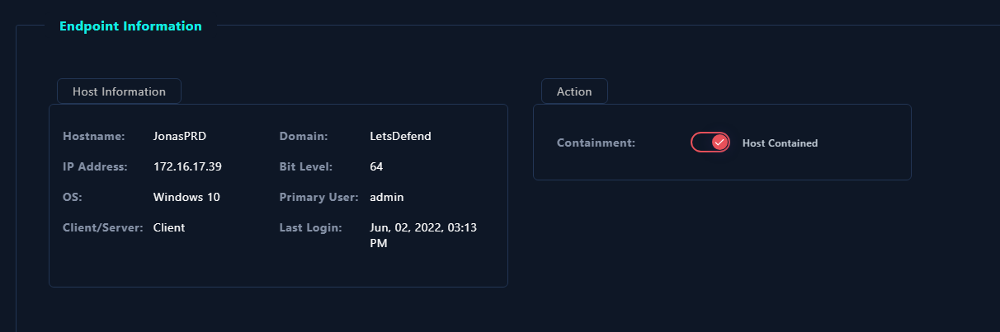
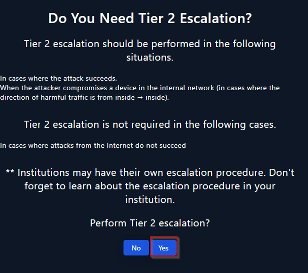
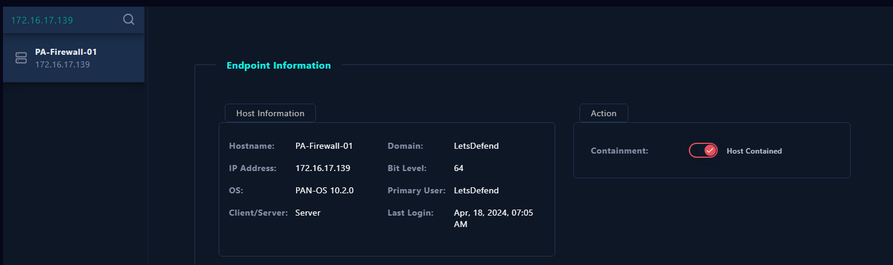
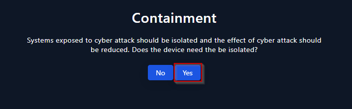
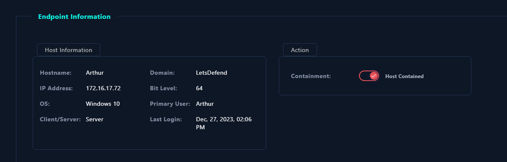

# Respuesta y seguimiento de incidentes 

## SOC210 - Possible Brute Force Detected on VPN

**Taxonomía:** Brute Force 
**Criticidad:** Alta 

### Descripción Possible Brute Force Detected on VPN

Un atacante ha generado varios intentos de conexión a distintos usuarios de la red interna a través de la VPN.

### Memoria Possible Brute Force Detected on VPN

La primera pregunta a la que me he enfrentado en este playbook es si la dirección IP de origen es a una dirección externa o interna. La dirección es la 37.19.221.229 y la dirección IP es la 33.33.33.33. 

Comprobando el endpoint security vemos que la dirección IP no aparece como una de la LAN.

He seleccionado que es externa.

Lo siguiente que se nos pide comprobar la dirección IP en virtustotal por ejemplo. Solo un uno la ha encontrado como sospechosa.

Por lo tanto si la he considerado sospechosa.

El siguiente paso del playbook es comprobar en los logs el tipo de objetivo si es un SSH o un RDP. He buscado la dirección IP para comprobar el puerto de destino y el puerto es 443.

Así que la respuesta es no.

Puesto que el puerto de destino siempre es 443 la siguiente pregunta también se responde como no.

La siguiente pregunta del playbook es si el brute force a la VPN fue exitosa. Investigando los logs se puede ver que si lo es.

Por lo tanto la respuesta es que si lo fue.

La siguiente pregunta es si deberíamos aislar el dispositivo de la red y en mi opinión debería ser así ya que puede acabar landeando a otros dispositivos.

En la imagen donde podemos compronar el login vemos que el usuario ha sido Mane por lo tanto hay que aislarlo de la red clicando en contener.

### Preguntas Possible Brute Force Detected on VPN

**1.b ¿Cuál es el proceso de investigación seguido para investigar el incidente y que evidencias han sido clave para la resolución del incidente?**

El proceso para su investigación es el análisis de los logs generados por el brute force. Han sido clave la cantidad de logs que muestran que se ha intentado acceder a una serie de usuarios desde una dirección IP.

**2.a Durante la resolución del incidente ¿has tenido que realizar algún tipo de actuación para el restableciciomiento de servicios afectados por el incidente, con el objetivo de volver a la normalidad**

Si, he tenido que contener el equipo de la red.

**3.a Tras trabajar en la resolución del incidente ¿Que acciones/actuaciones destacadas se han realizado para solucionar el incidente?**

La más importante son contener el equipo fuera de la red y analizar los logs del sistema.

**3.b Realizar un proceso de análisis de las actuaciones llevadas a cabo y obtener un registro de lecciones aprendidas, para finalmente concluir en las posibles mejoras que podrías plantear para tu plan/playbooks desarrollado en la práctica anterior.**

Los playbooks que hemos creado anteriormente se deben mejorar con la intención de ser más explicitos en los pasos a realizar.

**4.a Seguro que en el proceso de análisis para obtener un registro de lecciones aprendidas anterior, has pensado como evitar que una situación similar se vuelva a repetir. ¿Que actuaciones has decidido para evitar que se pueda dar una situación similar?**

Se debería prohibir a través de la red las conexiones externas a la red interna de la empresa con el firewall.

## Follina 0-Day Detected

**Taxonomía:** Malware 
**Criticidad:** Medio 

### Descripción Follina 0-Day

Follina 0-Day es una vulnerabilidad que se encuentra en una herramienta de Microsoft llamada Windows Support Diagnostic Tool (MSDT). 

### Memoria Follina 0-Day

El primer paso es seleccionar el indicador de amenaza. En este caso ninguna de las opciones define el indicador de amenaza así que seleccionamos otro.

Lo siguiente es comprobar si el malware ha sido eliminado o contenido y como podemos ver no ha sido contenido.

Marcamos que no ha sido puesto en cuarentena.

El siguiente paso es comprobar el hash del malware que nos da el log management en virustotal para analizar el malware.

Lo marcamos como malicioso ya que como hemos visto en virustotal, 41/61 lo detectan como tal.

El playbook nos pregunta si alguien accedio a la URL. Como podemos ver en virus total las URL que accede es la misma que se encuentra en los logs dados.

Así que marcamos accessed.

Lo siguiente del playbook es contener el EDR.

### Preguntas 0-Day Detected

**1.b ¿Cuál es el proceso de investigación seguido para investigar el incidente y que evidencias han sido clave para la resolución del incidente?**

El proceso para su investigación es el análisis de los logs generados por el malware y analizar el malware. Ha sido clave el hash de los logs generados para comprobar en virustotal que es malicioso y no un falso positivo.

**2.a Durante la resolución del incidente ¿has tenido que realizar algún tipo de actuación para el restableciciomiento de servicios afectados por el incidente, con el objetivo de volver a la normalidad**

Si, he tenido que contener el equipo de la red.

**3.a Tras trabajar en la resolución del incidente ¿Que acciones/actuaciones destacadas se han realizado para solucionar el incidente?**

La más importante son contener el equipo fuera de la red y analizar las acciones del EDR.

**3.b Realizar un proceso de análisis de las actuaciones llevadas a cabo y obtener un registro de lecciones aprendidas, para finalmente concluir en las posibles mejoras que podrías plantear para tu plan/playbooks desarrollado en la práctica anterior.**

Los playbooks que hemos creado anteriormente se deben mejorar con la intención de ser más explicitos en los pasos a realizar.

**4.a Seguro que en el proceso de análisis para obtener un registro de lecciones aprendidas anterior, has pensado como evitar que una situación similar se vuelva a repetir. ¿Que actuaciones has decidido para evitar que se pueda dar una situación similar?**

Se debería prohibir a través de la red las conexiones que no sean referentes a las URL que solo deberían acceder los empleados y hacer cada 6 meses una serie de charlas para enseñar a los empleados para concienciarlos.

## Microsoft SharePoint Server Elevation of Privilege

**Taxonomía:** Ataque Web 
**Criticidad:** Crítica 

### Descripción Microsoft SharePoint Server Elevation of Privilege

Un atacante ha escalado privilegios a través de Microsoft SharePoint Server.

### Memoria Microsoft SharePoint Server Elevation of Privilege

El primer paso es comprobar si la amenaza ha sido un falso positivo, para ello debemos investigar la dirección IP de origen en virustotal para comprobar si es maliciosa. Por lo tanto no lo es.

Como podemos ver la dirección IP proviene de China UNICOM

Según el playbook hay que comprobar el tráfico HTTP para ver si es inyección SQL, XSS, inyección de comandos, IDOR o RFI/LF.

Si comprobamos los logs generados con el CVE dado por el log, podemos ver que las solicitudes son exactas a las del CVE dado comprobando el script del exploit en su [github](https://github.com/Chocapikk/CVE-2023-29357/blob/main/exploit.py).

Lo marcamos como malicioso.

El origen del ataque no es ninguno de los mencionados anteriormente así que marcamos otro.

El siguiente punto es comprobar si ha sido planeado, en mi investigación no he encontrado nada que indique que haya sido planeado.

Como hemos podido ver anteriormente el atacante pudo acceder con exito a dos de las tres URL como hemos podido ver en la captura que muestra el script en la web de Lestdefend como ejemplo. Lo marcamos como que si ha sido exitoso.

Lo siguiente es contener el equipo de la red.

Como el ataque ha sido exitoso, escalamos a nivel 2.

### Preguntas Microsoft SharePoint Server Elevation of Privilege 

**1.b ¿Cuál es el proceso de investigación seguido para investigar el incidente y que evidencias han sido clave para la resolución del incidente?**

Analizar el trafico HTTP y la dirección IP de origen en virustotal.

**2.a Durante la resolución del incidente ¿has tenido que realizar algún tipo de actuación para el restableciciomiento de servicios afectados por el incidente, con el objetivo de volver a la normalidad**

Si, he tenido que contener el equipo de la red y escalar a nivel dos.

**3.a Tras trabajar en la resolución del incidente ¿Que acciones/actuaciones destacadas se han realizado para solucionar el incidente?**

La más importante son contener el equipo fuera de la red y escalarlo a otro nivel.

**3.b Realizar un proceso de análisis de las actuaciones llevadas a cabo y obtener un registro de lecciones aprendidas, para finalmente concluir en las posibles mejoras que podrías plantear para tu plan/playbooks desarrollado en la práctica anterior.**

Los playbooks que hemos creado anteriormente se deben mejorar con la intención de ser más explicitos en los pasos a realizar.

**4.a Seguro que en el proceso de análisis para obtener un registro de lecciones aprendidas anterior, has pensado como evitar que una situación similar se vuelva a repetir. ¿Que actuaciones has decidido para evitar que se pueda dar una situación similar?**

Se deberá modificar Microsoft SharePoint Server para que no permita los accesos a las URL afectadas.

## Remote Code Execution Detected in Splunk Enterprise

**Taxonomía:** Acceso no autorizado 
**Criticidad:** Alta 

### Descripción Code Execution Detected in Splunk Enterprise

Un atacante a ejecutado codigo en Splunk Enterprise que es un software para buscar, ​​​ monitorizar y analizar macrodatos generados por máquinas de aplicaciones, sistemas e infraestructura IT a través de una interfaz web.

### Memoria Code Execution Detected in Splunk Enterprise

Lo primero que indica el playbook es que se debe investigar el origen del ataque. Si investigamos la dirección IP en virustotal, encontramos que la dirección de origen es maliciosa. Como podemos ver proviene de internet y de Chinanet.

Si comprobamos los logs, el atacante ha enviado varias peticiones desde una dirección IP haciendo referencia a un archivo shell.sh y un shell.xsl

Considero que varias peticiones a un archivo shell.sh es tráfico malicioso.

Podría ser un ataque de inyección de XML ya que hace referencia a un shell.xsl como ya se ha mencionado anteriormente.

En el siguiente paso el playbook nos pregunta si ha sido planeado, no he encontrado nada que indique que haya sido planeado.

Como vemos por el origen de la dirección IP, la conexión ha sido desde internet a la empresa.

Teniendo en cuenta el último log, se puede comprobar de que obtuvo acceso al usuario administrador y su contraseña.

Entonces marcamos que si ha sido exitoso.

Contenemos el equipo que ha sido afectado según el playbook.

Como el ataque ha sido exitoso y el playbook indica que entonces debemos escalarlo, se escala al nivel 2.

### Preguntas Code Execution Detected in Splunk Enterprise

**1.b ¿Cuál es el proceso de investigación seguido para investigar el incidente y que evidencias han sido clave para la resolución del incidente?**

Analizar el trafico HTTP y la dirección IP de origen.

**2.a Durante la resolución del incidente ¿has tenido que realizar algún tipo de actuación para el restableciciomiento de servicios afectados por el incidente, con el objetivo de volver a la normalidad**

Si, he tenido que contener el equipo de la red y escalar a nivel dos.

**3.a Tras trabajar en la resolución del incidente ¿Que acciones/actuaciones destacadas se han realizado para solucionar el incidente?**

La más importante son contener el equipo fuera de la red y escalarlo a otro nivel.

**3.b Realizar un proceso de análisis de las actuaciones llevadas a cabo y obtener un registro de lecciones aprendidas, para finalmente concluir en las posibles mejoras que podrías plantear para tu plan/playbooks desarrollado en la práctica anterior.**

Los playbooks que hemos creado anteriormente se deben mejorar con la intención de ser más explicitos en los pasos a realizar.

**4.a Seguro que en el proceso de análisis para obtener un registro de lecciones aprendidas anterior, has pensado como evitar que una situación similar se vuelva a repetir. ¿Que actuaciones has decidido para evitar que se pueda dar una situación similar?**

Se deberá monitorizar el servidor Splunk y mantener las conexiones externas prohibidas.

## FakeGPT Malicious Chrome Extension

**Taxonomía:** Fuga de Datos 
**Criticidad:** Alta 

## Introducción FakeGPT Malicious Chrome Extension

Una extensión llamada FakeGPT que es posiblemente maliciosa está instalada en Chrome.

### Memoria FakeGPT Malicious Chrome Extension

Lo primero es saber el indicador de amenaza, en mi caso he seleccionado otro ya que es una instalación de una extensión posiblemente maliciosa.

Ahora vamos a comprobar si el EDR ha sido contenido o no. He comprobado el EDR de Samuel ya que es el que indica la alerta y no ha sido contenido.

He marcado en el playbook que no ha sido puesto en cuarentena.

Lo siguiente es comprobar que si el archivo es o no malicioso. Para ello he comprobado el hash del fichero generado por la alerta en virustotal. No ha sido encontrado como malicioso.

Pero según en un artículo que han posteado en la comunidad es una extensión maliciosa que imita a chatgpt por lo tanto la selecciono como maliciosa.

Ahora nos pregunta si podemos confirmar si alguien accedio al C2 (Command and control) y como podemos ver la máquina de Samuel si accedio a www.chatgptforgoogle.pro.

Marcamos que si se accedio en el playbook.

Por último el playbook nos pide que contengamos el equipo de Samuel.

### Preguntas FakeGPT Malicious Chrome Extension

**1.b ¿Cuál es el proceso de investigación seguido para investigar el incidente y que evidencias han sido clave para la resolución del incidente?**

El proceso de investigación ha comenzado por analizar el EDR afectado y la extensión maliciosa instalada en Chrome en virustotal.

**2.a Durante la resolución del incidente ¿has tenido que realizar algún tipo de actuación para el restableciciomiento de servicios afectados por el incidente, con el objetivo de volver a la normalidad**

Si, he tenido que contener el equipo de la red.

**3.a Tras trabajar en la resolución del incidente ¿Que acciones/actuaciones destacadas se han realizado para solucionar el incidente?**

La más importante son contener el equipo fuera de la red.

**3.b Realizar un proceso de análisis de las actuaciones llevadas a cabo y obtener un registro de lecciones aprendidas, para finalmente concluir en las posibles mejoras que podrías plantear para tu plan/playbooks desarrollado en la práctica anterior.**

Los playbooks que hemos creado anteriormente se deben mejorar con la intención de ser más explicitos en los pasos a realizar.

**4.a Seguro que en el proceso de análisis para obtener un registro de lecciones aprendidas anterior, has pensado como evitar que una situación similar se vuelva a repetir. ¿Que actuaciones has decidido para evitar que se pueda dar una situación similar?**

Se deberá bloquear el acceso a la página web desde donde se descarga la extensión maliciosa y concienciar a los empleados.

## Suspicious Certutil.exe Usage

**Taxonomía:** LOLBin 
**Criticidad:** Media 

## Introducción Suspicious Certutil.exe Usage

Se ha hecho un posible uso malicioso de Certutil que es una herramienta utilizada por desarrolladores y administradores de TI para ver la información de contenido del certificado en los dispositivos.

### Memoria Suspicious Certutil.exe Usage

El primer paso del playbook nos indica que es un LOLBin que es un binario de uso legitimo que puede ser utilizado con fines maliciosos por un atacante.

En el segundo paso, nos explica que debemos determinar que binario fue el que ha generado la alerta. Para ello podemos directamente ir a la alerta generada.

Lo siguiente es saber que acción sospecha se ha ejecutado, para ello el playbook nos indica una página web que nos permite saber como "normalmente" actúan los LOLBAS. Si miramos en la captura anterior el Command Line, podemos comprobar que se ha hecho un mal uso de este binario si lo comparamos al dado por la página web.

Por lo tanto indicamos que si ha sido utilizado de manera sospechosa.

Lo siguiente es indicar el tipo de actividad que ha hecho, como podemos ver en el command line y en la web dada por el playbook, la actividad es descargar un zip.

Tras indicar el tipo de actividad, el playbook nos pide que investiguemos si la actividad la ha ejecutado un malware o un usuario.

Si investigamos el usuario vemos que entre los comandos que ha ejecutado el comando en cuestión para descargar nmap entonces esto me indica que ha sido el usuario y no un malware.

Marcamos que ha sido por parte del usuario y no de un malware.

Por último el playbook nos dice que debemos contener el EDR. Así que he buscado el EDR del usuario a tráves de la dirección IP dada por la alerta y se ha contenido.

### Preguntas Suspicious Certutil.exe Usage

**1.b ¿Cuál es el proceso de investigación seguido para investigar el incidente y que evidencias han sido clave para la resolución del incidente?**

El proceso de investigación ha comenzado por investigar que es un LOLBin y los LOLBoas para saber las posibles actividades sospechosas pueden realizar. Además investigar el EDR del equipo que ha generado la alerta.

**2.a Durante la resolución del incidente ¿has tenido que realizar algún tipo de actuación para el restableciciomiento de servicios afectados por el incidente, con el objetivo de volver a la normalidad**

Si, he tenido que contener el equipo de la red.

**3.a Tras trabajar en la resolución del incidente ¿Que acciones/actuaciones destacadas se han realizado para solucionar el incidente?**

Las más importantes son investigar la actividad del EDR, investigar sobre los LOLBin y los LOLBoas y contener el equipo fuera de la red.

**3.b Realizar un proceso de análisis de las actuaciones llevadas a cabo y obtener un registro de lecciones aprendidas, para finalmente concluir en las posibles mejoras que podrías plantear para tu plan/playbooks desarrollado en la práctica anterior.**

Los playbooks que hemos creado anteriormente se deben mejorar con la intención de ser más explicitos en los pasos a realizar.

**4.a Seguro que en el proceso de análisis para obtener un registro de lecciones aprendidas anterior, has pensado como evitar que una situación similar se vuelva a repetir. ¿Que actuaciones has decidido para evitar que se pueda dar una situación similar?**

Se deberá hablar con el empleado y concienciar a los demás sobre los problemas que pueden ocurrir.

## Quishing Detected (QR Code Phishing)

**Taxonomía:** Quishing 
**Criticidad:** Media 

### Descripción Quishing Detected (QR Code Phishing)

Al parecer un usuario ha recibido un posible QR malicioso a través de su correo electrónico.

### Memoria Quishing Detected (QR Code Phishing)

El primer paso del playbook es comprobar que la alarma es generada por una actividad sospechosa. Como podemos ver el correo recibido por Claire proviene de una Dirección de correo que no se corresponde con la de Microsoft.

Es obvio que la dirección de correo electrónico es falsa pero podemos investigar también el QR con ScanQR.

Si colocamos la URL dada por ScanQR en Virustotal, podemos ver que la URL es maliciosa.

Una vez determinado que el QR es malicioso, avanzamos en el playbook hasta que nos pregunta el tipo de reconocimiento. Marcamos Phishing para obtener información.

El siguiente paso es indicar si la dirección IP es externa, la dirección IP no se encuentra dentro de la red de la empresa siendo la siguiente, 158.69.201.47. Por lo tanto la dirección IP la marcamos como externa.

Ahora debemos comprobar que la dirección IP es maliciosa, la he comprobado a través de Virustotal.

Así que marcamos que la dirección IP si es maliciosa.

Debemos en el siguiente paso que indica el playbook comprobar quién fue el objetivo, si es solo Claire o hay alguien más. Si investigamos al dirección IP en log management o el email security nada que indique que haya otro objetivo aparte de Claire así que marcamos que no ha sido afectado nadie más.

Por último nos indica que si creemos necesario, deberemos contener el EDR y que si creemos que lo es. En mi opinión hasta que no se sepa bien el alcance del Quishing, se debe contener el EDR.

### Preguntas Quishing Detected (QR Code Phishing)

**1.b ¿Cuál es el proceso de investigación seguido para investigar el incidente y que evidencias han sido clave para la resolución del incidente?**

El proceso de investigación ha comenzado por investigar quién recibió el QR a través del correo lectrónico, el QR recibido por el usuario Claire y si ha habido algún objetivo además de ella.

**2.a Durante la resolución del incidente ¿has tenido que realizar algún tipo de actuación para el restableciciomiento de servicios afectados por el incidente, con el objetivo de volver a la normalidad**

No he tenido que ejecutar ningún tipo de actuación ya que el playbook no indica por ejemplo que haya que contener el EDR pero si pregunta si creemos necesario.

**3.a Tras trabajar en la resolución del incidente ¿Que acciones/actuaciones destacadas se han realizado para solucionar el incidente?**

Investigar el QR a través de ScanQR para identificar si el QR es malicioso.

**3.b Realizar un proceso de análisis de las actuaciones llevadas a cabo y obtener un registro de lecciones aprendidas, para finalmente concluir en las posibles mejoras que podrías plantear para tu plan/playbooks desarrollado en la práctica anterior.**

Los playbooks que hemos creado anteriormente se deben mejorar con la intención de ser más explicitos en los pasos a realizar.

**4.a Seguro que en el proceso de análisis para obtener un registro de lecciones aprendidas anterior, has pensado como evitar que una situación similar se vuelva a repetir. ¿Que actuaciones has decidido para evitar que se pueda dar una situación similar?**

Se debería concienciar mejor a los empleados si no se hace ya sobre este tipo de ataques.

## PowerShell Found in Requested URL - Possible CVE-2022-41082 Exploitation

**Taxonomía:** Ataque Web 
**Criticidad:** Alta 

### Descripción PowerShell Found in Requested URL - Possible CVE-2022-41082 Exploitation

Se ha encontrado en una solicitud web una ejecución de power shell posiblemente para la explotación del CVE-2022-41082 en el cual se explota una vulnerabilidad de ejecución de código remota en Microsoft Exchange Server.

### Memoria PowerShell Found in Requested URL - Possible CVE-2022-41082 Exploitation

El primer paso de este playbook es comprobar si el trafico es malicioso, para ello he investigado el log generado en busca de la url.

Teniendo la URL he ido a virustotal para comprobar si la URL se puede considerar sospechosa encontrandome con 2 antivirus dandolo como sospechoso.

Así que marcamos como que el tráfico puede ser con siderado como malicioso.

En el siguiente paso debemos indicar el tipo de ataque, teniendo en cuenta el escript y el cve, lo considero inyección de comando. Así que seleccionamos el tipo de ataque.

Ahora debemos comprobar si ha sido planeado o no, después de investigar el EDR y sus correos, determino que no ha sido planeado.

En el playbook ahora se indica que debemos comprobar desde donde va el tráfico y hacia adonde, en este caso la dirección IP viene desde la empresa hacia internet.

Ahora debemos contener el EDR, buscamos la dirección IP en endpoint security y encontramos que el EDR es Emma.

Según el playbook, en caso de que el ataque sea efectivo, debemos escalarlo a tier 2.

### Preguntas PowerShell Found in Requested URL - Possible CVE-2022-41082 Exploitation

**1.b ¿Cuál es el proceso de investigación seguido para investigar el incidente y que evidencias han sido clave para la resolución del incidente?**

El proceso realizado es investigar el log para comprobar la vulnerabilidad encontrada con la dirección IP de origen hacia la de destino e investigar el tipo de vulnerabilidad y el posible script malicioso. La evidencia clave ha sido el fichero que ha alertado al log y la página web hacia la que se ha redirigido.

**2.a Durante la resolución del incidente ¿has tenido que realizar algún tipo de actuación para el restableciciomiento de servicios afectados por el incidente, con el objetivo de volver a la normalidad**

No, solo se ha tenido que contener el EDR.

**3.a Tras trabajar en la resolución del incidente ¿Que acciones/actuaciones destacadas se han realizado para solucionar el incidente?**

Investigar de donde proviene el log y el archivo que ha creado la alerta al ser ejecutado.

**3.b Realizar un proceso de análisis de las actuaciones llevadas a cabo y obtener un registro de lecciones aprendidas, para finalmente concluir en las posibles mejoras que podrías plantear para tu plan/playbooks desarrollado en la práctica anterior.**

Los playbooks que hemos creado anteriormente se deben mejorar con la intención de ser más explicitos en los pasos a realizar.

**4.a Seguro que en el proceso de análisis para obtener un registro de lecciones aprendidas anterior, has pensado como evitar que una situación similar se vuelva a repetir. ¿Que actuaciones has decidido para evitar que se pueda dar una situación similar?**

Concienciación para los empleados para que no caigan en phishing o descarguen cosas que no esten permitidas en la empresa y tener un firewall que desde la empresa rechace conexiones que no sean necesarias para el trabajo de la propia empresa.

## Palo Alto Networks PAN-OS Command Injection Vulnerability Exploitation (CVE-2024-3400)

**Taxonomía:** Ataque Web 
**Criticidad:** Crítica 

### Descripción Palo Alto Networks PAN-OS Command Injection Vulnerability Exploitation (CVE-2024-3400)

Una inyección de comandos a sido identificado en el software de Palo Alto Networks PAN-OS.

### Memoria Palo Alto Networks PAN-OS Command Injection Vulnerability Exploitation (CVE-2024-3400)

El primer paso de este playbook es recolectar información que pueda contener evidencias de la propia vulnerabilidad. Lo más importante es comprobar si el tráfico ha sido malicioso. Para ello comprobamos la dirección IP de destino y la comprobamos en virustotal.

Como vemos en virustotal, la página web de destino es una dirección IP maliciosa que tiene relación con un malware. Marcamos que si es malicioso el tráfico.

El siguiente paso es determinar el tipo de ataque, comprobado el log podemos ver obviamente que es una inyección de comandos.

Marcamos el tipo de ataque que hemos determinado.

Lo siguiente es comprobar si ha sido planeado, para ello investigamos los correos electrónicos y las conexiones del EDR el cual es el firewall. No he encontrado nada que indique que ha sido planeado.

El tráfico proviene de una dirección IP externa a la empresa.

Una vez tenemos la vulnerabilidad y sabemos el EDR, el playbook nos insta a que lo contengamos.

Por último escalamos a tier 2 ya que el atacante ha tenido exito.

### Preguntas PowerShell Found in Requested URL - Possible CVE-2022-41082 Exploitation

**1.b ¿Cuál es el proceso de investigación seguido para investigar el incidente y que evidencias han sido clave para la resolución del incidente?**

El proceso de investigación ha sido comprobar el tráfico de la red y comprobar el tipo de ataque que se ha realizado. La evidencia ha sido el resultado sobre la dirección IP dada por virustotal y el propio log dandonos información de la inyección de comandos realizado.

**2.a Durante la resolución del incidente ¿has tenido que realizar algún tipo de actuación para el restableciciomiento de servicios afectados por el incidente, con el objetivo de volver a la normalidad**

No, solo he tenido que contener el EDR.

**3.a Tras trabajar en la resolución del incidente ¿Que acciones/actuaciones destacadas se han realizado para solucionar el incidente?**

La comprobación de la dirección IP en virustotal indicando que es maliciosa y por último contener el EDR para que el atacante no tenga cceso a otros equipos de la red.

**3.b Realizar un proceso de análisis de las actuaciones llevadas a cabo y obtener un registro de lecciones aprendidas, para finalmente concluir en las posibles mejoras que podrías plantear para tu plan/playbooks desarrollado en la práctica anterior.**

Los playbooks que hemos creado anteriormente se deben mejorar con la intención de ser más explicitos en los pasos a realizar.

**4.a Seguro que en el proceso de análisis para obtener un registro de lecciones aprendidas anterior, has pensado como evitar que una situación similar se vuelva a repetir. ¿Que actuaciones has decidido para evitar que se pueda dar una situación similar?**

Teniendo en cuenta que el EDR es el propio firewall de la empresa, se deben crear reglas que impidan conexiones externas a direcciones que no se deban de ver externamente y restringir las peticiones a la web.

## APT35 HyperScrape Data Exfiltration Tool Detected

**Taxonomía:** Fuga de datos 
**Criticidad:** Medio 

### Descripción APT35 HyperScrape Data Exfiltration Tool Detected

Se ha observado que APT35 conocido como Charming Kitten utilizaba una herramienta llamada Hyperscrape para extraer correos electrónicos de sus victimas.

### Memoria APT35 HyperScrape Data Exfiltration Tool Detected

El primer paso de este playbook es determinar si se ha reconocido la red y el tipo. Para ello comprobamos la dirección IP que ha generado la alerta. Como podemos ver, la alerta generada por el EDR Arthur indica que se descargó una aplicación llamada Emaildownloader.

Teniendo en cuenta el archivo descargado que podría ser malicioso y el tipo de alerta dada que es a tráves de la herramienta HyperScrape que se ha usado para robar información de la victima.

Ahora debemos indicar si la IP del atacante es interna o externa, para ello debemos comprobar los logs que tengan que ver con la dirección IP de Arthur. Existe un log creado tras una conexión hacia el exterior realizado por el proceso EmailDownloader.exe que tiene como origen la dirección IP de Arthur.

Marcamos que la dirección IP es externa.

Debemos en el siguiente paso comprobar la reputación de esta dirección IP en virustotal.

Como podemos ver la dirección IP es sospechosa así que marcamos en el playbook que lo es.

Ahora indica el playbook que investigamos si más EDR han sido obhetivo, solo ha sido el de Arthur al investigar las conexiones hacia esa dirección IP externa.

Puesto que solo ha sido ese EDR, el playbook nos pregunta si es necesario que lo contengamos, ya que las conexiones pueden seguir siendo exitosas y robar más información, debemos indicar que si.

Así que lo contenemos.

**1.b ¿Cuál es el proceso de investigación seguido para investigar el incidente y que evidencias han sido clave para la resolución del incidente?**

Investigar el log generado para comprobar la dirección IP de origen y destino del atacante y de las conexiones creadas por el proceso de EmailDownloader.exe.

**2.a Durante la resolución del incidente ¿has tenido que realizar algún tipo de actuación para el restableciciomiento de servicios afectados por el incidente, con el objetivo de volver a la normalidad**

Solo se ha contenido el EDR.

**3.a Tras trabajar en la resolución del incidente ¿Que acciones/actuaciones destacadas se han realizado para solucionar el incidente?**

Investigar sobre la dirección IP externa que se ha encontrado en los logs y sobre el tipo de vulnerabilidad.

**3.b Realizar un proceso de análisis de las actuaciones llevadas a cabo y obtener un registro de lecciones aprendidas, para finalmente concluir en las posibles mejoras que podrías plantear para tu plan/playbooks desarrollado en la práctica anterior.**

Los playbooks que hemos creado anteriormente se deben mejorar con la intención de ser más explicitos en los pasos a realizar.

**4.a Seguro que en el proceso de análisis para obtener un registro de lecciones aprendidas anterior, has pensado como evitar que una situación similar se vuelva a repetir. ¿Que actuaciones has decidido para evitar que se pueda dar una situación similar?**

 Se debe concienciar a los empleados, prohibir el uso de aplicaciones no permitidas por la empresa y
 crear reglas que impidan las conexiones hacia el exterior que no sean de la empresa.
